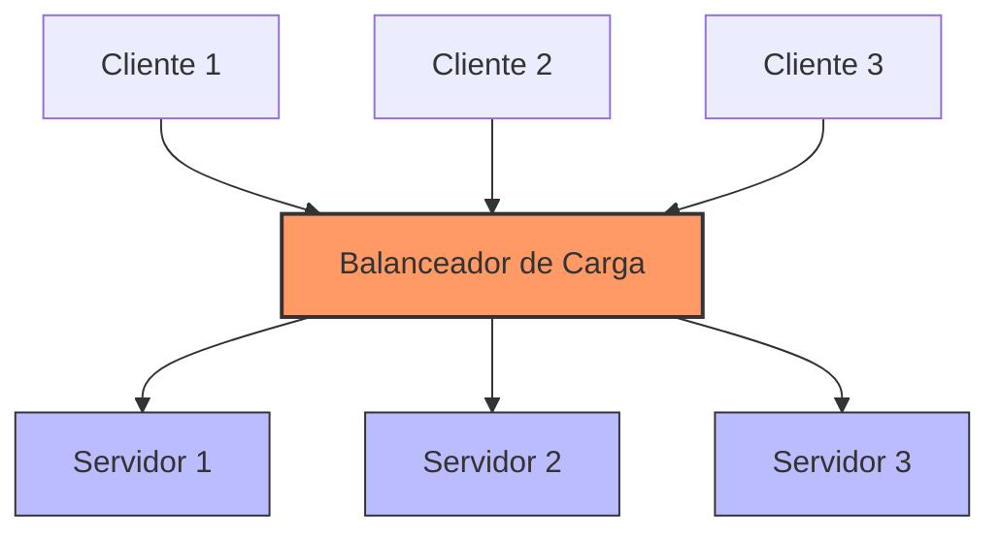
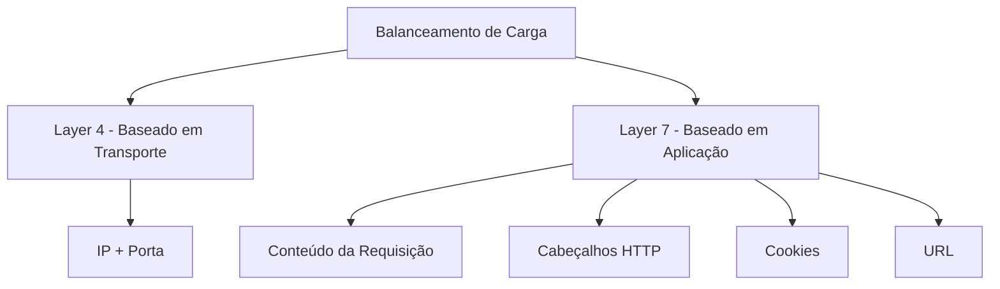
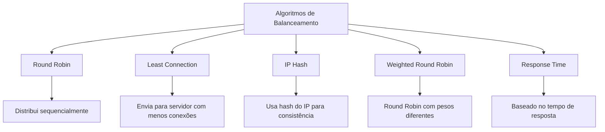

# ⚖️ Load Balancing (Balanceamento de Carga)

## Definição e Visão Geral

O balanceamento de carga é uma técnica utilizada para distribuir tráfego de rede ou requisições entre múltiplos servidores ou recursos computacionais. Seu objetivo principal é otimizar a utilização de recursos, maximizar a taxa de transferência, minimizar o tempo de resposta e evitar sobrecarga em qualquer servidor individual.

Um balanceador de carga atua como um "controlador de tráfego", direcionando as solicitações de clientes para os servidores disponíveis, usando diferentes algoritmos para garantir distribuição eficiente.

## Diagramas

### Arquitetura Básica de Balanceamento de Carga



### Tipos de Balanceamento de Carga



## Algoritmos Comuns de Balanceamento de Carga



## Casos de Uso

- **Sites de alto tráfego**: Distribuição de milhões de requisições entre servidores web
- **Aplicações empresariais**: Garantia de disponibilidade para sistemas críticos
- **APIs públicas**: Gerenciamento de picos de demanda de clientes externos
- **Microserviços**: Roteamento de tráfego entre diferentes instâncias de serviços
- **Streaming de mídia**: Distribuição de cargas para servidores de conteúdo

## Exemplos Práticos

### Configuração Básica no NGINX

```nginx
http {
    upstream backend_servers {
        server backend1.example.com weight=3;
        server backend2.example.com;
        server backend3.example.com;
    }
    
    server {
        listen 80;
        location / {
            proxy_pass http://backend_servers;
        }
    }
}
```

### AWS Elastic Load Balancer (ELB)

```hcl
# Terraform example for AWS ELB
resource "aws_lb" "example" {
  name               = "example-lb"
  internal           = false
  load_balancer_type = "application"
  security_groups    = [aws_security_group.lb_sg.id]
  subnets            = aws_subnet.public.*.id

  enable_deletion_protection = true
}

resource "aws_lb_target_group" "example" {
  name     = "example-target-group"
  port     = 80
  protocol = "HTTP"
  vpc_id   = aws_vpc.main.id
}
```

## Prós e Contras

### Prós
- Aumenta a disponibilidade do sistema
- Melhora o desempenho e reduz tempos de resposta
- Previne falhas devido à sobrecarga de um único servidor
- Facilita a escalabilidade horizontal (adição de mais servidores)
- Permite manutenção sem tempo de inatividade (servidores podem ser removidos/adicionados sem interrupção)

### Contras
- Introduz um ponto único de falha se não for configurado com redundância
- Pode adicionar latência se mal configurado
- Configuração complexa para estados de sessão e persistência
- Custos adicionais de hardware/software
- Pode complicar a arquitetura do sistema

## Melhores Práticas

1. **Implemente redundância no balanceador de carga**: Use configurações ativo-passivo ou ativo-ativo para evitar ponto único de falha.

2. **Selecione o algoritmo adequado**: Escolha com base nas características da aplicação (sessões persistentes, distribuição uniforme, etc.).

3. **Configure verificações de saúde (health checks)**: Detecte e remova automaticamente servidores não saudáveis do pool.

4. **Planeje para escalabilidade**: Garanta que seu balanceador de carga possa lidar com o crescimento futuro.

5. **Monitore métricas-chave**: Latência, disponibilidade, taxas de erro e distribuição de tráfego.

6. **Gerencie sessões adequadamente**: Configure persistência de sessão quando necessário para aplicações stateful.

7. **Implemente SSL offloading quando apropriado**: Reduz a carga de processamento dos servidores de aplicação.

## Ferramentas Populares

- **Hardware**: F5 BIG-IP, Citrix ADC, Barracuda
- **Software**: NGINX, HAProxy, Traefik
- **Nuvem**: AWS ELB/ALB/NLB, Google Cloud Load Balancing, Azure Load Balancer
- **Kubernetes**: Ingress Controllers, Service Mesh (Istio, Linkerd)

## Referências

- Bourke, T. (2001). Server Load Balancing. O'Reilly Media.
- NGINX. (2023). NGINX Load Balancing. https://docs.nginx.com/nginx/admin-guide/load-balancer/
- HAProxy. (2023). HAProxy Documentation. http://cbonte.github.io/haproxy-dconv/
- AWS. (2023). Elastic Load Balancing. https://aws.amazon.com/elasticloadbalancing/
- Kubernetes. (2023). Service, Load Balancing, and Networking. https://kubernetes.io/docs/concepts/services-networking/
