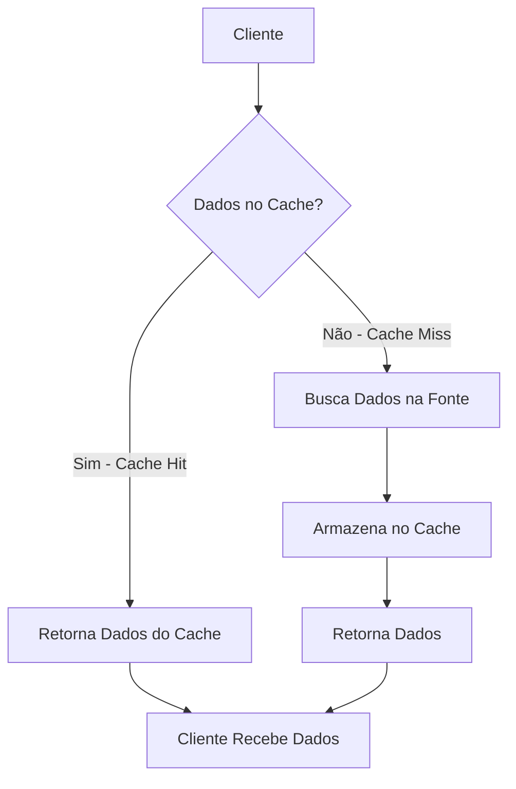
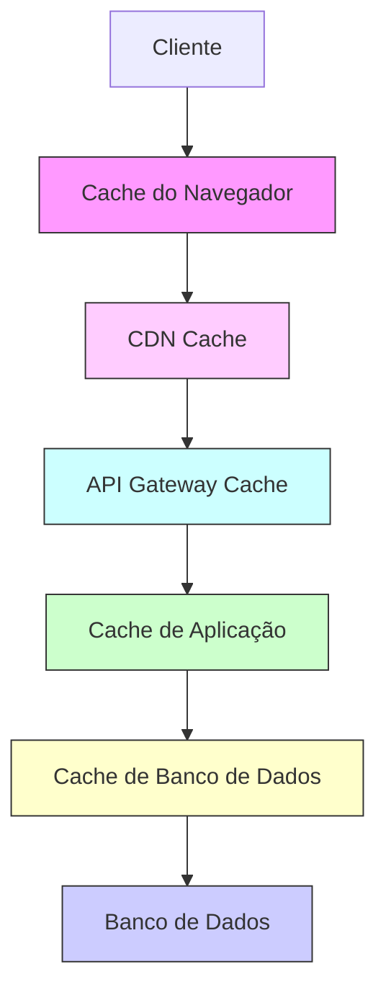
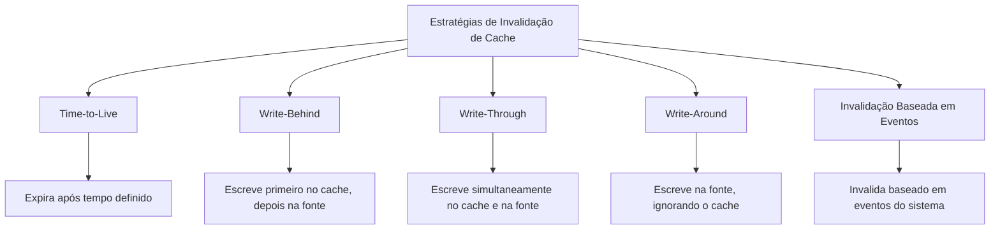
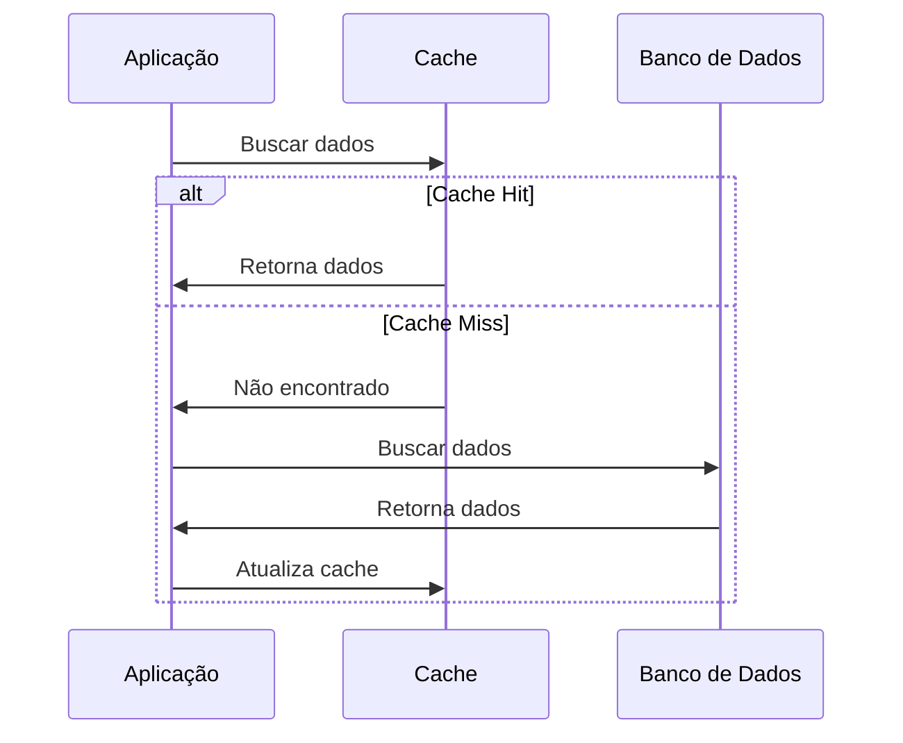
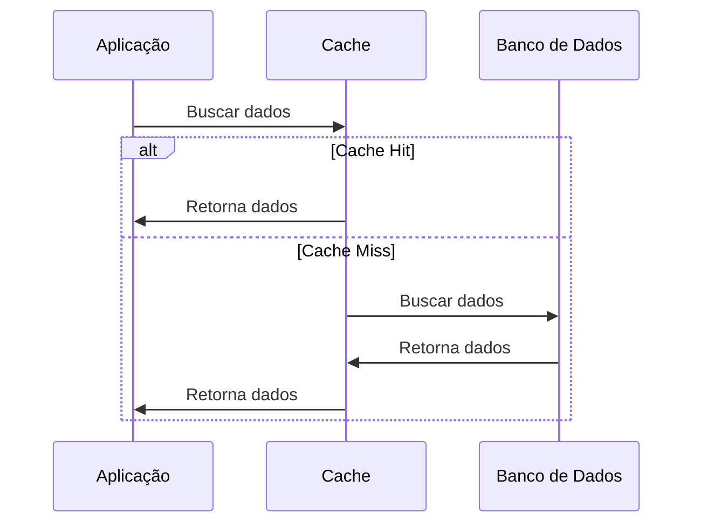

# ⚡ Caching (Cache)

## Definição e Visão Geral

Caching é uma técnica que armazena cópias de dados em um sistema de armazenamento temporário (cache) para permitir acesso mais rápido em requisições futuras. Em vez de buscar os dados na fonte original (que pode ser mais lenta, como um banco de dados ou serviço externo), o sistema verifica primeiro se os dados estão disponíveis no cache.

O princípio fundamental do caching baseia-se na "localidade de referência", que assume que dados recentemente acessados têm maior probabilidade de serem acessados novamente no futuro próximo. Ao armazenar esses dados em memória de acesso rápido, podemos reduzir significativamente a latência e a carga nos sistemas de back-end.

## Diagramas

### Fluxo Básico de Caching



### Níveis de Cache em Arquitetura Moderna



### Padrões de Invalidação de Cache



## Casos de Uso

- **Consultas frequentes de banco de dados**: Resultados de consultas caras são armazenados em cache
- **API Responses**: Respostas de APIs externas são cacheadas para reduzir chamadas
- **Páginas web estáticas**: HTML, CSS, JavaScript, imagens são cacheados em CDNs
- **Sessões de usuário**: Dados de sessão são mantidos em cache distribuído
- **Computação intensiva**: Resultados de cálculos complexos são armazenados para reutilização
- **Conteúdo dinâmico mas raramente alterado**: Como relatórios e dashboards

## Exemplos Práticos

### Implementação de Cache com Redis

```python
import redis
import json

# Conexão com Redis
redis_client = redis.Redis(host='localhost', port=6379, db=0)

def get_user(user_id):
    # Tenta obter do cache primeiro
    cached_user = redis_client.get(f"user:{user_id}")
    
    if cached_user:
        # Cache hit - retorna dado do cache
        return json.loads(cached_user)
    else:
        # Cache miss - busca do banco de dados
        user = database.query(f"SELECT * FROM users WHERE id = {user_id}")
        
        # Armazena no cache com expiração de 1 hora
        redis_client.setex(
            f"user:{user_id}", 
            3600,  # TTL em segundos
            json.dumps(user)
        )
        
        return user
```

### Cache HTTP usando Nginx

```nginx
http {
    # Definição da zona de cache
    proxy_cache_path /path/to/cache levels=1:2 keys_zone=my_cache:10m max_size=10g inactive=60m;
    
    server {
        listen 80;
        server_name example.com;
        
        location / {
            proxy_cache my_cache;
            proxy_cache_valid 200 302 10m;  # Cache respostas 200 e 302 por 10 minutos
            proxy_cache_valid 404 1m;       # Cache respostas 404 por 1 minuto
            proxy_cache_use_stale error timeout updating http_500 http_502 http_503 http_504;
            
            proxy_pass http://backend;
        }
    }
}
```

## Estratégias de Cache

### Cache-Aside (Lazy Loading)



### Read-Through Cache



## Prós e Contras

### Prós
- Redução significativa de latência
- Diminuição da carga nos sistemas de origem (banco de dados, APIs)
- Maior capacidade de lidar com picos de tráfego
- Economia de recursos computacionais e custos de infraestrutura
- Melhoria da experiência do usuário (tempos de resposta menores)
- Redução de tráfego de rede

### Contras
- Aumento da complexidade do sistema
- Desafios de consistência entre cache e fonte de dados
- Possibilidade de servir dados desatualizados
- Custo adicional de memória
- Complexidade na invalidação e atualização do cache
- Problemas de coerência em sistemas distribuídos

## Melhores Práticas

1. **Defina uma estratégia de expiração adequada**: Balance entre desempenho e consistência.

2. **Monitore a taxa de acertos (hit rate)**: Uma taxa baixa indica configuração ineficiente.

3. **Dimensione corretamente**: Evite caches muito pequenos (muitas evicções) ou muito grandes (desperdício de memória).

4. **Implemente compressão quando apropriado**: Economiza espaço, especialmente para grandes volumes de dados.

5. **Defina uma estratégia para falhas de cache**: Sua aplicação deve funcionar mesmo se o cache falhar.

6. **Pré-aqueça caches críticos**: Carregue dados importantes antes de precisar deles.

7. **Utilize particionamento para caches distribuídos**: Melhora a escalabilidade e resiliência.

8. **Cache apenas dados que fazem sentido**: Nem tudo deve ser cacheado (dados altamente voláteis, dados sensíveis).

## Tecnologias Populares de Cache

- **In-Memory Caches**: Redis, Memcached
- **CDNs**: Cloudflare, Akamai, AWS CloudFront
- **Cache de Banco de Dados**: Oracle Coherence, Couchbase
- **Cache para Aplicações Web**: Varnish, Squid
- **Cache em Frameworks**: Spring Cache, Laravel Cache, Rails Cache
- **Cache Distribuído**: Hazelcast, Apache Ignite
- **Browser Caching**: Políticas de cache HTTP, Service Workers

## Referências

- Redis Documentation. (2023). Introduction to Redis Caching. https://redis.io/docs/manual/
- Amazon Web Services. (2023). Caching Overview. https://aws.amazon.com/caching/
- Scott, W. (2015). Redis in Action. Manning Publications.
- Memcached. (2023). Memcached Wiki. https://github.com/memcached/memcached/wiki
- Nginx. (2023). NGINX Content Caching. https://docs.nginx.com/nginx/admin-guide/content-cache/
- Kleppmann, M. (2017). Designing Data-Intensive Applications. O'Reilly Media.
- Nottingham, M. (2007). HTTP Caching. https://www.mnot.net/cache_docs/
