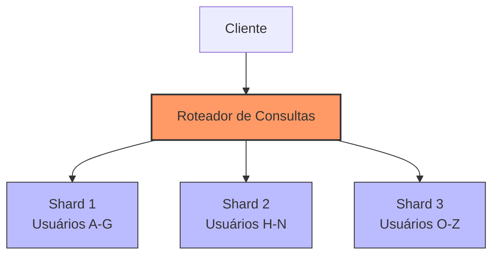
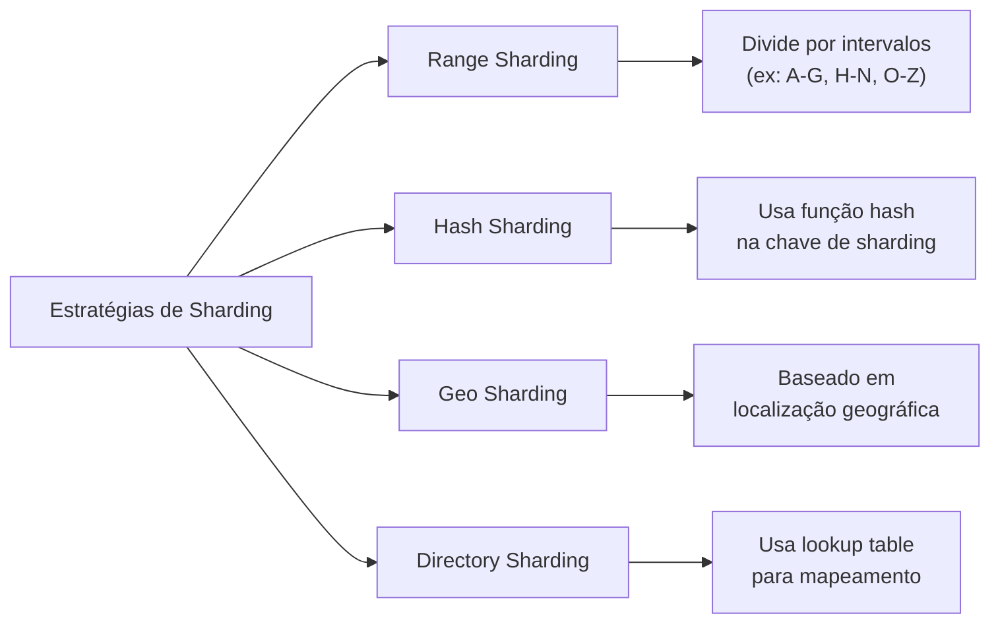
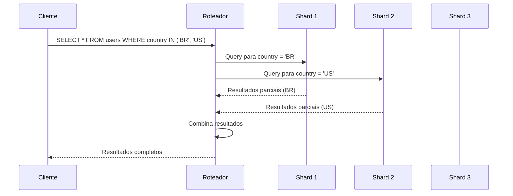

# 🧩 Database Sharding (Fragmentação de Banco de Dados)

## Definição e Visão Geral

Database Sharding é uma técnica de arquitetura de banco de dados que particiona um banco de dados maior em fragmentos menores, independentes e mais gerenciáveis chamados "shards". Cada shard é uma instância de banco de dados independente que armazena um subconjunto específico dos dados totais. Todos os shards juntos compõem o conjunto completo de dados.

Sharding é uma forma de particionamento horizontal, onde linhas de uma tabela de banco de dados são armazenadas separadamente, em vez de dividir uma tabela por colunas (particionamento vertical). O objetivo principal é distribuir a carga de maneira uniforme, melhorar a performance e permitir maior escalabilidade para lidar com o crescimento de dados em grande escala.

## Diagramas

### Visão Geral do Sharding



### Estratégias de Sharding



### Consultas entre Shards (Cross-Shard Queries)



## Casos de Uso

- **Aplicações de alto tráfego**: Redes sociais, e-commerce, plataformas de streaming
- **Big Data**: Sistemas de análise que processam petabytes de dados
- **IoT (Internet das Coisas)**: Sistemas que ingerem quantidades massivas de dados de sensores
- **Jogos online**: Separação de jogadores por regiões ou servidores
- **SaaS multi-tenant**: Isolamento de dados de diferentes clientes

## Exemplos Práticos

### Implementação de Sharding com MongoDB

```javascript
// Configuração de um cluster sharded no MongoDB
sh.enableSharding("meu_banco_de_dados")

// Definir chave de sharding para uma coleção
sh.shardCollection(
    "meu_banco_de_dados.usuarios",
    { "pais": 1 }  // Chave de sharding baseada no país
)

// Adicionar tags para distribuição geográfica
sh.addShardTag("shard0000", "us")
sh.addShardTag("shard0001", "eu")
sh.addShardTag("shard0002", "asia")

// Definir ranges para as tags
sh.addTagRange(
    "meu_banco_de_dados.usuarios",
    { "pais": "US" },
    { "pais": "UZ" },
    "us"
)

sh.addTagRange(
    "meu_banco_de_dados.usuarios",
    { "pais": "DE" },
    { "pais": "GB" },
    "eu"
)
```

### Sharding com PostgreSQL (usando extensão Citus)

```sql
-- Criar tabela distribuída
CREATE TABLE usuarios (
    id bigserial PRIMARY KEY,
    nome text NOT NULL,
    email text NOT NULL,
    pais_codigo char(2)
);

-- Distribuir tabela usando Citus
SELECT create_distributed_table('usuarios', 'pais_codigo');

-- Consulta que será automaticamente roteada para o shard apropriado
SELECT count(*) FROM usuarios WHERE pais_codigo = 'BR';

-- Consulta que precisa consolidar resultados de múltiplos shards
SELECT pais_codigo, count(*) FROM usuarios GROUP BY pais_codigo;
```

## Prós e Contras

### Prós
- **Escalabilidade horizontal**: Facilita a adição de novos nós para acomodar crescimento
- **Performance melhorada**: Consultas são distribuídas em múltiplos nós
- **Melhor localidade de dados**: Os dados podem ser armazenados mais próximos dos usuários
- **Isolamento de falhas**: Falhas impactam apenas um shard, não todo o sistema
- **Otimização de recursos**: Cada shard pode ser otimizado para seu tipo específico de dados

### Contras
- **Complexidade operacional**: Aumenta significativamente a complexidade de administração
- **Complexidade de consultas**: Consultas que abrangem múltiplos shards são mais complexas
- **Desafios de JOIN**: JOINs entre tabelas em diferentes shards são muito custosos
- **Transações distribuídas**: Difícil manter ACID em transações entre shards
- **Rebalanceamento**: Mover dados entre shards pode ser complexo e disruptivo
- **Overhead**: Necessidade de servidores adicionais para gerenciamento

## Melhores Práticas

1. **Escolha cuidadosamente a chave de sharding**: Deve distribuir uniformemente os dados e minimizar consultas entre shards.

2. **Evite operações entre shards**: Projete seu esquema de dados para minimizar JOINs e transações que atravessam múltiplos shards.

3. **Implemente uma estratégia de backup consistente**: Garanta que backups sejam coordenados entre todos os shards.

4. **Considere o impacto de rebalanceamento**: Planeje com antecedência para crescimento e redistribuição de dados.

5. **Monitore a distribuição de dados**: Verifique regularmente se há hot spots (shards sobrecarregados).

6. **Implemente caching adequado**: Reduza a pressão nos shards com estratégias eficientes de cache.

7. **Teste exaustivamente**: Sharding introduz complexidade; teste todas as operações críticas.

8. **Tenha um plano de recuperação**: Prepare-se para cenários de falha completa ou parcial de shards.

## Estratégias de Sharding Comuns

### Range Sharding
Divide os dados com base em intervalos de valores.

**Exemplo**: Usuários A-M no Shard 1, N-Z no Shard 2.

**Vantagens**: Eficiente para consultas de intervalo.

**Desvantagens**: Risco de hot spots se a distribuição não for uniforme.

### Hash Sharding
Usa uma função hash aplicada à chave de sharding.

**Exemplo**: hash(user_id) % número_de_shards determina o shard.

**Vantagens**: Distribuição uniforme dos dados.

**Desvantagens**: Ineficiente para consultas de intervalo.

### Geo Sharding
Divide por localização geográfica.

**Exemplo**: Usuários europeus em shards europeus, americanos em shards americanos.

**Vantagens**: Baixa latência para usuários.

**Desvantagens**: Complexidade em consultas globais.

### Directory-Based Sharding
Mantém um serviço de diretório que mapeia os dados para os shards.

**Vantagens**: Flexibilidade máxima.

**Desvantagens**: O diretório torna-se um ponto único de falha.

## Tecnologias que Suportam Sharding

- **NoSQL**: MongoDB, Cassandra, DynamoDB
- **SQL**: MySQL Cluster, PostgreSQL (com Citus), CockroachDB
- **NewSQL**: Google Spanner, VoltDB, TiDB
- **Middleware**: Vitess (MySQL), ProxySQL, ShardingSphere
- **Serviços em Nuvem**: Azure Cosmos DB, Google Cloud Spanner, AWS Aurora

## Referências

- Tiwari, S. (2011). Professional NoSQL. Wrox.
- MongoDB. (2023). Sharding. https://docs.mongodb.com/manual/sharding/
- PostgreSQL. (2023). Citus Data Documentation. https://docs.citusdata.com/
- Kleppmann, M. (2017). Designing Data-Intensive Applications. O'Reilly Media.
- AWS. (2023). Sharding with Amazon DynamoDB. https://aws.amazon.com/blogs/database/sharding-with-amazon-dynamodb/
- Kreps, J. (2013). The Log: What every software engineer should know about real-time data's unifying abstraction. https://engineering.linkedin.com/distributed-systems/log-what-every-software-engineer-should-know-about-real-time-datas-unifying
