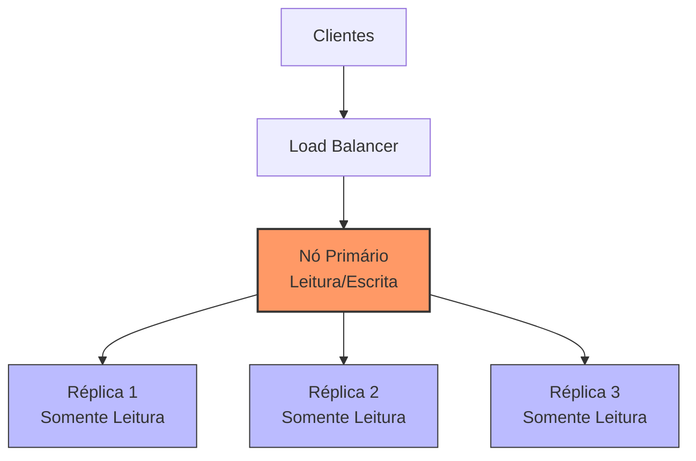
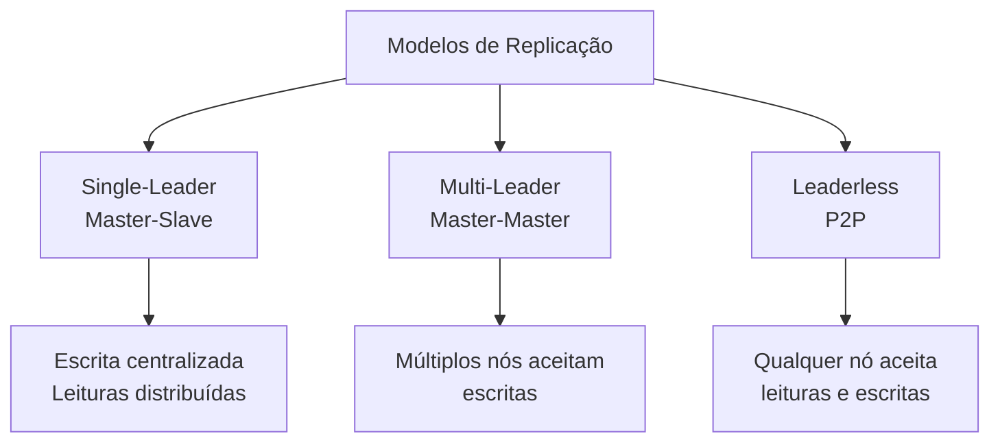
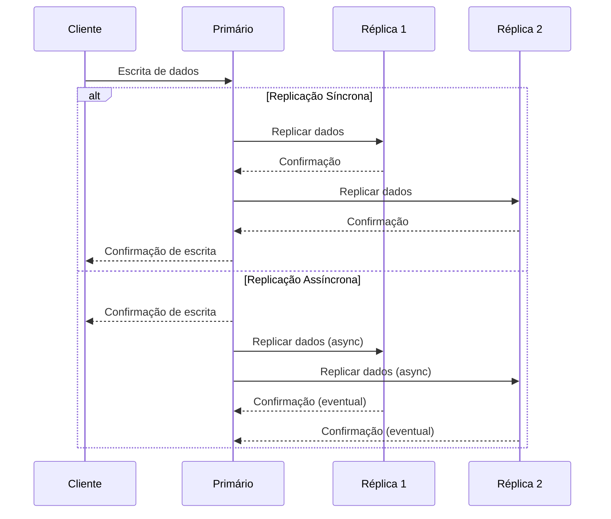
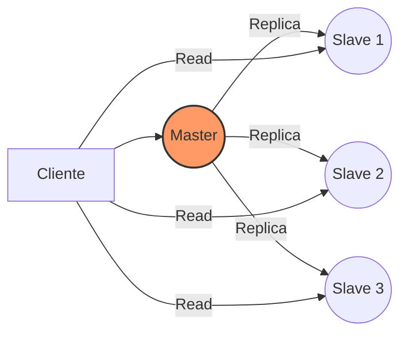
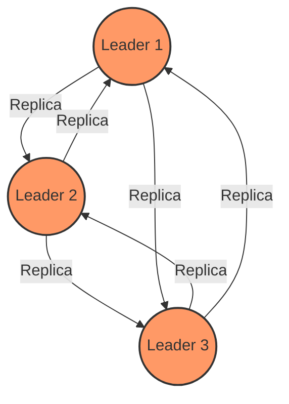
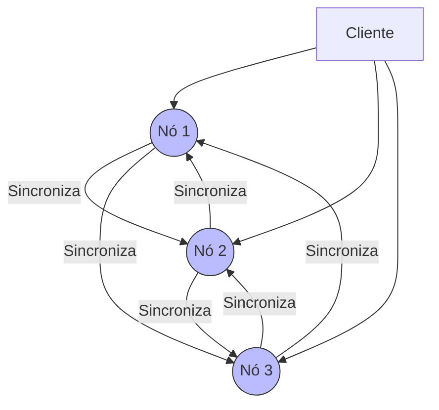

# 📑 Replication (Replicação)

## Definição e Visão Geral

Replicação é o processo de copiar e manter dados em múltiplos nós ou servidores, criando réplicas que permanecem sincronizadas ao longo do tempo. Este conceito fundamental em sistemas distribuídos permite que os mesmos dados estejam disponíveis em diferentes locais, fornecendo maior disponibilidade, confiabilidade e tolerância a falhas.

A replicação é utilizada principalmente para dois propósitos:

1. **Disponibilidade e tolerância a falhas**: Se um servidor falhar, os dados ainda estarão acessíveis a partir de outras réplicas.
2. **Desempenho**: Distribuir a carga de leitura entre várias réplicas pode melhorar significativamente a performance do sistema.

## Diagramas

### Replicação Básica



### Modelos de Replicação



### Sincronização de Dados



## Casos de Uso

- **Bancos de dados de alta disponibilidade**: Bancos críticos que não podem sofrer tempo de inatividade
- **Sistemas de cache distribuído**: Replicação de dados em memória
- **Armazenamento geográfico distribuído**: CDNs e data centers globalmente distribuídos
- **Sistemas de recuperação de desastres**: Backup em tempo real para locais secundários
- **Aplicações de alta carga de leitura**: Sistemas onde as leituras superem significativamente as escritas

## Exemplos Práticos

### Replicação no MySQL

```sql
-- Configuração do servidor primário (master)
-- Arquivo my.cnf no servidor primário
[mysqld]
server-id = 1
log_bin = /var/log/mysql/mysql-bin.log
binlog_do_db = meu_banco_de_dados

-- Configuração da réplica (slave)
-- Arquivo my.cnf no servidor de réplica
[mysqld]
server-id = 2
relay-log = /var/log/mysql/mysql-relay-bin.log

-- Comandos para configurar a réplica
CHANGE MASTER TO
  MASTER_HOST='servidor_primario',
  MASTER_USER='repl_user',
  MASTER_PASSWORD='repl_password',
  MASTER_LOG_FILE='mysql-bin.000001',
  MASTER_LOG_POS=4;

-- Iniciar o processo de replicação
START SLAVE;

-- Verificar status da replicação
SHOW SLAVE STATUS\G
```

### Replicação no PostgreSQL com Streaming Replication

```bash
# No servidor primário: postgresql.conf
wal_level = replica
max_wal_senders = 10
wal_keep_segments = 64

# No servidor primário: pg_hba.conf
host replication repl_user 192.168.1.0/24 md5

# Na réplica: comando para iniciar replicação
pg_basebackup -h primario -D /var/lib/postgresql/data -U repl_user -P -v -R -X stream

# Na réplica: postgresql.conf
primary_conninfo = 'host=primario port=5432 user=repl_user password=senha'
```

### Replicação em MongoDB

```javascript
// Configurar um conjunto de réplicas (replica set)
rs.initiate({
  _id: "meuReplicaSet",
  members: [
    { _id: 0, host: "servidor1:27017" },
    { _id: 1, host: "servidor2:27017" },
    { _id: 2, host: "servidor3:27017" }
  ]
})

// Verificar status do conjunto de réplicas
rs.status()

// Verificar quem é o primário
rs.isMaster()
```

## Estratégias de Replicação

### Single-Leader (Master-Slave)



**Características**:
- Todas as escritas vão para o nó líder (master)
- Leituras podem ser distribuídas entre réplicas
- Implementação mais simples e comum

### Multi-Leader (Master-Master)



**Características**:
- Múltiplos nós aceitam escritas
- Cada nó replica para os outros
- Maior disponibilidade, mas complexidade na resolução de conflitos

### Leaderless (Peer-to-Peer)



**Características**:
- Não há nó central
- Qualquer nó aceita leituras e escritas
- Usa quorum para consistência
- Utilizado em bancos NoSQL como Cassandra e Dynamo

## Prós e Contras

### Prós
- **Alta disponibilidade**: Serviço continua mesmo com falha de alguns nós
- **Escalabilidade de leitura**: Distribuição de carga entre réplicas
- **Latência reduzida**: Dados mais próximos dos usuários
- **Isolamento geográfico**: Proteção contra desastres regionais
- **Operações offline**: Possibilidade de análise sem afetar sistema principal

### Contras
- **Consistência**: Desafio em manter dados consistentes entre réplicas
- **Sobrecarga de rede**: Bandwidth utilizado para sincronização
- **Complexidade**: Aumento na complexidade operacional
- **Resolução de conflitos**: Desafios em sistemas multi-leader ou leaderless
- **Custos aumentados**: Recursos adicionais necessários

## Melhores Práticas

1. **Selecione o modelo apropriado**: Single-leader para cargas de trabalho mais simples, multi-leader para alta disponibilidade, leaderless para escala massiva.

2. **Planeje para falhas**: Implemente detecção de falhas e failover automático.

3. **Monitore a latência de replicação**: Acompanhe o atraso entre primário e réplicas.

4. **Defina estratégias de consistência**: Escolha entre consistência forte ou eventual de acordo com requisitos.

5. **Teste cenários de falha**: Simule regularmente falhas de nós para garantir que o sistema se recupera adequadamente.

6. **Automatize o processo de recuperação**: Minimize intervenção manual na reconstituição de réplicas.

7. **Configure topologias eficientes**: Otimize o fluxo de replicação para reduzir latência e consumo de recursos.

8. **Gerencie conflitos adequadamente**: Implemente estratégias claras de resolução de conflitos em sistemas multi-writer.

## Tecnologias Populares com Replicação

- **Bancos de Dados Relacionais**: MySQL, PostgreSQL, Oracle RAC
- **Bancos NoSQL**: MongoDB, Cassandra, DynamoDB, CouchDB
- **Caches Distribuídos**: Redis Sentinel/Cluster, Memcached
- **Message Brokers**: Kafka, RabbitMQ
- **Sistemas de Arquivos Distribuídos**: HDFS, GlusterFS
- **Bancos de Dados em Memória**: VoltDB, MemSQL

## Referências

- Kleppmann, M. (2017). Designing Data-Intensive Applications. O'Reilly Media.
- Tanenbaum, A. S., & Van Steen, M. (2017). Distributed Systems: Principles and Paradigms. Pearson.
- MongoDB. (2023). Replication. https://docs.mongodb.com/manual/replication/
- PostgreSQL. (2023). High Availability, Load Balancing, and Replication. https://www.postgresql.org/docs/current/high-availability.html
- MySQL. (2023). Replication. https://dev.mysql.com/doc/refman/8.0/en/replication.html
- Abadi, D. (2012). Consistency Tradeoffs in Modern Distributed Database System Design. IEEE Computer Society.
- DeCandia, G., et al. (2007). Dynamo: Amazon's Highly Available Key-value Store. SOSP '07: Proceedings of twenty-first ACM SIGOPS symposium on Operating systems principles.
