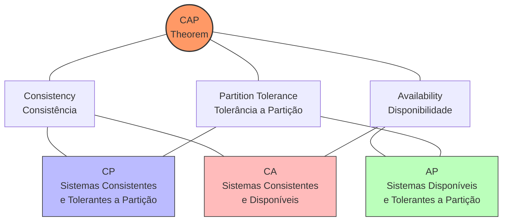
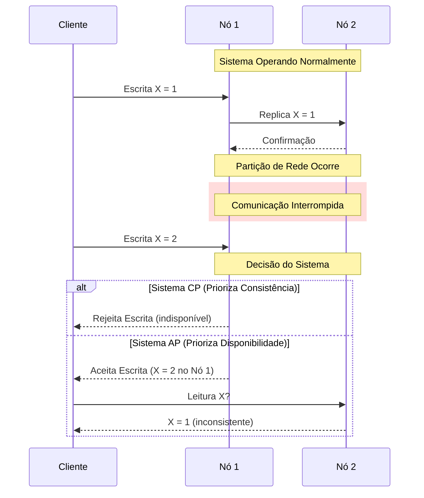
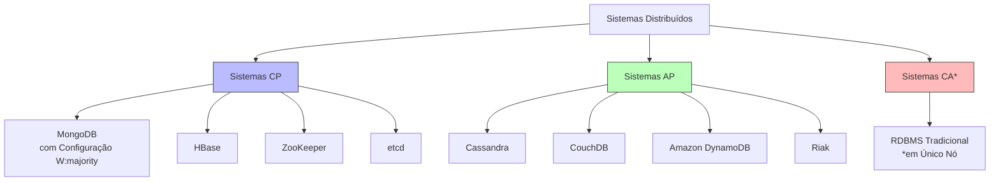
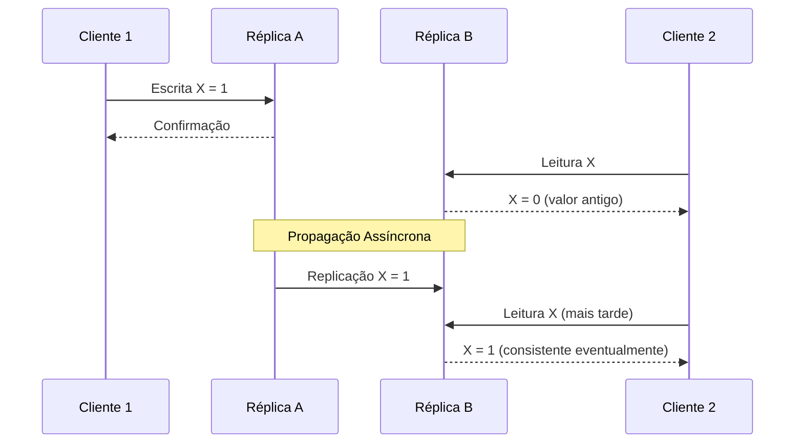

# 📐 CAP Theorem (Teorema CAP)

## Definição e Visão Geral

O Teorema CAP, também conhecido como Teorema de Brewer (proposto por Eric Brewer em 2000), é um princípio fundamental na teoria de sistemas distribuídos. O teorema afirma que é impossível para um sistema de dados distribuído garantir simultaneamente as três seguintes propriedades:

- **Consistency (Consistência)**: Todos os nós veem os mesmos dados ao mesmo tempo. Após uma operação de escrita, qualquer leitura subsequente retornará o valor atualizado.
- **Availability (Disponibilidade)**: O sistema continua operacional mesmo com falhas de nós individuais, garantindo que toda requisição receba uma resposta, sem garantia de que contenha os dados mais recentes.
- **Partition Tolerance (Tolerância a Partição)**: O sistema continua funcionando apesar de falhas de comunicação na rede que possam isolar partes do sistema umas das outras.

O teorema estabelece que, em um sistema distribuído sujeito a partições de rede (o que é inevitável em sistemas reais), os designers precisam escolher entre consistência e disponibilidade. Isso resulta em três tipos principais de sistemas:

- **CP (Consistência + Tolerância a Partição)**: Prioriza consistência e tolerância a partição sobre disponibilidade.
- **AP (Disponibilidade + Tolerância a Partição)**: Prioriza disponibilidade e tolerância a partição sobre consistência.
- **CA (Consistência + Disponibilidade)**: Prioriza consistência e disponibilidade sobre tolerância a partição (raramente viável em sistemas distribuídos reais).

## Diagramas

### O Triângulo CAP



### Cenário de Partição de Rede



### Sistemas e suas Características CAP



## Casos de Uso

### Sistemas CP (Consistency + Partition Tolerance)
- **Sistemas Financeiros**: Aplicações bancárias que exigem consistência rigorosa
- **Sistemas de Controle de Inventário**: Onde a precisão dos dados é crítica
- **Serviços de Coordenação**: Como ZooKeeper e etcd
- **Bancos de Dados com Fortes Garantias Transacionais**: Sistemas onde a integridade dos dados é prioritária

### Sistemas AP (Availability + Partition Tolerance)
- **Redes Sociais**: Onde disponibilidade contínua é mais importante que consistência imediata
- **Análise de Big Data**: Sistemas que priorizam disponibilidade para leituras e escritas
- **Sistemas de Cache Distribuído**: Onde dados temporariamente inconsistentes são aceitáveis
- **Sistemas de Alta Escalabilidade**: Aplicações globais que precisam de disponibilidade contínua

### Sistemas CA (Consistency + Availability)
- **Bancos de Dados Relacionais Tradicionais**: Em um único nó
- **Sistemas Monolíticos**: Aplicações não distribuídas
- **Nota**: Sistemas CA verdadeiros são praticamente impossíveis em redes reais, pois não podem tolerar partições

## Exemplos Práticos

### MongoDB (Sistema CP)

```js
// Configuração para priorizar consistência (CP)
db.runCommand({
    insert: "collection",
    documents: [ { x: 1 } ],
    writeConcern: { w: "majority", wtimeout: 5000 }
})

// Esta operação só terá sucesso se a maioria dos nós confirmar a escrita
// Se ocorrer uma partição de rede, operações podem falhar (redução de disponibilidade)
```

### Cassandra (Sistema AP)

```sql
-- Configuração para priorizar disponibilidade (AP)
CREATE TABLE users (
  user_id uuid PRIMARY KEY,
  name text,
  email text
) WITH CONSISTENCY LEVEL = ONE;

-- Leituras e escritas continuarão funcionando mesmo durante partições
-- Configuração de nível de consistência menor (ONE) prioriza disponibilidade
-- Mas pode resultar em dados inconsistentes durante partições
```

### PostgreSQL com Replicação (Aproximação de CA em cluster)

```sql
-- Configuração para priorizar disponibilidade durante falhas
-- Mas não tolera realmente partições de rede completas (não é verdadeiramente CA)
PRIMARY> SET synchronous_commit TO on; -- Garante consistência nas réplicas síncronas

-- Nível de isolamento para garantir consistência
PRIMARY> SET default_transaction_isolation TO 'serializable';
```

## Modelos de Consistência Alternativos

Como o teorema CAP limita o que podemos alcançar durante partições, vários modelos de consistência alternativos foram desenvolvidos para oferecer compromissos mais refinados:

### Consistência Eventual



### Consistência Causal

Garante que operações causalmente relacionadas sejam vistas por todos os nós na mesma ordem.

### Consistência de Sessão

Garante que, dentro da mesma sessão de um cliente, as leituras reflitam as escritas anteriores.

## Prós e Contras

### Sistemas CP (Consistency + Partition Tolerance)

#### Prós
- Sempre retorna dados consistentes
- Garantias transacionais mais fortes
- Adequado para aplicações críticas onde a precisão é fundamental
- Simplifica a lógica da aplicação (não precisa lidar com inconsistências)

#### Contras
- Pode ficar indisponível durante partições de rede
- Geralmente oferece maior latência
- Menor escalabilidade horizontal
- Pode rejeitar operações durante falhas

### Sistemas AP (Availability + Partition Tolerance)

#### Prós
- Alta disponibilidade mesmo durante falhas
- Baixa latência
- Excelente escalabilidade horizontal
- Continua aceitando operações durante partições

#### Contras
- Pode retornar dados desatualizados ou inconsistentes
- Complexidade adicional para resolver conflitos
- A aplicação precisa lidar com potenciais inconsistências
- Difícil implementar transações ACID completas

### Sistemas CA (Consistency + Availability)

#### Prós
- Modelo de dados e programação mais simples
- Suporte completo a transações ACID
- Familiar para a maioria dos desenvolvedores

#### Contras
- Não funciona bem em ambientes distribuídos reais
- Limitações fundamentais de escalabilidade
- Vulnerável a partições de rede (inevitáveis em sistemas distribuídos)

## Melhores Práticas

1. **Entenda os requisitos do seu domínio**: Algumas áreas exigem consistência forte (financeira), outras podem tolerar inconsistências temporárias (mídias sociais).

2. **Considere a granularidade das escolhas CAP**: Diferentes partes do sistema podem fazer escolhas CAP diferentes.

3. **Implemente modelos de consistência refinados**: Use consistência eventual, causal ou de sessão quando apropriado.

4. **Projete para recuperação de partições**: Tenha planos para reconciliação após a resolução de partições.

5. **Use compensação em vez de transações distribuídas**: Em sistemas AP, implemente mecanismos de compensação para corrigir inconsistências.

6. **Monitore e alerte sobre partições**: Detecte partições de rede rapidamente para mitigar seus efeitos.

7. **Implemente idempotência**: Garanta que operações possam ser repetidas com segurança durante recuperação.

8. **Considere abordagens de CQRS (Command Query Responsibility Segregation)**: Separe modelos de leitura e escrita para otimizar cada um para seus requisitos CAP.

## Além do CAP: PACELC

O teorema PACELC estende o CAP, reconhecendo que mesmo quando não há partições (P), ainda há uma escolha entre latência (L) e consistência (C):

- **PA/EL**: Se houver uma partição (P), escolha disponibilidade (A); senão (E), escolha baixa latência (L)
- **PA/EC**: Se houver uma partição, escolha disponibilidade; senão, escolha consistência
- **PC/EL**: Se houver uma partição, escolha consistência; senão, escolha baixa latência
- **PC/EC**: Se houver uma partição, escolha consistência; senão, também escolha consistência

## Aplicações e Tecnologias

| Sistema | Modelo CAP | PACELC | Casos de Uso |
|---------|------------|--------|--------------|
| MongoDB | CP | PC/EC | Dados estruturados com necessidade de consultas complexas |
| Cassandra | AP | PA/EL | Dados altamente distribuídos com prioridade para escrita |
| DynamoDB | AP | PA/EL | Aplicações serverless com alta escala |
| PostgreSQL | CA* | PC/EC | Sistemas transacionais tradicionais |
| Redis Cluster | CP | PC/EC | Cache distribuído com consistência |
| Memcached | AP | PA/EL | Cache distribuído com foco em disponibilidade |
| HBase | CP | PC/EC | Análise de big data com consistência |
| Riak | AP | PA/EL | Armazenamento de conteúdo distribuído |
| CockroachDB | CP+ | PC/EC | Bancos SQL globalmente distribuídos |
| Neo4j | CP | PC/EC | Bancos de dados de grafos |

\* Em um único nó  
\+ Com mecanismos adicionais para alta disponibilidade

## Referências

- Gilbert, S., & Lynch, N. (2002). Brewer's Conjecture and the Feasibility of Consistent, Available, Partition-Tolerant Web Services. ACM SIGACT News, 33(2), 51-59.
- Brewer, E. (2012). CAP Twelve Years Later: How the "Rules" Have Changed. Computer, 45(2), 23-29.
- Kleppmann, M. (2017). Designing Data-Intensive Applications. O'Reilly Media.
- Abadi, D. (2012). Consistency Tradeoffs in Modern Distributed Database System Design. IEEE Computer Society.
- Bailis, P., & Ghodsi, A. (2013). Eventual Consistency Today: Limitations, Extensions, and Beyond. ACM Queue, 11(3).
- Vogels, W. (2009). Eventually Consistent. Communications of the ACM, 52(1), 40-44.
- Hamilton, J. (2007). On Designing and Deploying Internet-Scale Services. USENIX Large Installation System Administration Conference (LISA).
- Kingsbury, K. (2013). Jepsen: An Analysis of Distributed Systems Under Partition. https://aphyr.com/posts/281-jepsen-on-consistency
