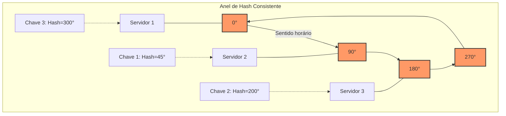
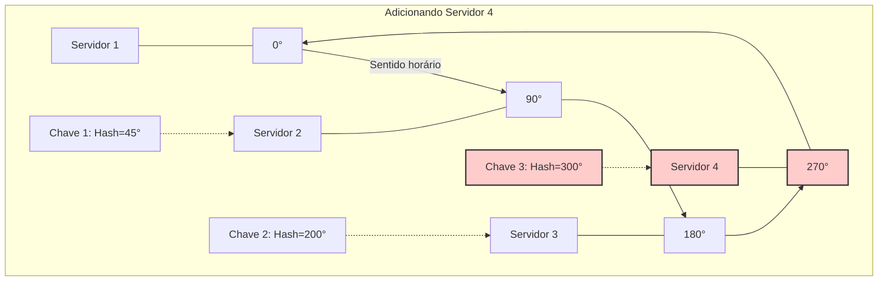
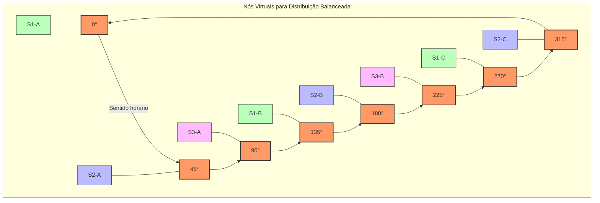
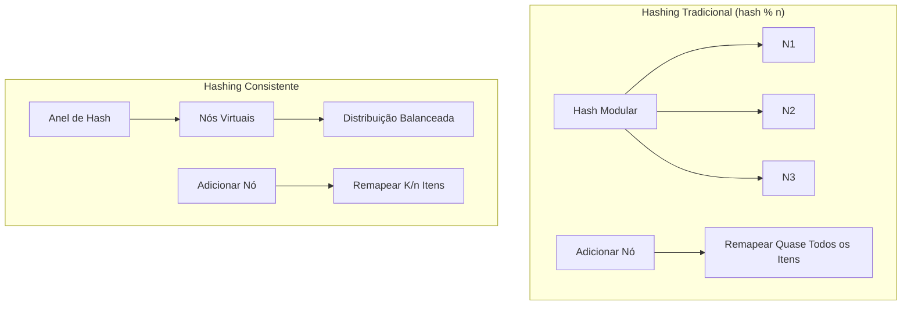

# Consistent Hashing (Hash Consistente)

## Definição e Visão Geral

Consistent Hashing é uma técnica de distribuição de dados que minimiza a reorganização de dados quando o número de nós em um sistema distribuído muda. Esta técnica é crucial para sistemas distribuídos, pois permite adicionar ou remover nós com impacto mínimo na distribuição geral dos dados.

No hashing tradicional (como em `hash(key) % n`, onde n é o número de servidores), a adição ou remoção de um servidor requer o remapeamento de quase todos os itens. Com o hashing consistente, apenas uma fração dos itens precisa ser remapeada, tipicamente apenas `K/n` itens, onde K é o número total de itens e n é o número de nós.

O hash consistente funciona mapeando tanto os dados quanto os servidores para o mesmo "espaço de hash" circular (geralmente representado como um anel de 0 a 2^n - 1). Cada item de dados é atribuído ao primeiro servidor encontrado ao percorrer o anel no sentido horário a partir da posição do hash do item.

## Diagramas

### Anel de Hash Consistente



### Adição de um Novo Servidor



### Virtual Nodes (Nós Virtuais)



## Casos de Uso

- **Sistemas de Cache Distribuído**: Memcached, Redis Cluster
- **Bancos de Dados Distribuídos**: Cassandra, DynamoDB, Riak
- **Sistemas de Armazenamento de Conteúdo**: Sistemas CDN, armazenamento de objetos
- **Balanceamento de carga**: Distribuição de requisições entre servidores web
- **Sharding de Banco de Dados**: Particionar dados entre múltiplas instâncias de banco de dados
- **Sistemas P2P (peer-to-peer)**: Distribuição de responsabilidade entre nós

## Exemplos Práticos

### Implementação Básica em Python

```python
import hashlib
import bisect

class ConsistentHash:
    def __init__(self, nodes=None, replicas=100):
        """
        nodes: lista inicial de nós
        replicas: número de nós virtuais por nó real
        """
        self.replicas = replicas
        self.ring = {}  # Mapeamento posição -> nó
        self.sorted_keys = []  # Lista ordenada de posições no anel
        
        if nodes:
            for node in nodes:
                self.add_node(node)
    
    def _hash(self, key):
        """Gera um hash para a chave"""
        key_bytes = str(key).encode('utf-8')
        return int(hashlib.md5(key_bytes).hexdigest(), 16)
    
    def add_node(self, node):
        """Adiciona um nó ao anel"""
        for i in range(self.replicas):
            # Cria múltiplos pontos no anel para cada nó (nós virtuais)
            key = self._hash(f"{node}:{i}")
            self.ring[key] = node
            bisect.insort(self.sorted_keys, key)
    
    def remove_node(self, node):
        """Remove um nó do anel"""
        for i in range(self.replicas):
            key = self._hash(f"{node}:{i}")
            if key in self.ring:
                del self.ring[key]
                index = bisect.bisect_left(self.sorted_keys, key)
                if index < len(self.sorted_keys) and self.sorted_keys[index] == key:
                    del self.sorted_keys[index]
    
    def get_node(self, key):
        """Retorna o nó responsável pela chave"""
        if not self.ring:
            return None
        
        hash_key = self._hash(key)
        
        # Encontra a posição no anel
        index = bisect.bisect(self.sorted_keys, hash_key)
        if index == len(self.sorted_keys):
            # Volta ao início do anel
            index = 0
        
        # Retorna o nó nessa posição
        return self.ring[self.sorted_keys[index]]

# Exemplo de uso
servers = ['server1', 'server2', 'server3']
ch = ConsistentHash(servers)

# Distribuir dados
for data in ['user1', 'user2', 'user3', 'user4', 'user5']:
    server = ch.get_node(data)
    print(f"Data: {data} -> Server: {server}")

# Adicionar um novo servidor
ch.add_node('server4')
print("\nApós adicionar server4:")
for data in ['user1', 'user2', 'user3', 'user4', 'user5']:
    server = ch.get_node(data)
    print(f"Data: {data} -> Server: {server}")
```

### Configuração no Redis Cluster

```bash
# Exemplo de configuração de um nó Redis para hashing consistente

# cluster-enabled yes
# cluster-config-file nodes.conf
# cluster-node-timeout 5000
# cluster-require-full-coverage no

# No primeiro nó
redis-cli --cluster create 127.0.0.1:7000 127.0.0.1:7001 127.0.0.1:7002 \
  --cluster-replicas 1

# Adicionar um novo nó (automaticamente rebalanceia apenas parte dos slots)
redis-cli --cluster add-node 127.0.0.1:7003 127.0.0.1:7000
redis-cli --cluster rebalance 127.0.0.1:7000 --cluster-use-empty-masters
```

### Uso em Cassandra

```yaml
# cassandra.yaml - configuração para hashing consistente
partitioner: org.apache.cassandra.dht.Murmur3Partitioner

# Definição de token para posicionar o nó no anel
# inicial_token: 0

# O Cassandra utiliza uma abordagem de "token range" baseada em hashing consistente
# Cada nó é responsável por um intervalo específico do anel de hash
```

## Benefícios do Hashing Consistente

### Comparação: Hashing Tradicional vs. Hashing Consistente



### Principais Vantagens:

1. **Redistribuição Mínima**: Quando servidores são adicionados ou removidos, apenas uma fração dos dados precisa ser movida
2. **Escalabilidade Horizontal**: Facilita adicionar ou remover nós sem interrupção do serviço
3. **Balanceamento de Carga**: Com nós virtuais, distribui dados de forma mais uniforme
4. **Tolerância a Falhas**: Quando um nó falha, seus dados são redistribuídos apenas para nós adjacentes
5. **Localidade de Dados**: Itens relacionados podem ser agrupados no mesmo nó utilizando funções de hash apropriadas

## Prós e Contras

### Prós
- Minimiza a reorganização de dados durante mudanças de topologia
- Facilita a escalabilidade horizontal
- Distribui carga de maneira mais uniforme (com nós virtuais)
- Permite adicionar/remover nós com impacto mínimo
- Ideal para sistemas distribuídos dinâmicos
- Melhora resiliência e disponibilidade

### Contras
- Complexidade adicional na implementação e manutenção
- Distribuição pode ainda ser desigual sem técnicas como nós virtuais
- Alguns algoritmos podem ser intensivos em memória
- Requer gestão cuidadosa de nós virtuais para evitar sobrecarga
- Funções de hash podem afetar significativamente a distribuição

## Melhores Práticas

1. **Use nós virtuais**: Crie múltiplos pontos no anel para cada servidor físico para melhor distribuição.

2. **Escolha funções de hash adequadas**: Prefira funções que gerem distribuição uniforme, como Murmur3 ou MD5.

3. **Balance servidores com capacidades diferentes**: Atribua mais nós virtuais proporcionalmente à capacidade.

4. **Monitore distribuição**: Verifique regularmente a carga em cada nó para identificar hotspots.

5. **Implemente mecanismos de rebalanceamento**: Para casos onde a distribuição se torna muito desigual.

6. **Considere topologias físicas**: Em sistemas geograficamente distribuídos, considere proximidade de rede.

7. **Gerencie falhas**: Implemente detecção de falhas e mecanismos de recuperação automáticos.

8. **Cache resultados do hash**: Para evitar recalcular repetidamente a mesma informação.

## Variações e Técnicas Avançadas

### Jump Hash
Um algoritmo de hash consistente sem estado que não requer armazenamento de um anel de hash.

```python
def jump_hash(key, num_buckets):
    b = -1
    j = 0
    while j < num_buckets:
        b = j
        key = ((key * 2862933555777941757) + 1) & 0xffffffffffffffff
        j = int(float(b + 1) * (float(1 << 31) / float((key >> 33) + 1)))
    return b
```

### Rendezvous Hashing (Highest Random Weight)
Outra técnica de hash consistente onde cada chave é mapeada para o servidor com o maior "peso" calculado.

```python
def rendezvous_hash(key, servers):
    max_weight = -1
    max_server = None
    
    for server in servers:
        weight = hash(f"{key}:{server}")
        if weight > max_weight:
            max_weight = weight
            max_server = server
    
    return max_server
```

### Maglev Hashing
Utilizado no balanceador de carga Maglev do Google, otimizado para alta performance.

## Tecnologias que Utilizam Hashing Consistente

- **Redis Cluster**: Para distribuição de dados e gerenciamento de shards
- **Cassandra**: Para particionamento de dados entre nós
- **DynamoDB**: Para distribuição de dados em sua tabela de partição
- **Memcached**: Implementações como libketama usam hash consistente
- **Akamai CDN**: Para rotear requisições aos servidores edge
- **gRPC**: Para balanceamento de carga entre servidores
- **Nginx**: Com módulos de upstream consistentes
- **HAProxy**: Com algoritmo de hash consistente opcional
- **Elasticsearch**: Para alocação de shards
- **Varnish Cache**: Para distribuição de cache

## Referências

- Karger, D., et al. (1997). Consistent Hashing and Random Trees: Distributed Caching Protocols for Relieving Hot Spots on the World Wide Web. ACM Symposium on Theory of Computing.
- Lamping, J., & Veach, E. (2014). A Fast, Minimal Memory, Consistent Hash Algorithm. arXiv preprint arXiv:1406.2294.
- DeCandia, G., et al. (2007). Dynamo: Amazon's Highly Available Key-value Store. SOSP '07: Proceedings of twenty-first ACM SIGOPS symposium on Operating systems principles.
- Stoica, I., et al. (2001). Chord: A Scalable Peer-to-peer Lookup Service for Internet Applications. SIGCOMM '01.
- Redis Labs. (2023). Redis Cluster Specification. https://redis.io/topics/cluster-spec
- Datastax. (2023). Data Distribution in the Cassandra Database. https://docs.datastax.com/en/cassandra/3.0/cassandra/architecture/archDataDistributeDistribute.html
- Google. (2016). Maglev: A Fast and Reliable Software Network Load Balancer. NSDI '16.
- Nginx. (2023). Using the Consistent Hash Load Balancing Method. https://docs.nginx.com/nginx/admin-guide/load-balancer/http-load-balancer/#consistent-hash
