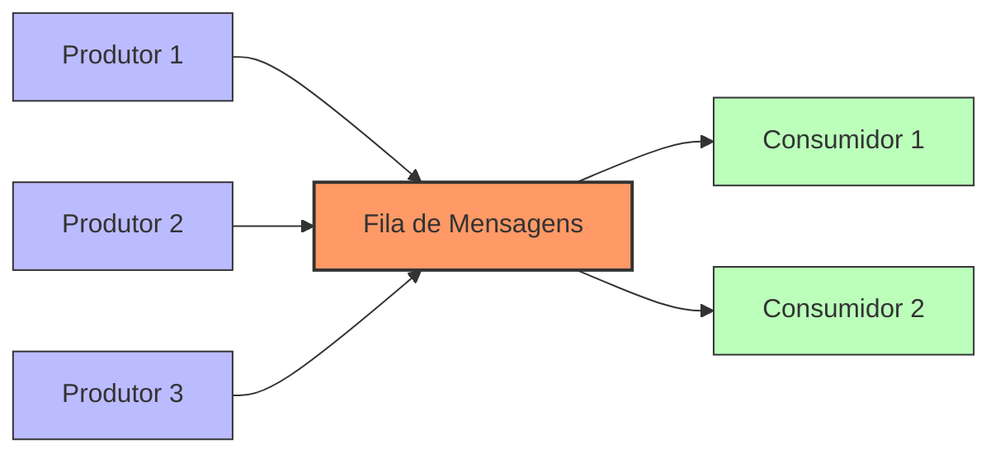
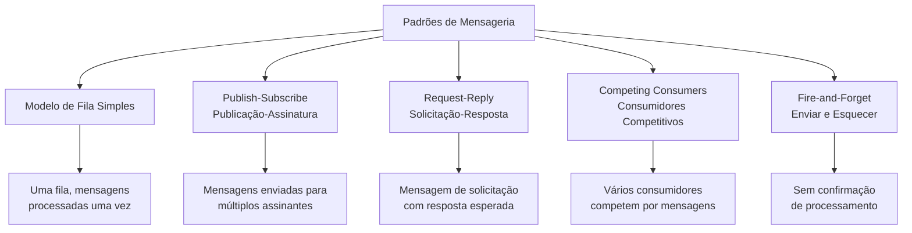
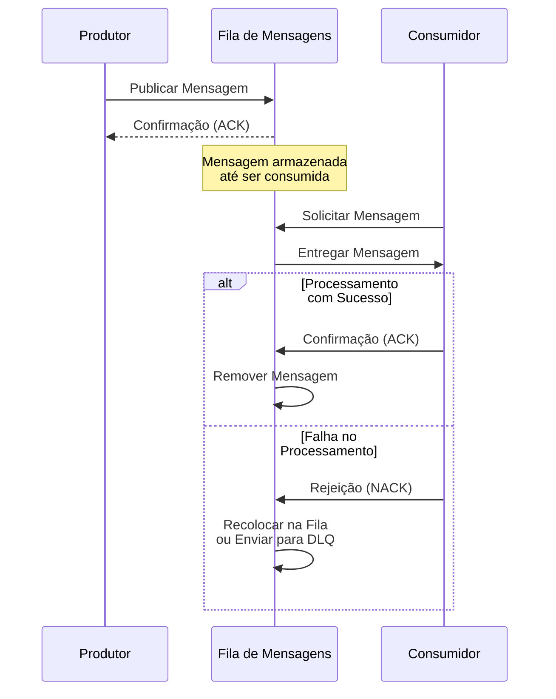
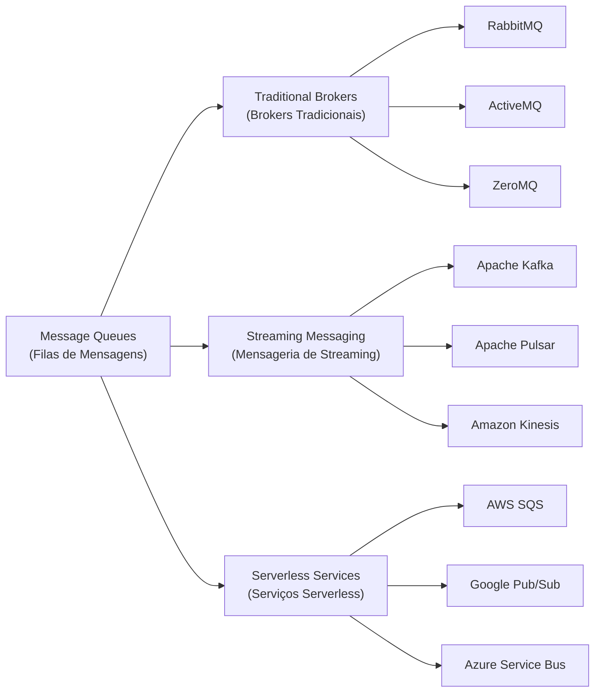
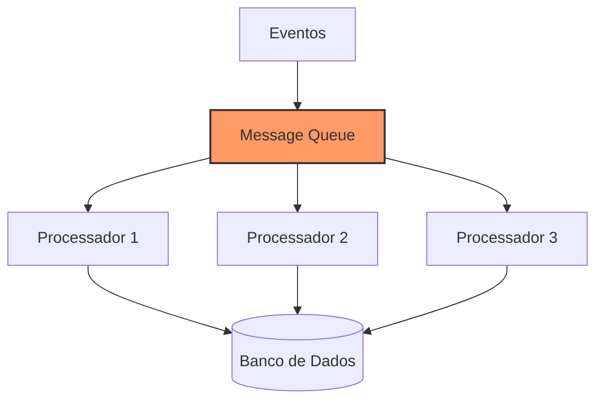
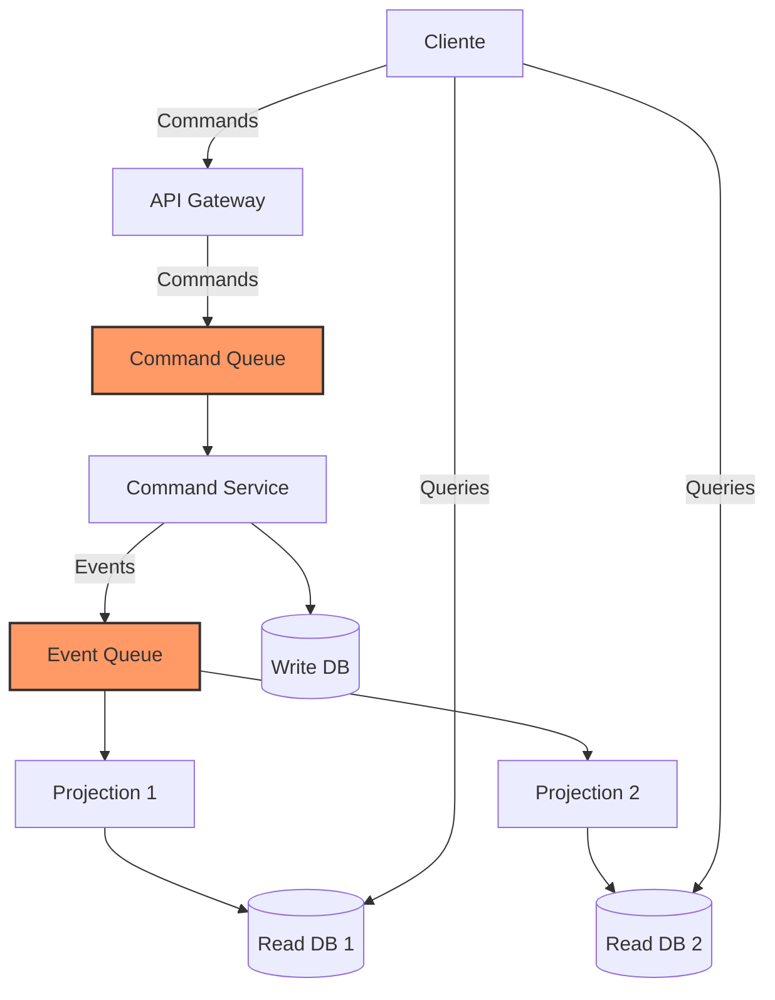
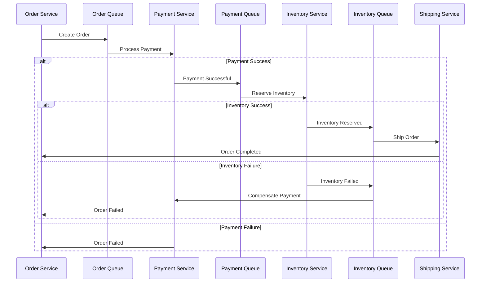
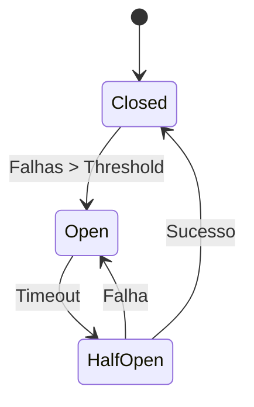

# Message Queues (Filas de Mensagens)

## Definição e Visão Geral

Message Queues (Filas de Mensagens) são componentes de arquitetura de software que permitem a comunicação assíncrona entre diferentes partes de um sistema ou entre sistemas diferentes. Elas funcionam como intermediários que recebem, armazenam e entregam mensagens, permitindo que os produtores e consumidores de mensagens operem de forma desacoplada e independente.

Uma fila de mensagens implementa o padrão produtor-consumidor, onde os produtores enviam mensagens para a fila sem conhecimento direto de quem irá processá-las, e os consumidores as recebem e processam sem necessariamente conhecer sua origem. Esse desacoplamento traz flexibilidade, resiliência e escalabilidade para sistemas distribuídos.

## Diagramas

### Arquitetura Básica de Message Queue



### Padrões de Mensageria



### Fluxo de Processamento de Mensagens



## Casos de Uso

- **Balanceamento de carga**: Distribuir tarefas entre vários workers
- **Desacoplamento de serviços**: Permitir que componentes operem independentemente
- **Processamento assíncrono**: Executar tarefas demoradas em background
- **Buffering e throttling**: Gerenciar picos de tráfego e controlar a taxa de processamento
- **Garantia de entrega**: Assegurar que mensagens sejam processadas mesmo em caso de falhas
- **Integração entre sistemas**: Conectar aplicações heterogêneas
- **Processamento de eventos**: Implementar arquiteturas orientadas a eventos
- **Microbatching**: Agrupar mensagens para processamento eficiente

## Exemplos Práticos

### RabbitMQ - Exemplo em Python

Produtor:
```python
import pika

# Conexão com o RabbitMQ
connection = pika.BlockingConnection(pika.ConnectionParameters('localhost'))
channel = connection.channel()

# Declaração da fila
channel.queue_declare(queue='tarefas', durable=True)

# Publicação da mensagem
mensagem = "Tarefa de processamento #1"
channel.basic_publish(
    exchange='',
    routing_key='tarefas',
    body=mensagem,
    properties=pika.BasicProperties(
        delivery_mode=2,  # Mensagem persistente
    )
)

print(f"Enviado: {mensagem}")
connection.close()
```

Consumidor:
```python
import pika
import time

# Conexão com o RabbitMQ
connection = pika.BlockingConnection(pika.ConnectionParameters('localhost'))
channel = connection.channel()

# Declaração da fila
channel.queue_declare(queue='tarefas', durable=True)

# Função de callback para processar mensagens
def callback(ch, method, properties, body):
    print(f"Recebido: {body.decode()}")
    # Simulação de trabalho pesado
    time.sleep(3)
    print("Processamento concluído")
    # Confirmação de processamento
    ch.basic_ack(delivery_tag=method.delivery_tag)

# Configurar para não enviar mais de uma mensagem por vez para um worker
channel.basic_qos(prefetch_count=1)

# Registrar o consumidor
channel.basic_consume(queue='tarefas', on_message_callback=callback)

print("Aguardando mensagens. Para sair pressione CTRL+C")
channel.start_consuming()
```

### Apache Kafka - Exemplo em Java

Produtor:
```java
import org.apache.kafka.clients.producer.*;
import java.util.Properties;

public class ExemploProdutor {
    public static void main(String[] args) {
        Properties props = new Properties();
        props.put("bootstrap.servers", "localhost:9092");
        props.put("key.serializer", "org.apache.kafka.common.serialization.StringSerializer");
        props.put("value.serializer", "org.apache.kafka.common.serialization.StringSerializer");
        
        Producer<String, String> producer = new KafkaProducer<>(props);
        
        for (int i = 0; i < 10; i++) {
            String mensagem = "Mensagem #" + i;
            ProducerRecord<String, String> record = 
                new ProducerRecord<>("meu-topico", "chave-" + i, mensagem);
            
            producer.send(record, new Callback() {
                public void onCompletion(RecordMetadata metadata, Exception e) {
                    if (e != null) {
                        e.printStackTrace();
                    } else {
                        System.out.println("Mensagem enviada para partição " + 
                            metadata.partition() + ", offset: " + metadata.offset());
                    }
                }
            });
        }
        
        producer.close();
    }
}
```

Consumidor:
```java
import org.apache.kafka.clients.consumer.*;
import java.time.Duration;
import java.util.*;

public class ExemploConsumidor {
    public static void main(String[] args) {
        Properties props = new Properties();
        props.put("bootstrap.servers", "localhost:9092");
        props.put("group.id", "grupo-consumidor-1");
        props.put("key.deserializer", "org.apache.kafka.common.serialization.StringDeserializer");
        props.put("value.deserializer", "org.apache.kafka.common.serialization.StringDeserializer");
        props.put("auto.offset.reset", "earliest");
        
        Consumer<String, String> consumer = new KafkaConsumer<>(props);
        consumer.subscribe(Arrays.asList("meu-topico"));
        
        try {
            while (true) {
                ConsumerRecords<String, String> records = consumer.poll(Duration.ofMillis(100));
                
                for (ConsumerRecord<String, String> record : records) {
                    System.out.printf("Tópico = %s, Partição = %d, Offset = %d, " +
                            "Chave = %s, Valor = %s%n", 
                        record.topic(), record.partition(), record.offset(),
                        record.key(), record.value());
                }
            }
        } finally {
            consumer.close();
        }
    }
}
```

### AWS SQS - Exemplo com AWS SDK (Node.js)

Produtor:
```javascript
const { SQSClient, SendMessageCommand } = require("@aws-sdk/client-sqs");

// Configuração do cliente SQS
const sqsClient = new SQSClient({ region: "us-east-1" });

const enviarMensagem = async () => {
  const comando = new SendMessageCommand({
    QueueUrl: "https://sqs.us-east-1.amazonaws.com/123456789012/MinhaFila",
    MessageBody: JSON.stringify({
      id: "123",
      tipo: "novo_pedido",
      dados: {
        cliente: "João Silva",
        itens: [
          { produto: "Camiseta", quantidade: 2, preco: 29.90 },
          { produto: "Calça Jeans", quantidade: 1, preco: 89.90 }
        ]
      }
    }),
    DelaySeconds: 0,
    MessageAttributes: {
      "TipoEvento": {
        DataType: "String",
        StringValue: "novo_pedido"
      }
    }
  });

  try {
    const response = await sqsClient.send(comando);
    console.log("Mensagem enviada com sucesso:", response.MessageId);
  } catch (err) {
    console.error("Erro ao enviar mensagem:", err);
  }
};

enviarMensagem();
```

Consumidor:
```javascript
const { SQSClient, ReceiveMessageCommand, DeleteMessageCommand } = require("@aws-sdk/client-sqs");

// Configuração do cliente SQS
const sqsClient = new SQSClient({ region: "us-east-1" });
const queueUrl = "https://sqs.us-east-1.amazonaws.com/123456789012/MinhaFila";

const receberMensagens = async () => {
  const comando = new ReceiveMessageCommand({
    QueueUrl: queueUrl,
    MaxNumberOfMessages: 10,
    WaitTimeSeconds: 20,
    MessageAttributeNames: ["All"]
  });

  try {
    const response = await sqsClient.send(comando);
    
    if (response.Messages) {
      console.log(`Recebidas ${response.Messages.length} mensagens`);
      
      for (const message of response.Messages) {
        console.log("Processando mensagem:", message.MessageId);
        const body = JSON.parse(message.Body);
        
        // Processar a mensagem
        await processarMensagem(body);
        
        // Remover da fila após processamento
        await removerMensagem(message.ReceiptHandle);
      }
    } else {
      console.log("Nenhuma mensagem recebida");
    }
  } catch (err) {
    console.error("Erro ao receber mensagens:", err);
  }
};

const processarMensagem = async (dados) => {
  console.log("Processando dados:", dados);
  // Lógica de processamento aqui
};

const removerMensagem = async (receiptHandle) => {
  const comando = new DeleteMessageCommand({
    QueueUrl: queueUrl,
    ReceiptHandle: receiptHandle
  });
  
  try {
    await sqsClient.send(comando);
    console.log("Mensagem removida da fila");
  } catch (err) {
    console.error("Erro ao remover mensagem:", err);
  }
};

// Executar periodicamente para poll contínuo
setInterval(receberMensagens, 30000);
```

## Comparativo de Sistemas de Mensageria

### Tipos de Message Queues



### Comparativo de Features

| Feature/Sistema | RabbitMQ | Apache Kafka | AWS SQS/SNS | Google Pub/Sub | ActiveMQ |
|-----------------|----------|--------------|-------------|----------------|----------|
| **Modelo Principal** | Multiple | Pub/Sub | Queue/Pub/Sub | Pub/Sub | Multiple |
| **Garantia de Entrega** | Forte | Forte (com acks) | Pelo menos uma vez | Pelo menos uma vez | Forte |
| **Persistência** | Memória/Disco | Disco (Log) | Gerenciado | Gerenciado | Memória/Disco |
| **Escalabilidade** | Cluster | Alta | Automática | Automática | Cluster |
| **Ordem de Mensagens** | Garantida | Por partição | Não garante/FIFO | Não garante | Garantida |
| **Retenção** | Até consumo | Configurável | 14 dias (máx) | 7 dias (default) | Até consumo |
| **Performance** | Média-Alta | Muito Alta | Alta | Alta | Média |
| **Deployment** | Self-hosted | Self/Cloud | Serverless | Serverless | Self-hosted |
| **Protocolos** | AMQP, MQTT, etc | Proprietário | HTTP/S, SQS | gRPC, HTTP | JMS, AMQP, etc |
| **Casos de Uso Ideal** | Aplicações Complexas | Streaming de Eventos | Integração Cloud | Integração GCP | Sistemas Java |

## Arquiteturas com Message Queues

### Arquitetura Event-Driven



### Arquitetura CQRS (Command Query Responsibility Segregation)



## Prós e Contras

### Prós
- **Desacoplamento**: Sistemas produtores e consumidores não precisam conhecer um ao outro
- **Escalabilidade**: Facilita a distribuição de carga entre múltiplos consumidores
- **Resiliência**: Continua funcionando mesmo se parte do sistema falhar
- **Buffering**: Gerencia picos de tráfego e diferenças de velocidade entre sistemas
- **Garantia de entrega**: Assegura que mensagens não sejam perdidas
- **Ordenação**: Alguns sistemas garantem a ordem de processamento das mensagens
- **Elasticidade**: Permite adicionar/remover consumidores conforme necessário

### Contras
- **Complexidade**: Adiciona componentes e pontos de falha ao sistema
- **Latência**: Introduz atraso no processamento end-to-end
- **Duplicação**: Pode ocorrer processamento duplicado em certos cenários
- **Debugging**: Torna o rastreamento de problemas mais complexo
- **Manutenção**: Requer monitoramento e gerenciamento adicional
- **Eventual Consistency**: Pode levar a inconsistências temporárias de dados
- **Overhead**: Custo adicional em termos de recursos e infraestrutura

## Melhores Práticas

1. **Idempotência**: Garanta que o processamento de uma mesma mensagem múltiplas vezes não cause efeitos colaterais indesejados.

2. **Dead Letter Queues (DLQ)**: Implemente filas de mensagens mortas para capturar mensagens que não puderam ser processadas.

3. **Monitoramento e Alertas**: Monitore tamanho de filas, taxa de processamento e erros.

4. **Controle de Retry**: Defina políticas de retry com backoff exponencial para lidar com falhas temporárias.

5. **Granularidade Adequada**: Defina o tamanho e escopo correto das mensagens para sua aplicação.

6. **Schemas e Versionamento**: Mantenha compatibilidade entre versões de produtores e consumidores.

7. **Segregação de Filas**: Separe mensagens por tipo ou criticidade em filas diferentes.

8. **Performance Tuning**: Ajuste parâmetros como prefetch count, batch size e paralelismo de acordo com seu caso de uso.

9. **Segurança**: Implemente autenticação, autorização e criptografia adequadas.

10. **Testes de Carga e Resiliência**: Verifique como seu sistema se comporta sob carga alta e em cenários de falha.

## Padrões Avançados

### Saga Pattern (Padrão Saga)



### Circuit Breaker (Disjuntor)



## Tecnologias e Ferramentas

### Message Brokers
- **RabbitMQ**: Message broker completo com suporte a múltiplos protocolos
- **Apache Kafka**: Plataforma distribuída de streaming de eventos
- **Apache Pulsar**: Sistema de mensageria pub-sub distribuído
- **ActiveMQ/Artemis**: Message broker baseado em JMS
- **NATS**: Sistema de mensageria leve e de alta performance
- **ZeroMQ**: Biblioteca de mensageria embarcada

### Serviços Gerenciados
- **AWS SQS/SNS**: Simple Queue Service e Simple Notification Service
- **Amazon Kinesis**: Processamento de dados de streaming
- **Google Cloud Pub/Sub**: Serviço global de messaging e ingestão
- **Azure Service Bus**: Serviço de mensageria empresarial
- **IBM MQ**: Middleware de mensageria corporativa
- **Redis Streams**: Implementação de log de mensagens no Redis

### Frameworks e Bibliotecas
- **Spring Integration**: Framework para integração em Java
- **Apache Camel**: Framework de integração com múltiplos componentes
- **MassTransit**: Framework de mensageria para .NET
- **Celery**: Sistema de fila de tarefas para Python
- **Bull**: Biblioteca de filas de tarefas para Node.js baseada em Redis
- **NServiceBus**: Framework de service bus para .NET

## Referências

- Kleppmann, M. (2017). Designing Data-Intensive Applications. O'Reilly Media.
- Hohpe, G., & Woolf, B. (2003). Enterprise Integration Patterns. Addison-Wesley.
- Newman, S. (2021). Building Microservices (2nd ed.). O'Reilly Media.
- Kreps, J. (2013). The Log: What every software engineer should know about real-time data's unifying abstraction. LinkedIn Engineering.
- Richardson, C. (2019). Microservices Patterns. Manning Publications.
- RabbitMQ. (2023). RabbitMQ Documentation. https://www.rabbitmq.com/documentation.html
- Apache Kafka. (2023). Apache Kafka Documentation. https://kafka.apache.org/documentation/
- AWS. (2023). Amazon SQS Developer Guide. https://docs.aws.amazon.com/AWSSimpleQueueService/latest/SQSDeveloperGuide/
- Google Cloud. (2023). Google Cloud Pub/Sub Documentation. https://cloud.google.com/pubsub/docs
- Vernon, V. (2016). Domain-Driven Design Distilled. Addison-Wesley.
