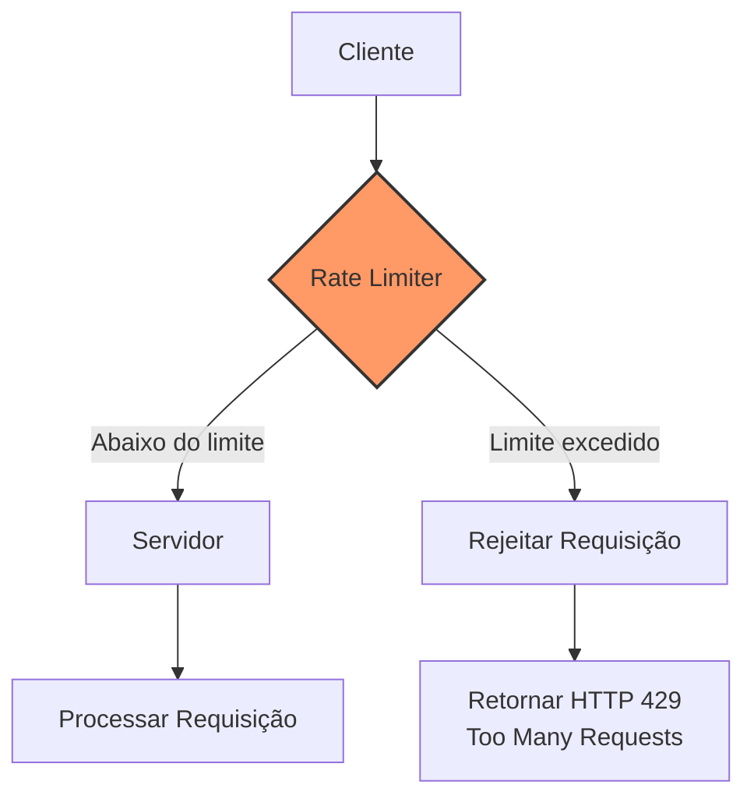
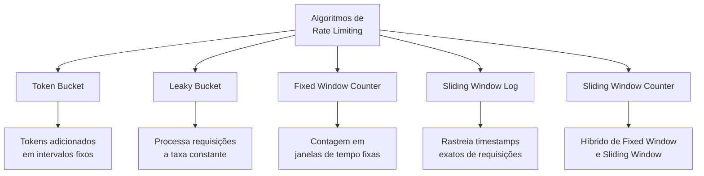
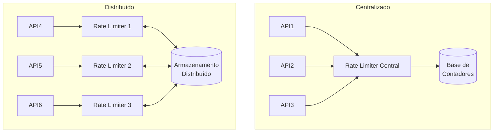
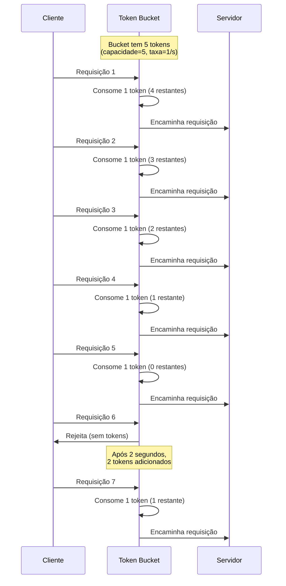
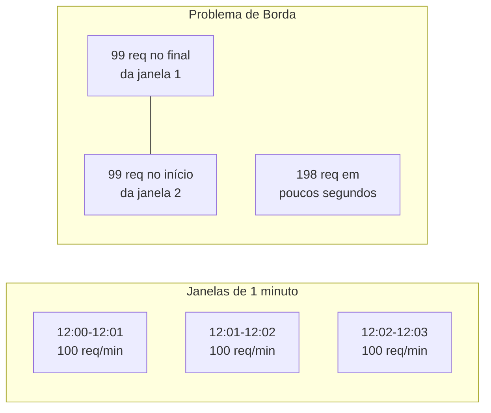
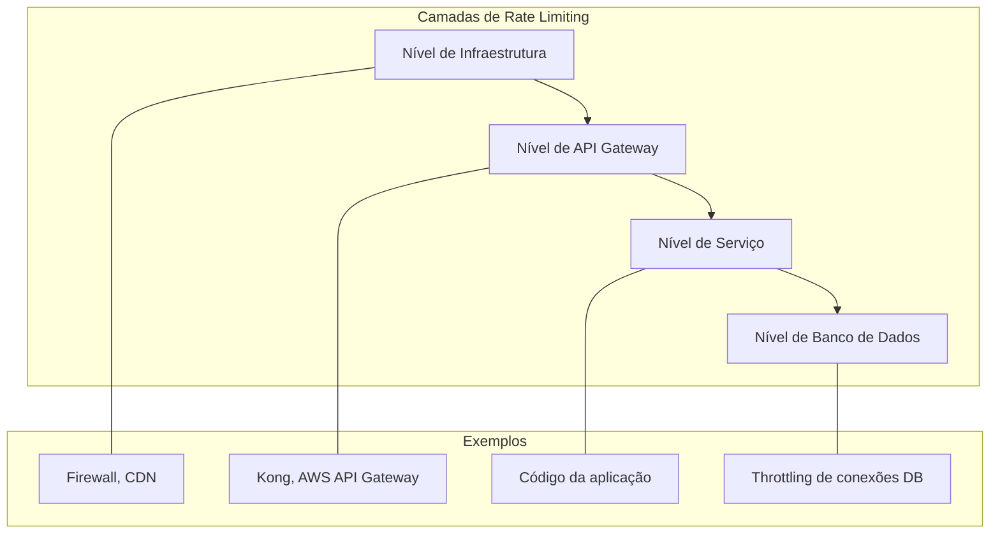
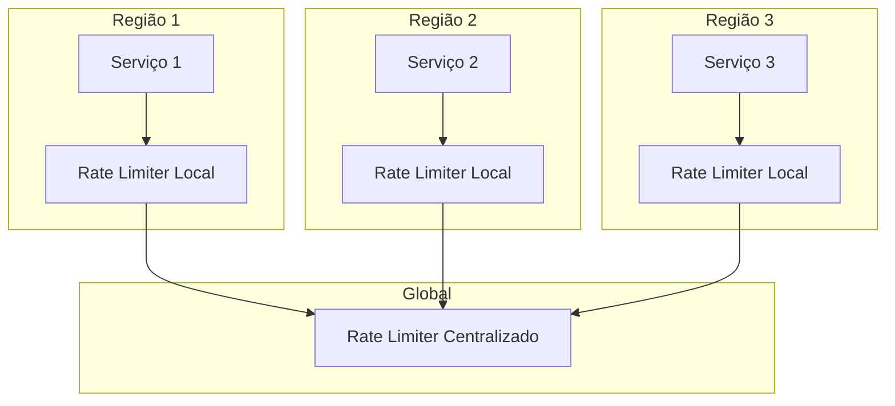

# 🚦 Rate Limiting (Limitação de Taxa)

## Definição e Visão Geral

Rate Limiting (Limitação de Taxa) é uma técnica usada para controlar a quantidade de solicitações que um cliente ou serviço pode fazer a um sistema em um determinado período de tempo. Esse conceito é fundamental para proteger sistemas contra uso excessivo, seja intencional (como ataques de negação de serviço) ou não intencional (como loops infinitos em código cliente).

A limitação de taxa estabelece limites claros sobre o número de ações ou solicitações permitidas, evitando que qualquer cliente único consuma recursos de forma desproporcional, garantindo assim uma distribuição justa de recursos do sistema e melhorando a disponibilidade e estabilidade para todos os usuários.

## Diagramas

### Fluxo Básico de Rate Limiting



### Algoritmos Comuns de Rate Limiting



### Implementação Centralizada vs. Distribuída



## Casos de Uso

- **APIs públicas**: Limitar o uso por cliente para garantir disponibilidade para todos
- **Proteção contra ataques**: Mitigar ataques DDoS ou brute force
- **Priorização de tráfego**: Favorecer clientes premium sobre planos gratuitos
- **Proteção de recursos com custo**: Limitar acesso a recursos externos cobrados por uso
- **Controle de QoS**: Manter qualidade de serviço em períodos de carga alta
- **Rate limiting por usuário**: Evitar que um único usuário consuma recursos excessivamente
- **Throttling de operações caras**: Limitar operações que consumam muitos recursos computacionais
- **Prevenção de spam**: Impedir envios repetitivos de conteúdo

## Exemplos Práticos

### Implementation do Token Bucket em Python

```python
import time

class TokenBucket:
    def __init__(self, capacity, refill_rate):
        """
        Inicializa um bucket de tokens
        :param capacity: Capacidade máxima do bucket
        :param refill_rate: Taxa de reabastecimento em tokens/segundo
        """
        self.capacity = capacity
        self.refill_rate = refill_rate
        self.tokens = capacity  # Começa cheio
        self.last_refill = time.time()
        
    def _refill(self):
        """Reabastece o bucket com tokens baseado no tempo decorrido"""
        now = time.time()
        elapsed = now - self.last_refill
        new_tokens = elapsed * self.refill_rate
        
        if new_tokens > 0:
            self.tokens = min(self.capacity, self.tokens + new_tokens)
            self.last_refill = now
    
    def consume(self, tokens=1):
        """
        Tenta consumir tokens do bucket
        :param tokens: Número de tokens a consumir
        :return: True se tokens foram consumidos, False caso contrário
        """
        self._refill()
        
        if tokens <= self.tokens:
            self.tokens -= tokens
            return True
        return False


# Exemplo de uso
limiter = TokenBucket(capacity=10, refill_rate=1)  # 10 tokens max, 1 token/s

def handle_request(request_id):
    if limiter.consume():
        print(f"Processando requisição {request_id}")
        # Lógica para processar a requisição
        return True
    else:
        print(f"Requisição {request_id} rejeitada: limite excedido")
        return False

# Simulação de burst de requisições
for i in range(15):
    handle_request(i)

# Simulação de requisições ao longo do tempo
print("\nAguardando reabastecimento...")
time.sleep(5)  # Espera 5 segundos (5 tokens reabastecidos)
print("Após 5 segundos:")
for i in range(15, 20):
    handle_request(i)
```

### Rate Limiting com Redis

```python
import redis
import time

class RedisRateLimiter:
    def __init__(self, redis_client, key_prefix, limit, window):
        """
        Implementa rate limiting usando Redis
        :param redis_client: Cliente Redis
        :param key_prefix: Prefixo para chaves (ex: 'ip:', 'user:')
        :param limit: Número máximo de requisições
        :param window: Janela de tempo em segundos
        """
        self.redis = redis_client
        self.key_prefix = key_prefix
        self.limit = limit
        self.window = window
        
    def is_allowed(self, identifier):
        """
        Verifica se o identificador pode realizar a requisição
        :param identifier: Identificador único (IP, user_id, etc.)
        :return: True se permitido, False se limite excedido
        """
        key = f"{self.key_prefix}{identifier}"
        current_time = int(time.time())
        window_start = current_time - self.window
        
        # Transação Redis para garantir atomicidade
        pipe = self.redis.pipeline()
        
        # Remove contagens antigas
        pipe.zremrangebyscore(key, 0, window_start)
        # Adiciona requisição atual
        pipe.zadd(key, {current_time: current_time})
        # Conta requisições na janela
        pipe.zcount(key, window_start, current_time)
        # Define expiração da chave
        pipe.expire(key, self.window)
        
        _, _, count, _ = pipe.execute()
        
        return count <= self.limit

# Exemplo de uso
redis_client = redis.Redis(host='localhost', port=6379, db=0)
rate_limiter = RedisRateLimiter(
    redis_client=redis_client,
    key_prefix='ip:',
    limit=100,  # 100 requisições
    window=3600  # em uma janela de 1 hora
)

def process_api_request(user_ip, request_data):
    if rate_limiter.is_allowed(user_ip):
        # Processar requisição normalmente
        print(f"Processando requisição de {user_ip}")
        return {"status": "success", "data": "..."}
    else:
        # Rejeitar requisição
        print(f"Limite excedido para {user_ip}")
        return {"status": "error", "message": "Rate limit exceeded. Try again later."}
```

### Implementação em Nginx

```nginx
# Exemplo de configuração de rate limiting no Nginx

http {
    # Define uma zona compartilhada chamada "mylimit" com 10MB
    # que armazenará o estado de rate limiting
    limit_req_zone $binary_remote_addr zone=mylimit:10m rate=10r/s;
    
    server {
        listen 80;
        server_name api.example.com;
        
        location /api/ {
            # Aplica a zona de rate limiting
            limit_req zone=mylimit burst=20 nodelay;
            
            # Configuração normal da rota
            proxy_pass http://backend;
        }
        
        # Taxas diferentes para endpoints diferentes
        location /api/premium/ {
            # Taxa mais alta para usuários premium
            limit_req zone=mylimit burst=100 nodelay;
            proxy_pass http://backend;
        }
        
        # Endpoint específico com limitação mais restritiva
        location /api/expensive-operation {
            # Limita a 1 requisição por segundo
            limit_req zone=mylimit rate=1r/s;
            proxy_pass http://backend;
        }
    }
}
```

## Algoritmos de Rate Limiting em Detalhes

### Token Bucket

O algoritmo Token Bucket é um dos mais populares para controle de taxa. Ele consiste em um bucket que armazena tokens virtuais, adicionados a uma taxa constante até atingir a capacidade máxima. Cada requisição consome um token, e requisições que não encontram tokens disponíveis são rejeitadas ou enfileiradas.



### Leaky Bucket

O Leaky Bucket (Balde Furado) é similar ao Token Bucket, mas controla a taxa de saída das requisições, não a entrada. As requisições são enfileiradas em um buffer e processadas a uma taxa constante. Se o buffer estiver cheio, novas requisições são descartadas.

### Fixed Window Counter

O Fixed Window Counter divide o tempo em janelas fixas (por exemplo, 1 minuto) e permite um número máximo de requisições em cada janela. Este algoritmo é simples de implementar, mas pode permitir picos de tráfego nas bordas das janelas.



### Sliding Window Log

O Sliding Window Log mantém um registro com timestamp de cada requisição. Para verificar se uma nova requisição é permitida, conta-se o número de entradas no registro dentro da janela de tempo. Este método é preciso, mas pode consumir muita memória para aplicações com alto tráfego.

### Sliding Window Counter

O Sliding Window Counter combina as abordagens de Fixed Window e Sliding Window Log. Ele usa dois contadores de janelas fixas adjacentes e calcula uma média ponderada com base no quanto da janela atual já passou.

## Prós e Contras

### Prós
- **Proteção do sistema**: Previne sobrecarga por excesso de requisições
- **Justiça na distribuição de recursos**: Impede que usuários únicos monopolizem o sistema
- **Mitigação de ataques**: Reduz o impacto de ataques de negação de serviço
- **Controle de custos**: Limita uso de serviços externos pagos por consumo
- **QoS previsível**: Garante tempos de resposta consistentes
- **Priorização de tráfego**: Permite diferenciar níveis de serviço
- **Detecção de anomalias**: Identifica padrões de uso anormais
- **Facilita planejamento de capacidade**: Torna o consumo de recursos mais previsível

### Contras
- **Complexidade**: Adiciona mais uma camada ao sistema
- **Falsos positivos**: Pode bloquear tráfego legítimo em picos
- **Experiência do usuário**: Clientes podem enfrentar falhas temporárias
- **Configuração delicada**: Definir limites apropriados pode ser desafiador
- **Distribuição complexa**: Em sistemas distribuídos, sincronização pode ser difícil
- **Overhead**: Adiciona latência às requisições
- **Recurso adicional**: Requer infraestrutura e manutenção separadas

## Melhores Práticas

1. **Comunique claramente os limites**: Informe aos usuários sobre as limitações de taxa através de documentação e cabeçalhos HTTP.

2. **Use cabeçalhos padrão**: Retorne cabeçalhos como `X-RateLimit-Limit`, `X-RateLimit-Remaining` e `X-RateLimit-Reset` para APIs.

3. **Implemente backoff exponencial**: Oriente clientes a usar espera exponencial antes de tentar novamente.

4. **Defina limites granulares**: Adapte os limites por endpoint, tipo de usuário, ou importância da operação.

5. **Monitore e ajuste**: Monitore constantemente os padrões de uso e ajuste limites conforme necessário.

6. **Use queue para requisições excedentes**: Em vez de rejeitar imediatamente, considere enfileirar.

7. **Implementação centralizada**: Use uma solução centralizada para consistência em sistemas distribuídos.

8. **Considere limites por IP e por usuário**: Combine diferentes identificadores para melhor segurança.

9. **Teste extensivamente**: Simule cenários de alta carga para verificar o comportamento do rate limiter.

10. **Planeje a degradação gradual**: Reduza a qualidade de serviço progressivamente em vez de falhar abruptamente.

## Implementações em Diferentes Níveis

### Rate Limiting por Camada



### Limitação por Cliente
- **Por IP**: Limita requisições baseado no endereço IP
- **Por usuário**: Limita baseado no ID de usuário autenticado
- **Por API key**: Limita baseado na chave de API fornecida
- **Por conta/organização**: Limita agregando uso de múltiplos usuários

### Cabeçalhos HTTP para Rate Limiting

```
HTTP/1.1 429 Too Many Requests
Content-Type: application/json
X-RateLimit-Limit: 100
X-RateLimit-Remaining: 0
X-RateLimit-Reset: 1616180088
Retry-After: 60

{
  "error": "rate_limit_exceeded",
  "message": "You have exceeded the rate limit of 100 requests per hour.",
  "retry_after": 60
}
```

## Ferramentas e Implementações Populares

### Software e Bibliotecas
- **Redis Cell**: Módulo Redis com implementação de rate limiting
- **Nginx Rate Limiting**: Módulos nativos do Nginx para limitação
- **HAProxy Rate Limiting**: Configurações para controle de taxa
- **Guava RateLimiter**: Biblioteca Java para rate limiting
- **Resilience4j**: Framework Java com suporte a rate limiting
- **Throttled**: Biblioteca Go para rate limiting
- **Flask-Limiter**: Extensão Flask para Python
- **Express Rate Limit**: Middleware para Node.js
- **AWS WAF**: Rate limiting em nível de firewall de aplicação
- **Azure API Management**: Políticas de rate limiting

### Serviços em Nuvem
- **Cloudflare Rate Limiting**: Proteção em nível de CDN
- **AWS API Gateway**: Throttling e limites de rajada configuráveis
- **Google Cloud Armor**: Proteção contra abusos e DDoS
- **Azure Front Door**: Limitação em nível de WAF
- **Akamai API Gateway**: Controle granular de taxa de API

## Considerações para Arquiteturas Distribuídas



### Estratégias para Sistemas Distribuídos
1. **Sincronização periódica**: Os nós sincronizam contadores em intervalos regulares
2. **Armazenamento centralizado**: Todos os nós consultam uma store distribuída
3. **Particionamento**: Cada nó gerencia um subconjunto de clientes/tokens
4. **Rate limiting aproximado**: Técnicas probabilísticas como Count-Min Sketch
5. **Rate limiting em camadas**: Combinar limitação local e global

## Referências

- Kleppmann, M. (2017). Designing Data-Intensive Applications. O'Reilly Media.
- Nygard, M. T. (2018). Release It! (2nd ed.). Pragmatic Bookshelf.
- Fielding, R. T. (2000). Architectural Styles and the Design of Network-based Software Architectures. University of California, Irvine.
- Metriks, E. (2022). HTTP Rate Limiter Algorithms Explained. Medium Article.
- Richardson, C. (2018). Microservices Patterns. Manning Publications.
- Kong. (2023). Rate Limiting Documentation. https://docs.konghq.com/hub/kong-inc/rate-limiting/
- Nginx. (2023). Rate Limiting. https://www.nginx.com/blog/rate-limiting-nginx/
- AWS. (2023). API Gateway Request Throttling. https://docs.aws.amazon.com/apigateway/latest/developerguide/api-gateway-request-throttling.html
- Google Cloud. (2023). Rate Limiting. https://cloud.google.com/solutions/rate-limiting-strategies-techniques
- Redis. (2023). Rate Limiting with Redis. https://redis.io/commands/incr
