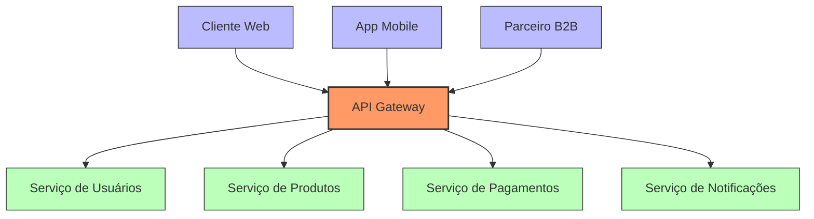
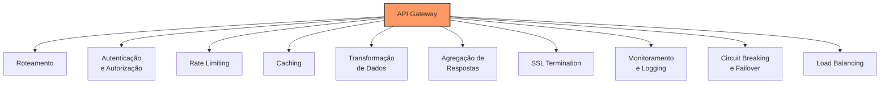
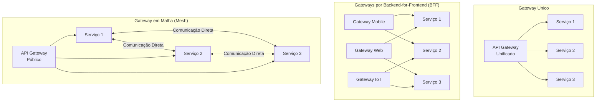
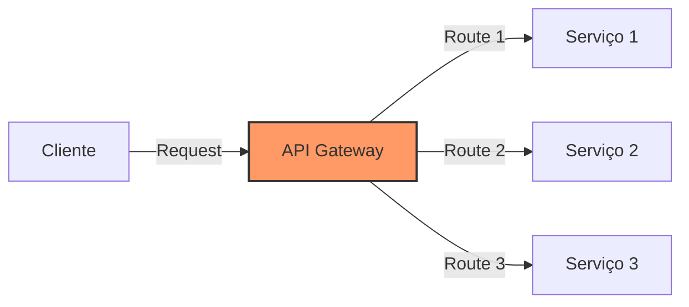
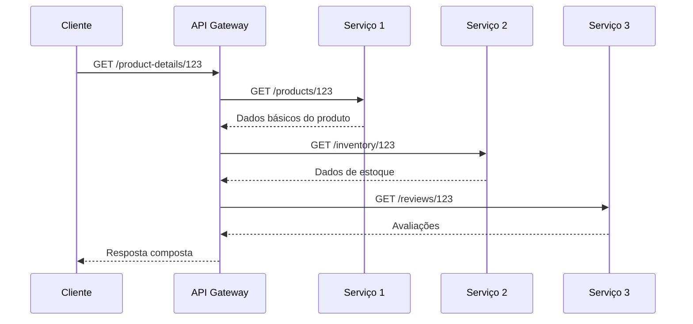
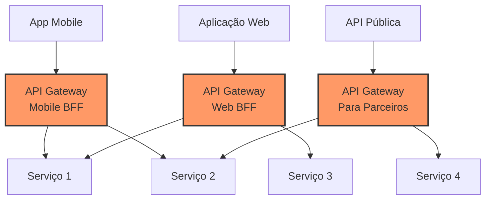
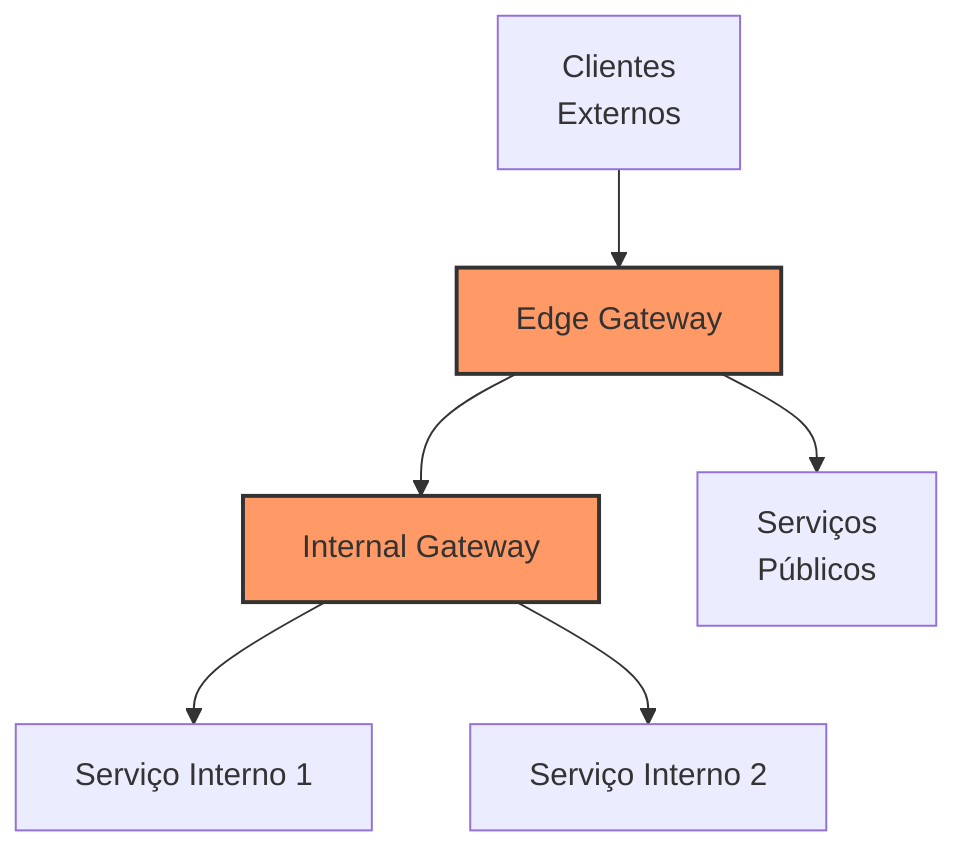

# 🚪 API Gateway (Gateway de API)

## Definição e Visão Geral

Um API Gateway (Gateway de API) é um componente arquitetônico que atua como ponto de entrada único para um conjunto de APIs e microserviços. Ele funciona como um intermediário entre os clientes (aplicações front-end, dispositivos móveis, sistemas externos) e os serviços de back-end, gerenciando o roteamento, composição e proteção das requisições.

O API Gateway serve como uma camada de abstração que oculta os detalhes da arquitetura interna de microserviços, proporcionando uma interface unificada para os clientes. Além do simples roteamento, um gateway de API moderno oferece funcionalidades como autenticação, autorização, limitação de taxa, cache, transformação de dados, agregação de respostas e monitoramento.

## Diagramas

### Arquitetura Básica de API Gateway



### Funções do API Gateway



### Padrões de API Gateway



## Casos de Uso

- **Arquiteturas de Microserviços**: Unificar o acesso a múltiplos microserviços
- **APIs Públicas**: Gerenciar, proteger e monetizar APIs expostas publicamente
- **Mobile Backend**: Otimizar APIs para uso em dispositivos móveis
- **Federação de APIs**: Unificar múltiplas APIs herdadas ou de terceiros
- **Multi-tenancy**: Isolar e personalizar rotas para diferentes inquilinos
- **Padrão BFF (Backend-for-Frontend)**: APIs especializadas para diferentes frontends
- **Controle de acesso granular**: Autenticação e autorização centralizadas
- **Modernização gradual**: Facilitar a migração de sistemas monolíticos

## Exemplos Práticos

### Configuração Básica no Kong

```yaml
# Declaração de serviços
services:
  - name: user-service
    url: http://user-service:8080
    routes:
      - name: user-routes
        paths:
          - /users
        strip_path: false
        
  - name: product-service
    url: http://product-service:8080
    routes:
      - name: product-routes
        paths:
          - /products
        strip_path: false

# Plugins globais
plugins:
  - name: rate-limiting
    config:
      minute: 60
      policy: local
      
  - name: key-auth
    config:
      key_names:
        - apikey
        
  - name: cors
    config:
      origins:
        - "*"
      methods:
        - GET
        - POST
        - PUT
        - DELETE
      headers:
        - Content-Type
        - Authorization
      credentials: true
      max_age: 3600
```

### Configuração no AWS API Gateway

```json
{
  "swagger": "2.0",
  "info": {
    "title": "E-commerce API",
    "version": "1.0.0"
  },
  "basePath": "/v1",
  "schemes": ["https"],
  "paths": {
    "/users": {
      "get": {
        "responses": {
          "200": {
            "description": "OK"
          }
        },
        "x-amazon-apigateway-integration": {
          "uri": "http://user-service.internal/users",
          "type": "http_proxy",
          "httpMethod": "GET",
          "responses": {
            "default": {
              "statusCode": "200"
            }
          },
          "connectionType": "VPC_LINK",
          "connectionId": "abcdef123456"
        }
      }
    },
    "/products": {
      "get": {
        "responses": {
          "200": {
            "description": "OK"
          }
        },
        "x-amazon-apigateway-integration": {
          "uri": "http://product-service.internal/products",
          "type": "http_proxy",
          "httpMethod": "GET",
          "responses": {
            "default": {
              "statusCode": "200"
            }
          },
          "connectionType": "VPC_LINK",
          "connectionId": "abcdef123456"
        }
      }
    }
  },
  "securityDefinitions": {
    "api-key": {
      "type": "apiKey",
      "name": "x-api-key",
      "in": "header"
    }
  },
  "x-amazon-apigateway-policy": {
    "Version": "2012-10-17",
    "Statement": [
      {
        "Effect": "Allow",
        "Principal": "*",
        "Action": "execute-api:Invoke",
        "Resource": "arn:aws:execute-api:*:*:*"
      }
    ]
  }
}
```

### Implementação em Spring Cloud Gateway

```java
@Configuration
public class GatewayConfig {
    
    @Bean
    public RouteLocator customRouteLocator(RouteLocatorBuilder builder) {
        return builder.routes()
            // Rota para o serviço de usuários
            .route("user-service", r -> r.path("/users/**")
                .filters(f -> f
                    .rewritePath("/users/(?<segment>.*)", "/${segment}")
                    .addRequestHeader("X-Gateway-Source", "spring-cloud-gateway")
                    .retry(config -> config.setRetries(3).setMethods(HttpMethod.GET))
                )
                .uri("lb://USER-SERVICE"))
                
            // Rota para o serviço de produtos
            .route("product-service", r -> r.path("/products/**")
                .filters(f -> f
                    .rewritePath("/products/(?<segment>.*)", "/${segment}")
                    .addRequestHeader("X-Gateway-Source", "spring-cloud-gateway")
                    .circuitBreaker(config -> config
                        .setName("productCircuitBreaker")
                        .setFallbackUri("forward:/fallback/products"))
                )
                .uri("lb://PRODUCT-SERVICE"))
                
            // Agregação de serviços
            .route("product-details", r -> r.path("/product-details/**")
                .filters(f -> f
                    .setPath("/product-details")
                    .addRequestParameter("ids", "{segment}")
                )
                .uri("lb://PRODUCT-DETAIL-AGGREGATOR"))
                
            .build();
    }
    
    // Configuração global de CORS
    @Bean
    public CorsWebFilter corsFilter() {
        CorsConfiguration config = new CorsConfiguration();
        config.addAllowedOrigin("*");
        config.addAllowedMethod("*");
        config.addAllowedHeader("*");
        
        UrlBasedCorsConfigurationSource source = new UrlBasedCorsConfigurationSource();
        source.registerCorsConfiguration("/**", config);
        
        return new CorsWebFilter(source);
    }
    
    // Configuração global de rate limiting
    @Bean
    public KeyResolver userKeyResolver() {
        return exchange -> Mono.just(
            exchange.getRequest().getHeaders().getFirst("X-API-Key") != null
                ? exchange.getRequest().getHeaders().getFirst("X-API-Key")
                : exchange.getRequest().getRemoteAddress().getAddress().getHostAddress()
        );
    }
}
```

## Recursos e Funcionalidades

### Capacidades Fundamentais

#### Roteamento de Requisições



O API Gateway mapeia URLs de requisição para serviços específicos, frequentemente suportando:
- Roteamento baseado em path (/users, /products)
- Roteamento baseado em host (api.example.com, mobile.example.com)
- Roteamento baseado em método HTTP (GET, POST)
- Roteamento baseado em cabeçalhos ou parâmetros
- Reescrita de URL e redirecionamentos

#### Composição de API



Permite combinar respostas de múltiplos serviços em uma única resposta:
- Reduz o número de roundtrips para o cliente
- Oculta a complexidade interna da arquitetura
- Possibilita otimizações específicas para diferentes clientes

#### Segurança

Fornece uma camada centralizada de segurança:
- Autenticação (API Keys, OAuth, JWT, etc.)
- Autorização (RBAC, ABAC)
- Criptografia e TLS termination
- Proteção contra ataques (SQL Injection, XSS)
- Filtragem de IP e geolocalização
- Validação de entrada

#### Transformação de Dados

Modifica requisições e respostas:
- Conversão de formatos (XML ⟷ JSON)
- Filtragem de dados (remover campos sensíveis)
- Enriquecimento de dados (adicionar metadados)
- Versionamento de APIs
- Compatibilidade com diferentes clientes

## Padrões Arquiteturais

### Backend for Frontend (BFF)



O padrão BFF cria gateways específicos para cada tipo de cliente:
- Otimizados para necessidades específicas de cada frontend
- Reduz a complexidade no cliente
- Permite equipes dedicadas para cada cliente
- Pode reduzir sobrecarga de dados em clientes com restrições (mobile)

### Agregação e Decomposição de APIs

No modelo de agregação, o gateway combina múltiplos serviços em uma API unificada:
- Oculta a complexidade da arquitetura interna
- Permite evolução independente de serviços
- Facilita a migração de monolitos para microserviços
- Melhora a experiência do desenvolvedor

### Edge API Gateway vs. Internal API Gateway



Edge Gateway:
- Exposto à internet
- Foco em segurança e controle de acesso
- Geográficamente distribuído (próximo aos clientes)
- Gerencia tráfego externo

Internal Gateway:
- Comunicação entre serviços
- Localizado dentro da rede privada
- Foco em descoberta de serviços e composição
- Gerencia tráfego norte-sul e leste-oeste

## Prós e Contras

### Prós
- **Centralização de controles**: Segurança, monitoramento e governança centralizados
- **Encapsulamento**: Esconde a complexidade interna dos serviços
- **Desacoplamento**: Permite que clientes e serviços evoluam independentemente
- **Simplificação de clientes**: Reduz a lógica necessária no lado do cliente
- **Otimização de tráfego**: Reduz a quantidade de chamadas de rede
- **Funcionalidades cross-cutting**: Implementa requisitos não-funcionais de forma centralizada
- **Segurança aprimorada**: Ponto único para políticas de segurança
- **Facilita operações**: Monitoramento e observabilidade centralizados

### Contras
- **Ponto único de falha**: Pode afetar todos os serviços se falhar
- **Latência adicional**: Adiciona um hop extra na comunicação
- **Complexidade de configuração**: Requer gerenciamento cuidadoso
- **Potencial gargalo**: Pode se tornar um gargalo para alta escala
- **Custo de operação**: Exige recursos e manutenção dedicados
- **Complexidade de depuração**: Dificulta troubleshooting
- **Controle centralizado**: Pode criar um acoplamento organizacional

## Melhores Práticas

1. **Design para resiliência**: Implemente circuit breakers, timeouts e retry para evitar cascata de falhas.

2. **Implante redundância**: Garanta alta disponibilidade com múltiplas instâncias e zonas.

3. **Monitore e alerte**: Implemente métricas, logging e tracing abrangentes.

4. **Automatize testes**: Teste rigorosamente sob condições de falha.

5. **Controle versões de API**: Gerencie alterações através de versionamento adequado.

6. **Documente APIs**: Mantenha documentação clara e atualizada (ex: Swagger/OpenAPI).

7. **Planeje para performance**: Otimize para baixa latência e alta vazão.

8. **Implemente cache estrategicamente**: Armazene respostas frequentes em cache.

9. **Segurança em camadas**: Implemente defesa em profundidade.

10. **Separe responsabilidades**: Defina e isole claramente as funções do gateway.

## Implementações Populares

### Gateways Open-Source
- **Kong**: Baseado em Nginx, extensível via plugins, suporta Kong Manager UI
- **APISIX**: Alta performance, baixa latência, baseado em Nginx e etcd
- **Tyk**: Gateway em Go com suporte a múltiplos protocolos
- **KrakenD**: Gateway ultrarrápido com foco em agregação de API
- **Gloo**: Gateway baseado em Envoy com foco em múltiplos protocolos
- **Traefik**: Facilidade de configuração, focado em containerização
- **Express Gateway**: Baseado em Node.js e Express
- **Spring Cloud Gateway**: Para ecossistema Spring, reativo

### Soluções na Nuvem
- **AWS API Gateway**: Integrado com serviços AWS
- **Azure API Management**: Conjunto completo de gerenciamento de API
- **Google Cloud Apigee**: Plataforma empresarial de gerenciamento de API
- **IBM API Connect**: Solução empresarial completa
- **Mulesoft Anypoint Platform**: Focada em integração e API
- **Cloudflare API Gateway**: Integrado com CDN e edge computing

### Frameworks e Bibliotecas
- **Netflix Zuul**: Gateway para microsserviços (legado)
- **Spring Cloud Gateway**: Framework reativo em Java
- **Ocelot**: Gateway para .NET Core
- **Fastify Gateway**: Solução para Node.js
- **Envoy**: Proxy de serviço extensível com recursos de gateway

## Design Patterns Relacionados

- **Circuit Breaker**: Previne cascata de falhas
- **Bulkhead**: Isola falhas em partes do sistema
- **Retry**: Tentativas automáticas para falhas temporárias
- **Cache-Aside**: Armazena respostas frequentes
- **CQRS**: Separação de leitura e escrita
- **Sidecar/Service Mesh**: Complementa API Gateway com comunicação serviço-a-serviço
- **Strangler Pattern**: Migração gradual de sistemas legados

## Referências

- Richardson, C. (2018). Microservices Patterns. Manning Publications.
- Newman, S. (2021). Building Microservices (2nd ed.). O'Reilly Media.
- Indrasiri, K. & Siriwardena, P. (2021). Design Patterns for Cloud Native Applications. O'Reilly Media.
- Butzin, B., Golatowski, F., & Timmermann, D. (2016). Microservices approach for the internet of things. IEEE International Conference on Emerging Technologies and Factory Automation.
- Hohpe, G., & Woolf, B. (2003). Enterprise Integration Patterns. Addison-Wesley.
- Amazon Web Services. (2023). Amazon API Gateway. https://aws.amazon.com/api-gateway/
- Microsoft Azure. (2023). Azure API Management. https://azure.microsoft.com/services/api-management/
- Kong Inc. (2023). Kong API Gateway. https://konghq.com/kong/
- Spring. (2023). Spring Cloud Gateway. https://spring.io/projects/spring-cloud-gateway
- Fowler, M. (2015). BFF - Backend For Frontend. https://martinfowler.com/articles/gateway-pattern.html
