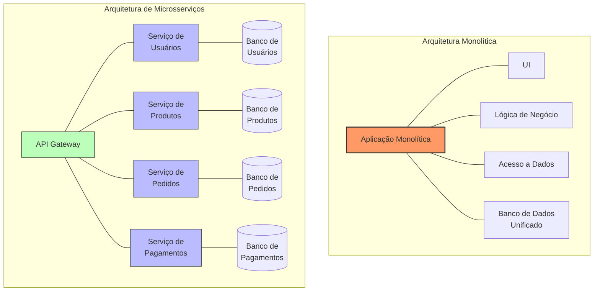
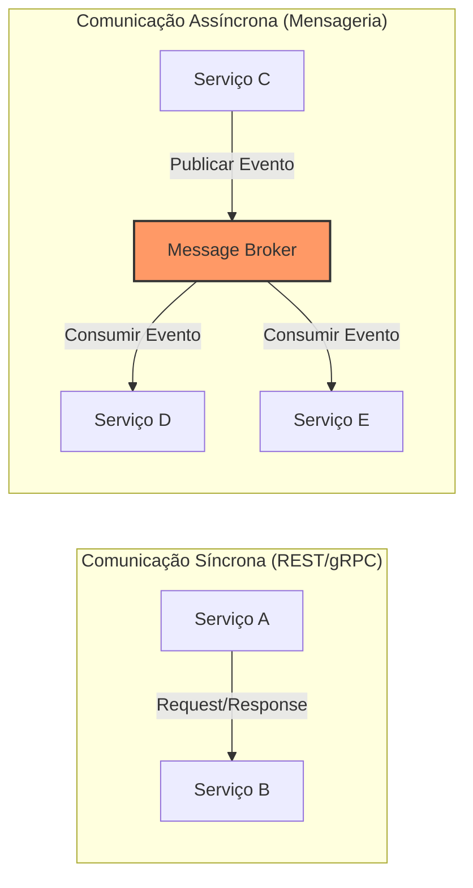
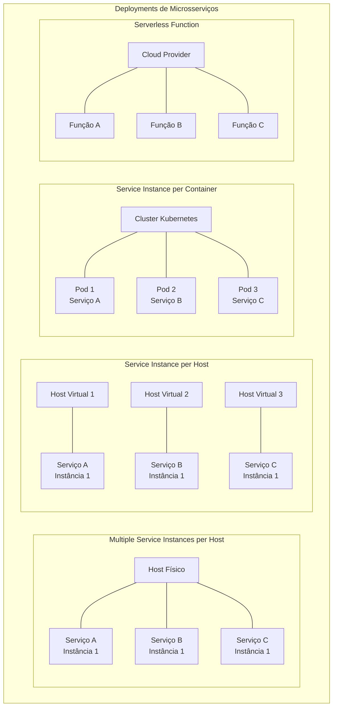
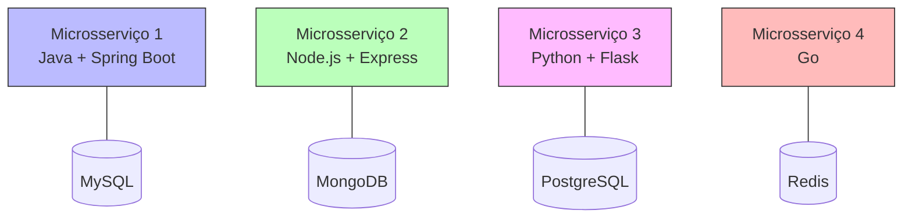
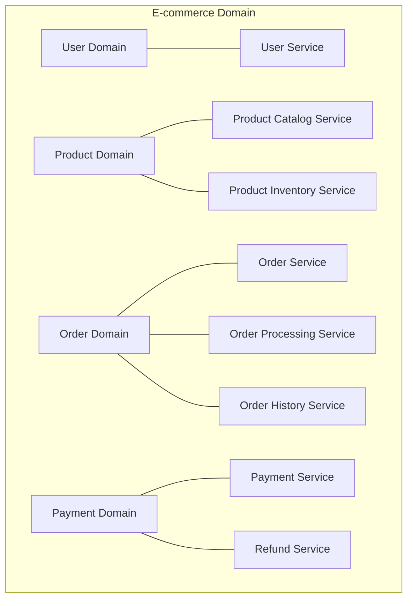
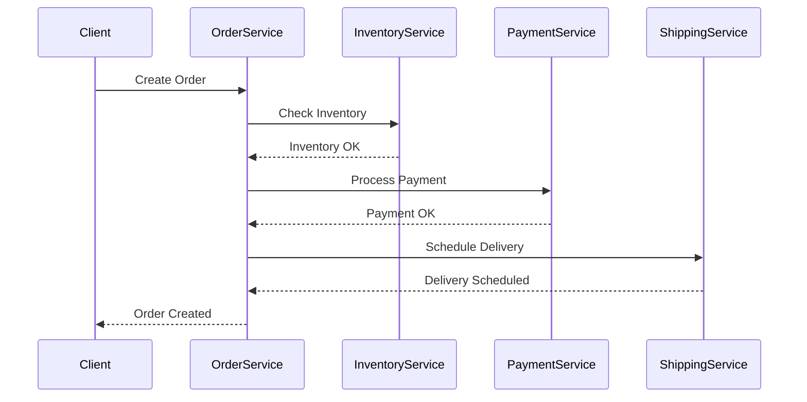
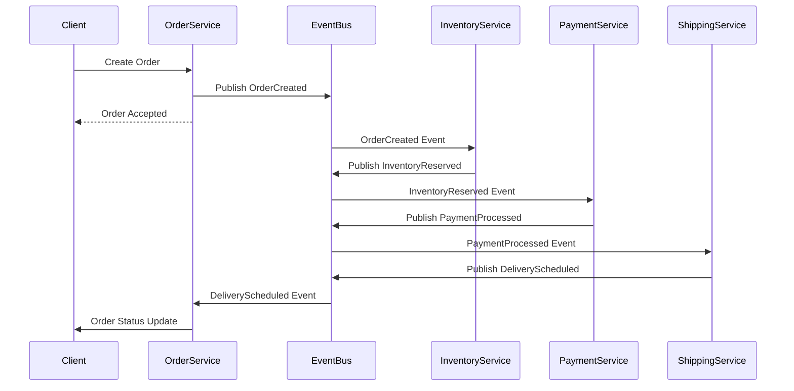
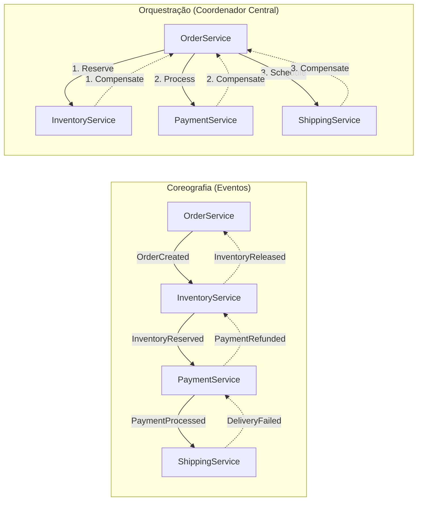
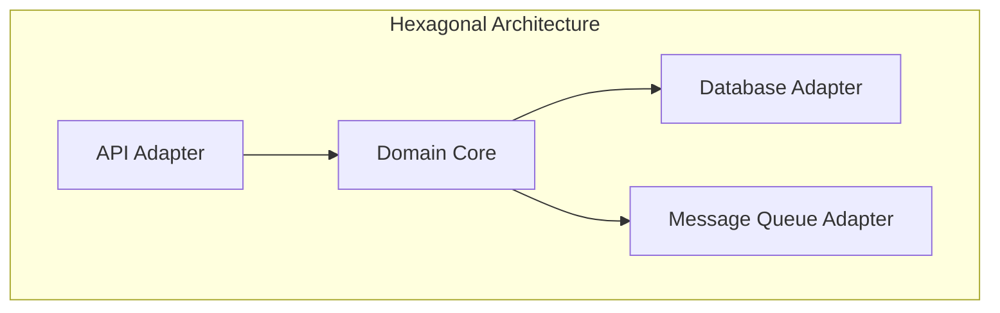
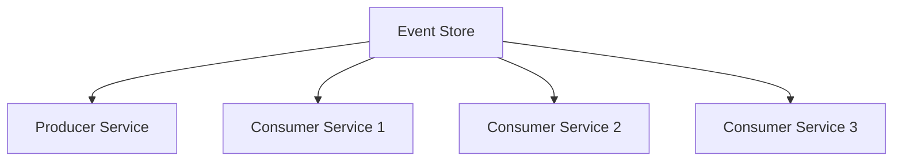

# 🧱 Microservices (Microsserviços)

## Definição e Visão Geral

Microservices (Microsserviços) é um estilo arquitetônico que estrutura uma aplicação como uma coleção de serviços pequenos, autônomos e levemente acoplados. Cada microsserviço é focado em uma única funcionalidade ou domínio de negócio, operando de forma independente e se comunicando através de APIs bem definidas.

Diferentemente da abordagem monolítica tradicional, onde toda a aplicação é construída como uma única unidade, a arquitetura de microsserviços promove a decomposição em componentes menores que podem ser desenvolvidos, implantados e escalados de forma independente. Isso permite maior agilidade no desenvolvimento, melhor isolamento de falhas e flexibilidade tecnológica.

## Diagramas

### Monolito vs. Microsserviços



### Comunicação entre Microsserviços



### Padrões de Deploy de Microsserviços



## Características Fundamentais

### Componentes Independentes



Cada microsserviço:
- Possui sua própria base de código
- Pode usar tecnologias diferentes
- Tem seu próprio banco de dados ou armazenamento
- É mantido por uma equipe específica

## Casos de Uso

- **Aplicações Complexas**: Decomposição de sistemas grandes em partes gerenciáveis
- **Escala Diferenciada**: Componentes podem ser escalados independentemente conforme demanda
- **Resiliência**: Isolamento de falhas para evitar efeito cascata
- **Ciclos de Desenvolvimento Independentes**: Times podem evoluir serviços em paralelo
- **Migração Incremental**: Transformação gradual de monolitos para microsserviços
- **Inovação Tecnológica**: Possibilidade de adotar novas tecnologias por serviço
- **Equipes Distribuídas**: Alocação de serviços para equipes geograficamente distribuídas
- **Alto Tráfego**: Arquitetura que suporta grandes volumes de requisições

## Exemplos Práticos

### Microsserviço em Spring Boot (Java)

```java
// Estrutura do projeto
// /src/main/java/com/example/productservice/
//   ProductServiceApplication.java
//   model/Product.java
//   repository/ProductRepository.java
//   controller/ProductController.java
//   service/ProductService.java

// ProductServiceApplication.java
@SpringBootApplication
public class ProductServiceApplication {
    public static void main(String[] args) {
        SpringApplication.run(ProductServiceApplication.class, args);
    }
}

// Product.java
@Entity
public class Product {
    @Id
    @GeneratedValue(strategy = GenerationType.AUTO)
    private Long id;
    private String name;
    private String description;
    private BigDecimal price;
    
    // Getters, setters, constructors, etc.
}

// ProductRepository.java
@Repository
public interface ProductRepository extends JpaRepository<Product, Long> {
    List<Product> findByNameContaining(String name);
}

// ProductController.java
@RestController
@RequestMapping("/products")
public class ProductController {
    @Autowired
    private ProductService productService;
    
    @GetMapping
    public List<Product> getAllProducts() {
        return productService.findAll();
    }
    
    @GetMapping("/{id}")
    public ResponseEntity<Product> getProductById(@PathVariable Long id) {
        return productService.findById(id)
            .map(ResponseEntity::ok)
            .orElse(ResponseEntity.notFound().build());
    }
    
    @PostMapping
    public ResponseEntity<Product> createProduct(@RequestBody Product product) {
        Product createdProduct = productService.save(product);
        return ResponseEntity
            .created(URI.create("/products/" + createdProduct.getId()))
            .body(createdProduct);
    }
    
    // PUT, DELETE methods, etc.
}

// ProductService.java
@Service
public class ProductService {
    @Autowired
    private ProductRepository productRepository;
    
    public List<Product> findAll() {
        return productRepository.findAll();
    }
    
    public Optional<Product> findById(Long id) {
        return productRepository.findById(id);
    }
    
    public Product save(Product product) {
        return productRepository.save(product);
    }
    
    // Other business logic methods
}
```

### Microsserviço em Express (Node.js)

```javascript
// Estrutura do projeto
// /src/
//   app.js
//   routes/
//     users.js
//   models/
//     user.js
//   controllers/
//     userController.js
//   services/
//     userService.js

// app.js
const express = require('express');
const mongoose = require('mongoose');
const userRoutes = require('./routes/users');

const app = express();
const PORT = process.env.PORT || 3000;

// Conectar ao MongoDB
mongoose.connect('mongodb://localhost:27017/user-service', {
  useNewUrlParser: true,
  useUnifiedTopology: true
});

app.use(express.json());
app.use('/users', userRoutes);

app.listen(PORT, () => {
  console.log(`User service running on port ${PORT}`);
});

// models/user.js
const mongoose = require('mongoose');

const userSchema = new mongoose.Schema({
  username: { type: String, required: true, unique: true },
  email: { type: String, required: true, unique: true },
  password: { type: String, required: true },
  createdAt: { type: Date, default: Date.now }
});

module.exports = mongoose.model('User', userSchema);

// controllers/userController.js
const User = require('../models/user');
const userService = require('../services/userService');

exports.getAllUsers = async (req, res) => {
  try {
    const users = await userService.findAll();
    res.json(users);
  } catch (err) {
    res.status(500).json({ error: err.message });
  }
};

exports.getUserById = async (req, res) => {
  try {
    const user = await userService.findById(req.params.id);
    if (!user) return res.status(404).json({ message: 'User not found' });
    res.json(user);
  } catch (err) {
    res.status(500).json({ error: err.message });
  }
};

// routes/users.js
const express = require('express');
const router = express.Router();
const userController = require('../controllers/userController');

router.get('/', userController.getAllUsers);
router.get('/:id', userController.getUserById);
router.post('/', userController.createUser);

module.exports = router;
```

### Configuração de Docker e Kubernetes

**Dockerfile para o microsserviço Java:**

```dockerfile
FROM openjdk:11-jre-slim
WORKDIR /app
COPY target/product-service-0.0.1-SNAPSHOT.jar /app/app.jar
EXPOSE 8080
ENTRYPOINT ["java", "-jar", "app.jar"]
```

**Manifesto Kubernetes para deploy:**

```yaml
apiVersion: apps/v1
kind: Deployment
metadata:
  name: product-service
  labels:
    app: product-service
spec:
  replicas: 3
  selector:
    matchLabels:
      app: product-service
  template:
    metadata:
      labels:
        app: product-service
    spec:
      containers:
      - name: product-service
        image: myregistry/product-service:latest
        ports:
        - containerPort: 8080
        env:
        - name: SPRING_PROFILES_ACTIVE
          value: "production"
        - name: DB_HOST
          valueFrom:
            configMapKeyRef:
              name: product-service-config
              key: db_host
        - name: DB_PASSWORD
          valueFrom:
            secretKeyRef:
              name: product-service-secrets
              key: db_password
        resources:
          limits:
            cpu: "0.5"
            memory: "512Mi"
          requests:
            cpu: "0.2"
            memory: "256Mi"
        readinessProbe:
          httpGet:
            path: /actuator/health
            port: 8080
          initialDelaySeconds: 30
          periodSeconds: 10
---
apiVersion: v1
kind: Service
metadata:
  name: product-service
spec:
  selector:
    app: product-service
  ports:
  - port: 80
    targetPort: 8080
  type: ClusterIP
```

## Padrões de Microsserviços

### Decomposição por Domínio



A decomposição por domínio segue os princípios do Domain-Driven Design (DDD):
- Identificação de contextos delimitados (bounded contexts)
- Modelagem de serviços alinhados com o domínio de negócio
- Uso de linguagem ubíqua em cada serviço

### Padrões de Comunicação

#### Comunicação Síncrona



#### Comunicação Assíncrona (Event-Driven)



### Padrão Saga para Transações Distribuídas



O padrão Saga resolve o problema de transações distribuídas:
- Mantém consistência entre serviços
- Implementa compensações para reverter ações em caso de falha
- Pode usar abordagem de coreografia (eventos) ou orquestração (coordenador)

## Prós e Contras

### Prós
- **Desacoplamento**: Serviços independentes com baixa interdependência
- **Escalabilidade**: Escala granular conforme necessidade específica
- **Resiliência**: Falhas isoladas não comprometem todo o sistema
- **Flexibilidade tecnológica**: Cada serviço pode usar a tecnologia mais adequada
- **Ciclos de desenvolvimento paralelos**: Equipes podem evoluir serviços independentemente
- **Facilidade de compreensão**: Código menor e mais focado por serviço
- **Implantação independente**: Lançamentos podem ser feitos por serviço
- **Organização por domínio**: Estrutura alinhada com áreas de negócio

### Contras
- **Complexidade distribuída**: Gerenciamento de múltiplos serviços e suas interações
- **Desafios de transações**: Dificuldade em manter consistência entre serviços
- **Sobrecarga operacional**: Mais componentes para monitorar e manter
- **Maior latência**: Comunicação entre serviços adiciona atrasos
- **Duplicação de dados**: Pode ser necessário para garantir autonomia
- **Desafios de debugging**: Rastreamento de problemas em sistemas distribuídos
- **Custo de infraestrutura**: Pode ser maior que soluções monolíticas
- **Complexidade de testes**: Testes de integração mais difíceis

## Melhores Práticas

1. **Comece com um monolito**: Evite a complexidade prematura de microsserviços para startups
   
2. **Decomponha por domínio de negócio**: Use Domain-Driven Design para identificar limites de serviços

3. **Independência total**: Cada serviço deve poder ser desenvolvido, implantado e escalado independentemente

4. **Design para falhas**: Implemente circuit breakers, timeouts e retries

5. **Use API Gateways**: Facade único para clientes acessarem múltiplos serviços

6. **Implemente observabilidade**: Centralize logs, métricas e tracing distribuído

7. **Automatize o deployment**: Use CI/CD para cada microsserviço

8. **Mantenha API contracts**: Use contratos claros entre serviços (OpenAPI, Protobuf)

9. **Isole dados**: Cada serviço deve ter seu próprio armazenamento de dados

10. **Adote Event Sourcing e CQRS**: Para manter consistência em sistemas distribuídos

11. **Implemente segurança por camadas**: Autenticação/autorização em cada nível

12. **Teste cada serviço independentemente**: Unit tests, testes de contrato e mocks para dependências

## Ferramentas e Tecnologias

### Desenvolvimento
- **Spring Boot**: Framework Java para microsserviços
- **Express.js/NestJS**: Frameworks JavaScript/TypeScript
- **Flask/FastAPI**: Frameworks Python
- **Go kit**: Toolkit para microsserviços em Go
- **Micronaut**: Framework JVM com startup rápido
- **Quarkus**: Framework Java nativo para Kubernetes

### Comunicação
- **REST**: API simples sobre HTTP
- **gRPC**: Comunicação RPC eficiente
- **GraphQL**: API flexível para clientes
- **Apache Kafka**: Streaming de eventos
- **RabbitMQ**: Message broker
- **Apache Pulsar**: Sistema de mensageria

### Orquestração e Deployment
- **Kubernetes**: Orquestração de containers
- **Docker Swarm**: Orquestração mais simples
- **AWS ECS/EKS**: Serviços gerenciados de containers
- **Google Kubernetes Engine**: Kubernetes gerenciado
- **Azure Kubernetes Service**: Kubernetes na Azure
- **Serverless**: AWS Lambda, Azure Functions, Google Cloud Functions

### Infraestrutura
- **Istio/Linkerd**: Service mesh
- **Consul/etcd**: Service discovery
- **Prometheus/Grafana**: Monitoramento
- **Jaeger/Zipkin**: Tracing distribuído
- **ELK/Fluentd**: Gerenciamento de logs
- **Kong/Ambassador**: API Gateway

## Arquiteturas Relacionadas

### Arquitetura Hexagonal



A arquitetura hexagonal (ou Ports & Adapters) é frequentemente usada em microsserviços para:
- Isolar a lógica de domínio
- Facilitar testes
- Permitir trocar implementações externas

### Event-Driven Architecture (EDA)



Arquitetura orientada a eventos complementa microsserviços:
- Comunicação assíncrona
- Baixo acoplamento
- Escalabilidade
- Rastreabilidade de mudanças

## Referências

- Newman, S. (2021). Building Microservices (2nd ed.). O'Reilly Media.
- Richardson, C. (2018). Microservices Patterns. Manning Publications.
- Fowler, M. & Lewis, J. (2014). Microservices: A Definition of This New Architectural Term. martinfowler.com.
- Evans, E. (2003). Domain-Driven Design: Tackling Complexity in the Heart of Software. Addison-Wesley.
- Kleppmann, M. (2017). Designing Data-Intensive Applications. O'Reilly Media.
- Burns, B. (2018). Designing Distributed Systems. O'Reilly Media.
- Indrasiri, K. & Siriwardena, P. (2021). Design Patterns for Cloud Native Applications. O'Reilly Media.
- Limoncelli, T. A., Chalup, S. R., & Hogan, C. J. (2014). The Practice of Cloud System Administration. Addison-Wesley.
- Kubernetes Documentation. https://kubernetes.io/docs/
- Spring Boot Documentation. https://docs.spring.io/spring-boot/docs/current/reference/html/
