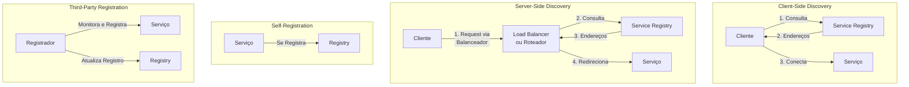
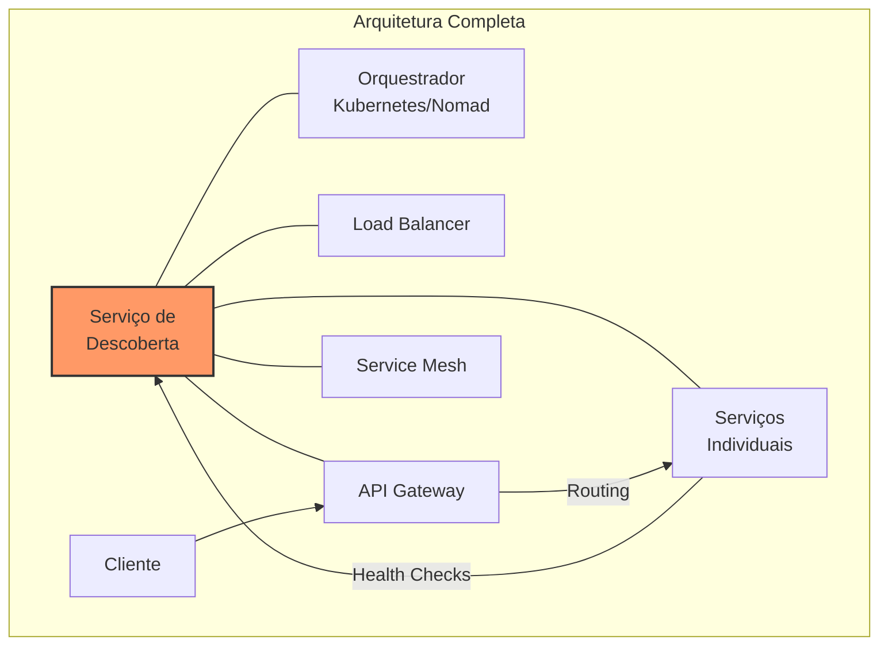
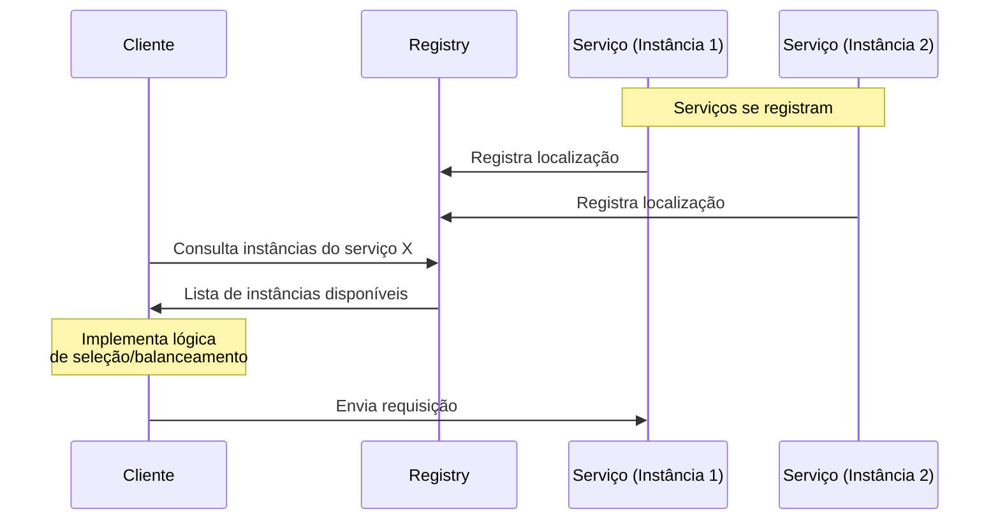
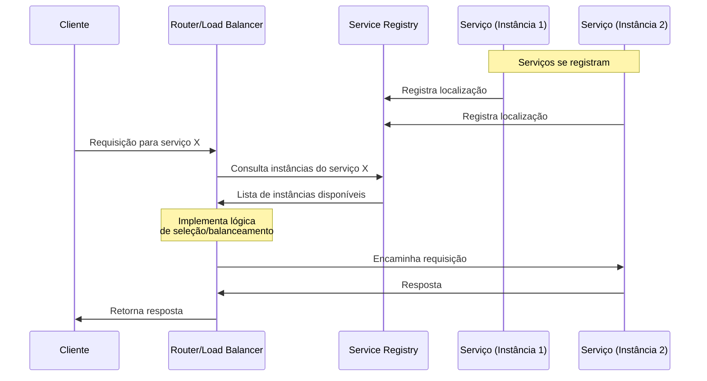
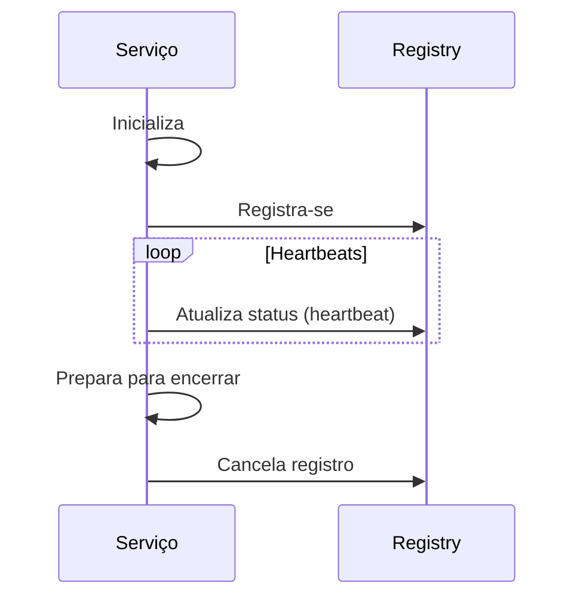
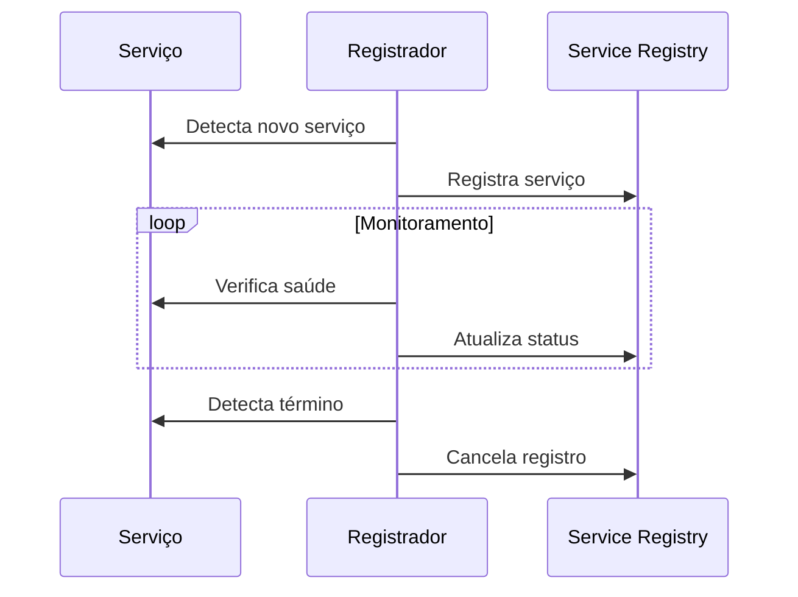
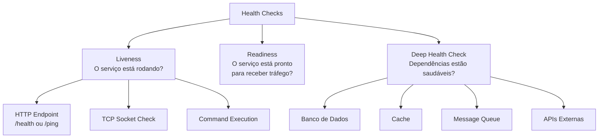
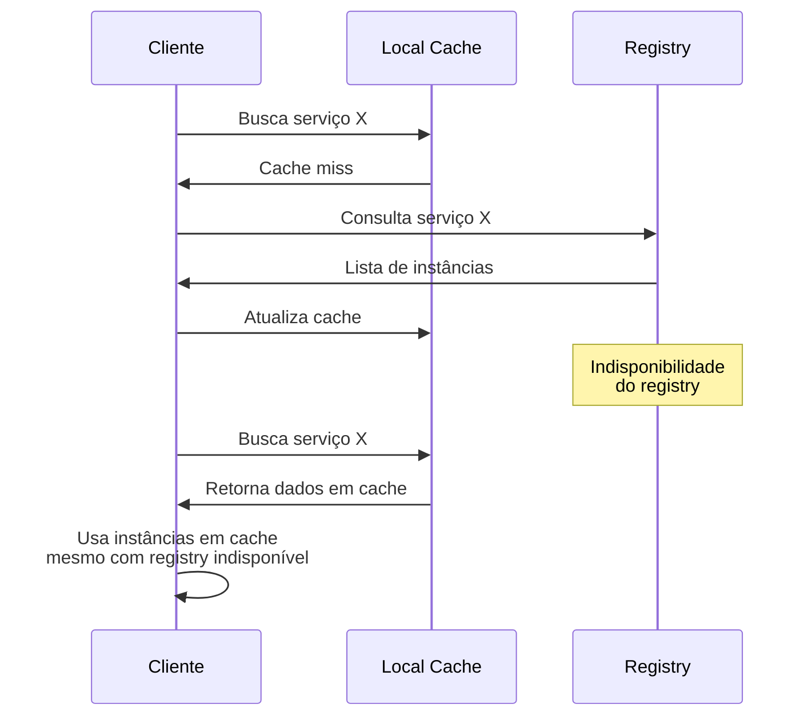

# Service Discovery (Descoberta de Serviços)

## Definição e Visão Geral

Service Discovery (Descoberta de Serviços) é um mecanismo que permite que os serviços em um ambiente distribuído localizem e se comuniquem entre si dinamicamente, sem a necessidade de configuração manual de endereços IP ou portas. Esta tecnologia é fundamental em arquiteturas modernas como microsserviços, onde serviços são frequentemente criados, destruídos ou movidos entre hosts.

Em um mundo de infraestrutura dinâmica, especialmente em ambientes em nuvem onde instâncias de serviços podem ser escaladas automaticamente, migradas ou reiniciadas a qualquer momento, ter uma maneira automatizada de rastrear a localização atual de cada serviço torna-se essencial. A descoberta de serviços resolve este problema fornecendo um "diretório" central onde serviços podem se registrar e consultar informações sobre outros serviços.

## Diagramas

### Arquitetura Básica de Service Discovery

```mermaid
graph TD
    subgraph "Service Discovery"
        R[Registry<br>Service] 
        S1[Serviço A<br>Instância 1] -->|Registra| R
        S2[Serviço A<br>Instância 2] -->|Registra| R
        S3[Serviço B<br>Instância 1] -->|Registra| R
        
        C[Cliente<br>Serviço C] -->|Consulta<br>"Onde está Serviço A?"| R
        R -->|Responde<br>"Instâncias 1 e 2 em..."| C
        C -->|Conecta| S1
        C -->|Conecta| S2
    end
    
    style R fill:#f96,stroke:#333,stroke-width:2px
```

### Padrões de Service Discovery



### Integração com Infraestrutura



## Casos de Uso

- **Microsserviços**: Localização dinâmica de instâncias de serviços
- **Balanceamento de carga**: Distribuição de tráfego entre instâncias disponíveis
- **Failover automático**: Redirecionamento para instâncias saudáveis em caso de falhas
- **Ambientes de nuvem**: Gerenciamento de recursos dinâmicos (auto-scaling)
- **Implantações blue-green/canary**: Roteamento gradual para novas versões
- **Plataformas multi-região**: Descoberta de serviços em diferentes regiões geográficas
- **Desenvolvimento local**: Simulação de ambientes completos em máquinas locais
- **Ambientes híbridos**: Comunicação entre serviços em nuvem e on-premises

## Exemplos Práticos

### Netflix Eureka (Java/Spring)

**Configuração do Servidor Eureka:**

```java
// Servidor de Descoberta com Spring Cloud Netflix
@SpringBootApplication
@EnableEurekaServer
public class ServiceDiscoveryApplication {
    public static void main(String[] args) {
        SpringApplication.run(ServiceDiscoveryApplication.class, args);
    }
}
```

**application.yml para o servidor:**
```yaml
server:
  port: 8761

eureka:
  client:
    registerWithEureka: false
    fetchRegistry: false
  server:
    waitTimeInMsWhenSyncEmpty: 0
```

**Cliente Eureka (um microsserviço):**
```java
@SpringBootApplication
@EnableDiscoveryClient
public class UserServiceApplication {
    public static void main(String[] args) {
        SpringApplication.run(UserServiceApplication.class, args);
    }
}
```

**application.yml para o cliente:**
```yaml
spring:
  application:
    name: user-service

server:
  port: 8080

eureka:
  client:
    serviceUrl:
      defaultZone: http://localhost:8761/eureka/
  instance:
    preferIpAddress: true
```

**Usando serviços descobertos com RestTemplate:**
```java
@Service
public class ProductClient {
    @Autowired
    private RestTemplate restTemplate;
    
    public Product getProduct(Long id) {
        return this.restTemplate.getForObject(
            "http://product-service/products/" + id,
            Product.class);
    }
}

@Configuration
public class RestTemplateConfig {
    @Bean
    @LoadBalanced
    public RestTemplate restTemplate() {
        return new RestTemplate();
    }
}
```

### Consul (Exemplo com Docker e API HTTP)

**docker-compose.yml para iniciar Consul:**
```yaml
version: '3'
services:
  consul:
    image: consul:latest
    ports:
      - "8500:8500"
      - "8600:8600/udp"
    command: "agent -server -ui -node=server-1 -bootstrap-expect=1 -client=0.0.0.0"
```

**Registrando um serviço via API HTTP:**
```bash
# Registrar um serviço
curl -X PUT -d '{
  "ID": "user-service-1",
  "Name": "user-service",
  "Tags": ["api", "user"],
  "Address": "192.168.1.10",
  "Port": 8080,
  "Check": {
    "HTTP": "http://192.168.1.10:8080/health",
    "Interval": "10s"
  }
}' http://localhost:8500/v1/agent/service/register

# Descobrir serviços
curl http://localhost:8500/v1/catalog/service/user-service
```

**Configuração em Node.js:**
```javascript
const Consul = require('consul');

const consul = new Consul({
  host: 'localhost',
  port: 8500
});

// Registrar serviço
consul.agent.service.register({
  name: 'payment-service',
  id: 'payment-1',
  tags: ['api', 'payment'],
  address: '192.168.1.20',
  port: 3000,
  check: {
    http: 'http://192.168.1.20:3000/health',
    interval: '10s'
  }
}, function(err) {
  if (err) throw err;
  console.log('Service registered');
});

// Descobrir serviços
consul.catalog.service.nodes('user-service', function(err, result) {
  if (err) throw err;
  console.log(result);
});
```

### Kubernetes Service Discovery

Kubernetes possui descoberta de serviços nativa. Um exemplo de definição de serviço:

```yaml
apiVersion: v1
kind: Service
metadata:
  name: user-service
spec:
  selector:
    app: user-service
  ports:
  - port: 80
    targetPort: 8080
```

**Código para descobrir e usar o serviço:**
```python
# Em Python, dentro de um pod Kubernetes
import requests

# O DNS interno do Kubernetes resolve o nome do serviço
response = requests.get("http://user-service/users/1")
user = response.json()
```

## Padrões e Mecanismos

### Cliente vs. Servidor

#### Descoberta do Lado do Cliente (Client-Side Discovery)



**Vantagens:**
- Menor número de hops de rede
- Cliente pode implementar estratégias de balanceamento personalizadas
- Maior controle sobre o fallback em caso de falhas

**Desvantagens:**
- Complexidade movida para o cliente
- Acoplamento do cliente com o mecanismo de descoberta
- Necessidade de bibliotecas cliente para cada linguagem

#### Descoberta do Lado do Servidor (Server-Side Discovery)



**Vantagens:**
- Clientes mais simples sem conhecimento do mecanismo de descoberta
- Implementação consistente de balanceamento e fallback
- Atualização centralizada de políticas de roteamento

**Desvantagens:**
- Hop adicional de rede
- Router pode se tornar um ponto único de falha
- Maior complexidade operacional

### Mecanismos de Registro

#### Auto-Registro (Self-Registration)

Os próprios serviços são responsáveis por se registrar e manter seu status atualizado:



#### Registro por Terceiros (Third-Party Registration)

Um componente externo monitora os serviços e gerencia seus registros:



## Considerações de Implementação

### Health Checks



Health checks são cruciais para descoberta de serviços:
- Permitem remover automaticamente instâncias não saudáveis
- Podem verificar dependências críticas
- Fornecem informações para auto-healing
- Funcionam como mecanismo de circuit breaking

### Metadados de Serviço

Além da localização, os registros de serviço frequentemente incluem:
- Versão do serviço
- Ambiente (dev, staging, prod)
- Capacidade e limites de carga
- Região/zona de disponibilidade
- Tags para seleção específica
- Métricas de saúde/performance

### Cache e Resiliência



Estratégias de resiliência:
- Cache local de registros de serviço
- Heartbeats periódicos
- Retry com backoff exponencial
- Circuit breaking para o serviço de descoberta
- Fallback para configuração estática

## Prós e Contras

### Prós
- **Infraestrutura dinâmica**: Suporta escala automática e rebalanceamento
- **Resiliência**: Remove automaticamente instâncias não saudáveis
- **Zero configuração**: Serviços se descobrem automaticamente
- **Balanceamento de carga**: Distribui tráfego entre instâncias disponíveis
- **Ambientes híbridos**: Facilita comunicação entre diferentes ambientes
- **Implantações**: Simplifica blue-green deployments e testes A/B
- **Observabilidade**: Fornece visão centralizada dos serviços
- **Independência de infraestrutura**: Abstrai detalhes de rede subjacentes

### Contras
- **Complexidade adicional**: Introduz mais componentes para gerenciar
- **Ponto único de falha**: O registro pode se tornar crítico (mitigado com HA)
- **Consistência eventual**: Pode haver atrasos na propagação de informações
- **Sobrecarga de rede**: Heartbeats e verificações contínuas geram tráfego
- **Troubleshooting complexo**: Problemas podem ser difíceis de rastrear
- **Curva de aprendizado**: Requer conhecimento específico da ferramenta

## Ferramentas Populares

### Soluções de Código Aberto
- **Consul**: Solução completa da HashiCorp com KV store e service mesh
- **etcd**: Store distribuída usada pelo Kubernetes
- **ZooKeeper**: Sistema de coordenação distribuída da Apache
- **Eureka**: Solução da Netflix para AWS
- **CoreDNS**: Sistema de descoberta baseado em DNS

### Soluções em Nuvem
- **AWS Cloud Map**: Descoberta para AWS
- **Azure Service Fabric**: Plataforma de microsserviços com descoberta
- **Google Cloud Service Directory**: Registro e descoberta para GCP
- **Kubernetes Service Discovery**: Integrado com DNS e rede Kubernetes

### Implementação via Service Mesh
- **Istio**: Service mesh com descoberta e roteamento avançados
- **Linkerd**: Service mesh leve com descoberta de serviços
- **Consul Connect**: Parte do Consul focada em service mesh
- **AWS App Mesh**: Service mesh gerenciado da AWS

## Melhores Práticas

1. **Implemente service registry redundante**: Evite ponto único de falha

2. **Combine DNS com descoberta dinâmica**: DNS para estabilidade, descoberta dinâmica para agilidade

3. **Use cache com TTL apropriado**: Reduz carga no serviço de registro

4. **Configure health checks adequados**: Verifique a verdadeira saúde do serviço, não apenas se está rodando

5. **Automatize registro e cancelamento**: Evite registros obsoletos ou fantasmas

6. **Inclua versionamento**: Permita roteamento baseado em versão

7. **Implemente circuit breakers**: Proteja contra falhas em cascata

8. **Monitore o service registry**: Alertas para problemas no próprio mecanismo de descoberta

9. **Planeje fallbacks**: Tenha estratégias para quando a descoberta falhar

10. **Documente convenções de nomeação**: Facilite a localização de serviços

## Referências

- Burns, B. (2018). Designing Distributed Systems. O'Reilly Media.
- Newman, S. (2021). Building Microservices (2nd ed.). O'Reilly Media.
- HashiCorp. (2023). Consul Documentation. https://www.consul.io/docs
- Richardson, C. (2018). Microservices Patterns. Manning Publications.
- Kubernetes Documentation. (2023). Service Discovery and Load Balancing. https://kubernetes.io/docs/concepts/services-networking/
- Netflix OSS. (2023). Eureka Wiki. https://github.com/Netflix/eureka/wiki
- AWS. (2023). AWS Cloud Map Documentation. https://aws.amazon.com/cloud-map/
- Nygard, M. (2018). Release It! (2nd ed.). Pragmatic Bookshelf.
- Istio Documentation. (2023). Service Discovery. https://istio.io/latest/docs/concepts/traffic-management/
