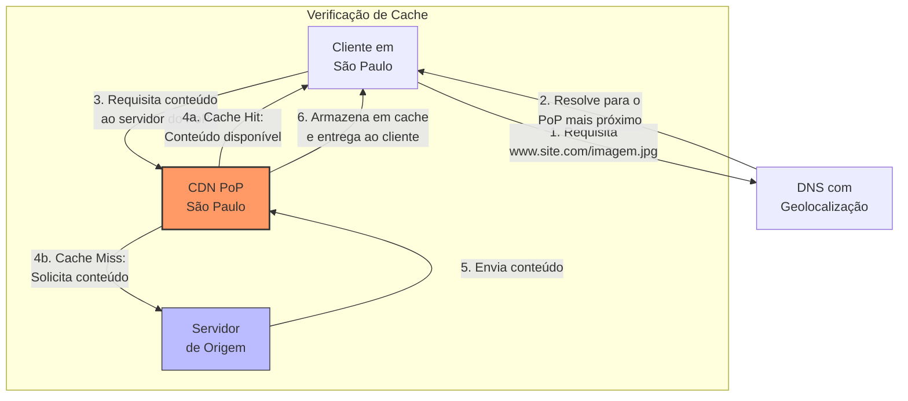
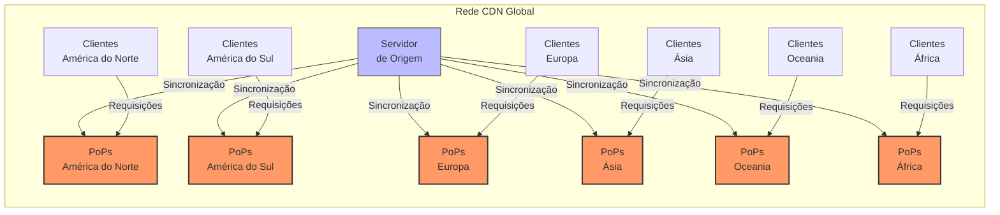
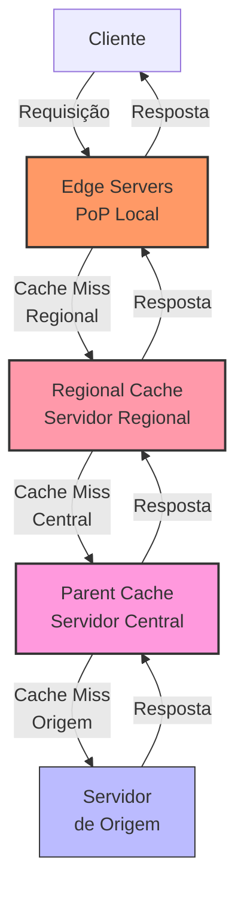
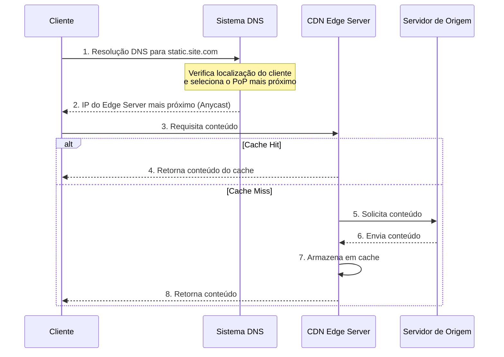
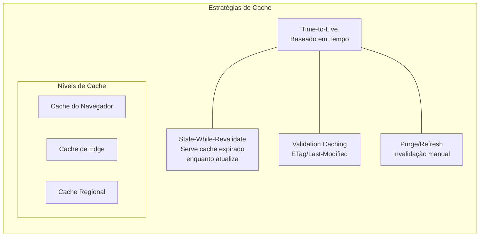
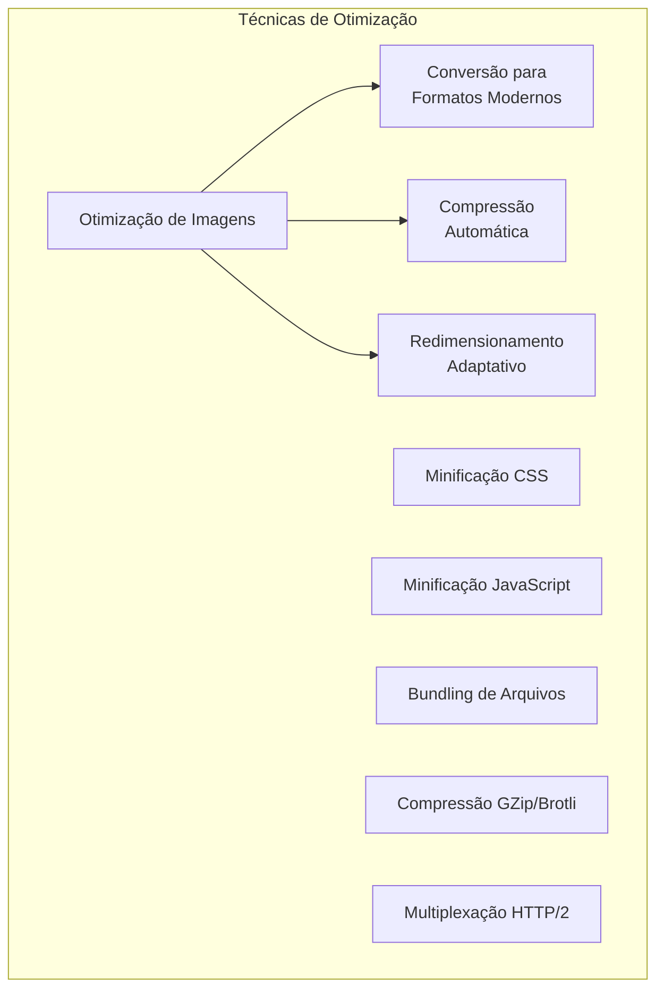
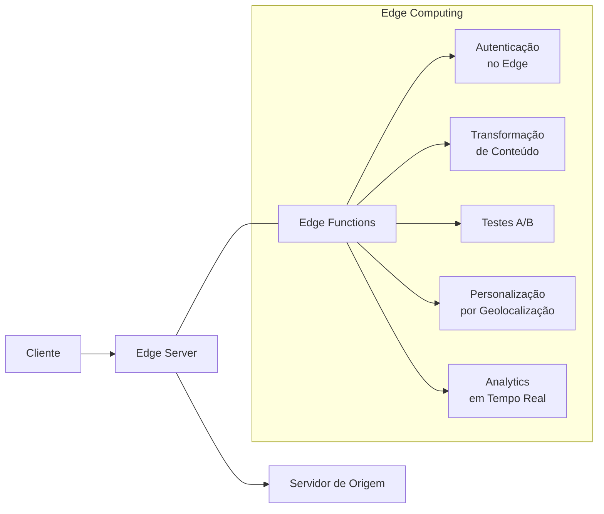
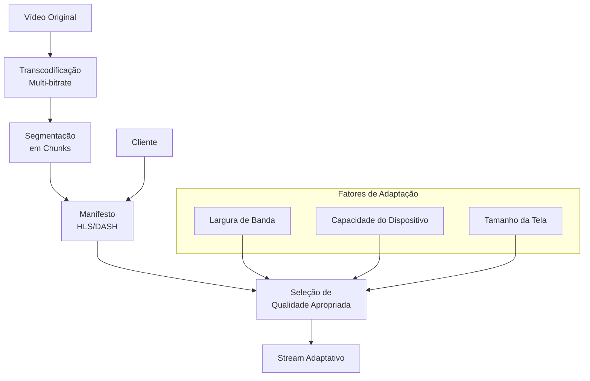
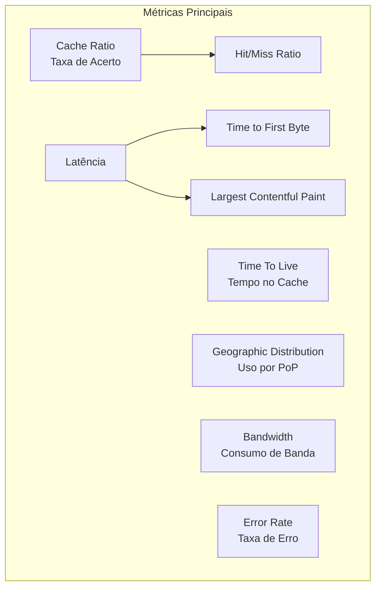

# 🌐 CDNs (Redes de Distribuição de Conteúdo)

## Definição e Visão Geral

Content Delivery Network (CDN), ou Rede de Distribuição de Conteúdo, é uma rede geograficamente distribuída de servidores proxy e seus data centers que entregam conteúdo da web aos usuários com base em sua localização geográfica. O objetivo principal de uma CDN é melhorar a performance, disponibilidade e escalabilidade da entrega de conteúdo, reduzindo a latência ao aproximar os dados do usuário final.

Em vez de servir conteúdo diretamente do servidor de origem (que pode estar distante do usuário), uma CDN armazena cópias em cache do conteúdo em múltiplos "pontos de presença" (PoPs) ao redor do mundo. Quando um usuário solicita conteúdo, o pedido é roteado para o servidor CDN mais próximo, reduzindo a distância que os dados precisam percorrer e, consequentemente, o tempo de resposta.

CDNs são especialmente eficazes para distribuir conteúdo estático (imagens, vídeos, arquivos CSS/JavaScript, downloads) e, cada vez mais, para conteúdo dinâmico e streaming ao vivo.

## Diagramas

### Funcionamento Básico de uma CDN



### Distribuição Global de PoPs



### Arquitetura Multi-Camada de CDN



## Casos de Uso

- **Sites com audiência global**: Redução de latência para usuários em diferentes regiões
- **Distribuição de mídia**: Streaming de vídeo, música e downloads de arquivos grandes
- **E-commerce**: Carregamento rápido de imagens de produtos e ativos estáticos
- **Jogos online**: Distribuição de atualizações e assets para jogadores globalmente
- **Aplicações SaaS**: Entrega rápida de interfaces de usuário e arquivos estáticos
- **Distribuição de software**: Downloads de aplicativos, patches e atualizações
- **Mobile apps**: Otimização de API endpoints e recursos estáticos para dispositivos móveis
- **Proteção contra DDoS**: Absorção de ataques com capacidade distribuída
- **SEO**: Melhoria de performance para ranqueamento em motores de busca

## Exemplos Práticos

### Integração com Amazon CloudFront

```html
<!-- Antes: Referência direta ao servidor de origem -->

<script src="https://www.meusite.com/js/main.js"></script>

<!-- Depois: Referência via CloudFront CDN -->

<script src="https://d1a2b3c4e5f6g7.cloudfront.net/js/main.js"></script>
```

Configuração no AWS CloudFront:
```json
{
  "Origins": [
    {
      "Id": "MeuSiteOrigin",
      "DomainName": "www.meusite.com",
      "CustomOriginConfig": {
        "HTTPPort": 80,
        "HTTPSPort": 443,
        "OriginProtocolPolicy": "https-only"
      }
    }
  ],
  "DefaultCacheBehavior": {
    "TargetOriginId": "MeuSiteOrigin",
    "ViewerProtocolPolicy": "redirect-to-https",
    "AllowedMethods": ["GET", "HEAD", "OPTIONS"],
    "CachedMethods": ["GET", "HEAD"],
    "ForwardedValues": {
      "QueryString": false,
      "Cookies": { "Forward": "none" }
    },
    "MinTTL": 0,
    "DefaultTTL": 86400,
    "MaxTTL": 31536000,
    "Compress": true
  },
  "PriceClass": "PriceClass_All",
  "Enabled": true
}
```

### Configuração com Cloudflare

**DNS Settings:**
```
Tipo    Nome            Valor                       TTL     Proxy Status
A       www             203.0.113.1                 Auto    Proxied
CNAME   images          www.meusite.com             Auto    Proxied  
```

**Page Rules para Controle de Cache:**
```
URL Pattern: *www.meusite.com/assets/*
Setting: Cache Level - Cache Everything
Edge TTL: 2 days
```

**Configuração de Workers para Transformação:**
```javascript
// Cloudflare Worker para otimização de imagem
addEventListener('fetch', event => {
  event.respondWith(handleRequest(event.request))
})

async function handleRequest(request) {
  // Verificar se a requisição é para uma imagem
  const url = new URL(request.url)
  if (/\.(jpg|jpeg|png|gif|webp)$/.test(url.pathname)) {
    // Clonar a requisição original
    const imageRequest = new Request(request)
    
    // Adicionar parâmetros de otimização do Cloudflare Image Resizing
    if (!url.searchParams.has('width')) {
      url.searchParams.set('width', '800')
      url.searchParams.set('format', 'webp')
      url.searchParams.set('quality', '80')
      
      // Criar uma nova requisição com os parâmetros
      const newRequest = new Request(url.toString(), imageRequest)
      return fetch(newRequest)
    }
  }
  
  // Para outras requisições, passar adiante sem modificação
  return fetch(request)
}
```

### Usando CDN para JavaScript/CSS (jsDelivr)

```html
<!-- Usando uma CDN para carregar bibliotecas populares -->
<link rel="stylesheet" href="https://cdn.jsdelivr.net/npm/bootstrap@5.2.3/dist/css/bootstrap.min.css">
<script src="https://cdn.jsdelivr.net/npm/jquery@3.6.3/dist/jquery.min.js"></script>

<!-- CDN para arquivos próprios de um repositório GitHub -->
<script src="https://cdn.jsdelivr.net/gh/username/repo@version/file.js"></script>
```

## Componentes e Funcionalidades

### Tecnologias por Trás das CDNs

#### DNS e Anycast Routing



#### Políticas de Cache



#### Otimização de Conteúdo



### Funcionalidades Avançadas de CDNs Modernas

#### Segurança

- **WAF (Web Application Firewall)**: Proteção contra ataques como SQL Injection, XSS
- **DDoS Protection**: Mitigação de ataques volumétricos e de camada de aplicação
- **Bot Management**: Identificação e controle de bots maliciosos
- **Rate Limiting**: Controle de taxa de requisições por cliente
- **SSL/TLS**: Terminação TLS e certificados gerenciados

#### Edge Computing



Exemplos de Edge Computing:
- Cloudflare Workers
- AWS Lambda@Edge
- Akamai EdgeWorkers
- Fastly Compute@Edge

#### Streaming Adaptativo



## Prós e Contras

### Prós
- **Melhor performance**: Redução significativa de latência para usuários globais
- **Economia de banda**: Redução de tráfego no servidor de origem
- **Escalabilidade**: Capacidade de lidar com picos de tráfego
- **Disponibilidade**: Redundância geográfica protege contra falhas
- **Segurança**: Proteção contra ataques DDoS e outras ameaças
- **SEO**: Melhor experiência do usuário leva a melhor ranqueamento
- **Análise de tráfego**: Insights sobre padrões de uso e performance
- **Custos reduzidos**: Menor necessidade de infraestrutura própria

### Contras
- **Custo adicional**: Serviços de CDN representam uma despesa extra
- **Complexidade**: Adiciona uma camada a mais para gerenciar e monitorar
- **Controle limitado**: Dependência de infraestrutura de terceiros
- **Invalidação de cache**: Pode ser complexo garantir conteúdo atualizado
- **Configuração inicial**: Requer conhecimento técnico para setup correto
- **Conteúdo dinâmico**: Menor benefício para conteúdo altamente personalizado
- **Preocupações com privacidade**: Em algumas jurisdições, devido à distribuição geográfica

## Integração e Implementação

### Como Implementar CDN

#### 1. Configuração de DNS (CNAME ou subdomain)

```
# Exemplo de configuração DNS para CDN com CNAME
static.meusite.com. IN CNAME d123.cloudfront.net.

# Ou com zonas de apex (A Record com Alias)
meusite.com. IN A 192.0.2.1 (IP do serviço CDN)
```

#### 2. Apontando Recursos para a CDN

```html
<!-- Estratégias para referência de recursos -->

<!-- Opção 1: Subdomínio específico para CDN -->

<script src="https://static.meusite.com/js/app.js"></script>

<!-- Opção 2: URL específica da CDN -->


<!-- Opção 3: Subpastas específicas via regras de rewrite -->

```

#### 3. Configurações de Cache-Control 

```
# Cabeçalhos HTTP para controle de cache
Cache-Control: max-age=86400, public
Cache-Control: no-cache, no-store, must-revalidate
Cache-Control: public, max-age=31536000, immutable
```

### Invalidação de Cache

```bash
# Exemplo com AWS CLI para CloudFront
aws cloudfront create-invalidation \
    --distribution-id EDFDVBD6EXAMPLE \
    --paths "/images/logo.png" "/css/*"

# Exemplo com cURL para Fastly
curl -X PURGE https://www.meusite.com/css/styles.css
```

### Integração com CI/CD

```yaml
# Exemplo de step em GitHub Actions
- name: Invalidate CDN Cache
  run: |
    aws cloudfront create-invalidation \
      --distribution-id ${{ secrets.CLOUDFRONT_DISTRIBUTION_ID }} \
      --paths "/*"
  env:
    AWS_ACCESS_KEY_ID: ${{ secrets.AWS_ACCESS_KEY_ID }}
    AWS_SECRET_ACCESS_KEY: ${{ secrets.AWS_SECRET_ACCESS_KEY }}
    AWS_REGION: 'us-east-1'
```

## Melhores Práticas

1. **Use TTLs apropriados**: Configure tempos de expiração adequados para cada tipo de conteúdo

2. **Automatize a invalidação de cache**: Integre com seu processo de CI/CD

3. **Implement cache busting**: Use versionamento de arquivos para forçar atualizações (ex: style.v2.css)

4. **Configure corretamente os cabeçalhos HTTP**: Use Cache-Control, ETag e Last-Modified

5. **Otimize recursos antes da distribuição**: Comprima imagens, minifique CSS/JS

6. **Monitore uso e métricas de performance**: Acompanhe taxas de hit/miss e latência

7. **Implemente DNS redundante**: Evite falhas na resolução de nomes

8. **Utilize URLs consistentes**: Mantenha URLs estáveis para maximizar o cache

9. **Separe domínios para conteúdo estático e dinâmico**: Otimize configurações para cada tipo

10. **Camada de segurança adequada**: Implemente HTTPS, proteções contra ataques

## Provedores Populares de CDN

### Provedores Globais
- **Cloudflare**: Popular por oferecer plano gratuito com recursos de segurança
- **Amazon CloudFront**: Integrado com o ecossistema AWS
- **Akamai**: Um dos pioneiros, com extensa rede global
- **Fastly**: Conhecido pela velocidade e configurabilidade
- **Google Cloud CDN**: Integrado com GCP e rede global do Google
- **Microsoft Azure CDN**: Integrado com o ecossistema Azure
- **StackPath**: Focado em segurança e edge computing
- **Limelight Networks**: Especializado em mídia e conteúdo de alto volume

### CDNs Especializadas
- **jsDelivr**: Específica para bibliotecas JavaScript e projetos open source
- **Unpkg**: CDN para pacotes npm
- **CDN77**: Especializada em streaming de vídeo
- **BunnyCDN**: Conhecida por preços acessíveis
- **KeyCDN**: Simplicidade e preço baseado em uso

## Métricas e Monitoramento

### KPIs para CDNs



### Ferramentas de Monitoramento

- **Real User Monitoring (RUM)**: Coleta dados reais de experiência do usuário
- **Synthetic Monitoring**: Testes periódicos a partir de locais conhecidos
- **CDN Analytics Dashboards**: Dashboards nativos dos provedores
- **Ferramentas de terceiros**: New Relic, Datadog, Grafana
- **Chrome Developer Tools**: Para troubleshooting local

## Referências

- Fielding, R., & Reschke, J. (2014). Hypertext Transfer Protocol (HTTP/1.1): Caching. RFC 7234.
- Grigorik, I. (2013). High Performance Browser Networking. O'Reilly Media.
- Cloudflare. (2023). What is a CDN? https://www.cloudflare.com/learning/cdn/what-is-a-cdn/
- Amazon Web Services. (2023). Amazon CloudFront Documentation. https://docs.aws.amazon.com/cloudfront/
- Nygren, E., Sitaraman, R. K., & Sun, J. (2010). The Akamai Network: A Platform for High-Performance Internet Applications. ACM SIGOPS Operating Systems Review, 44(3), 2-19.
- Google Developers. (2023). Content Delivery Networks. https://web.dev/content-delivery-networks/
- Fastly. (2023). Edge Cloud Platform Documentation. https://docs.fastly.com/
- Majkowski, M. (2018). The State of TLS Fingerprinting. Cloudflare Blog.
- Akamai. (2023). State of the Internet Reports. https://www.akamai.com/state-of-the-internet-report
