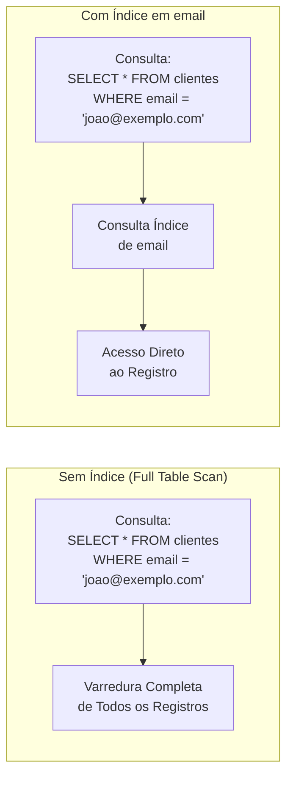
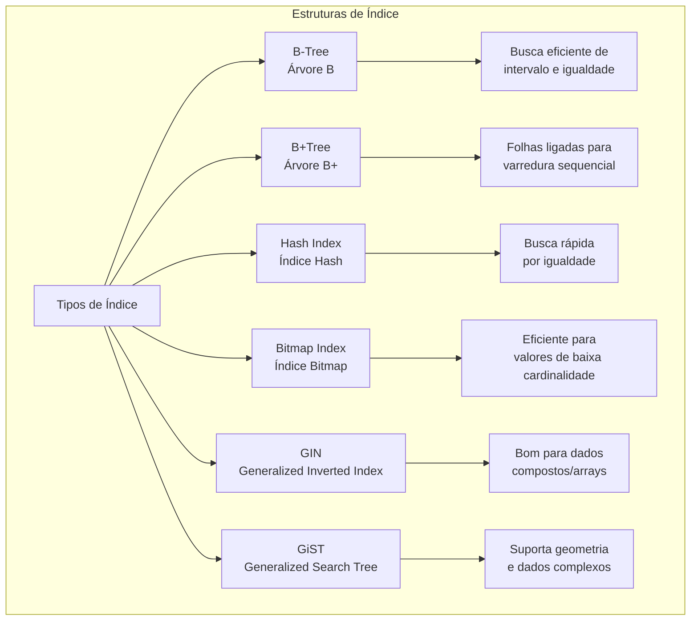
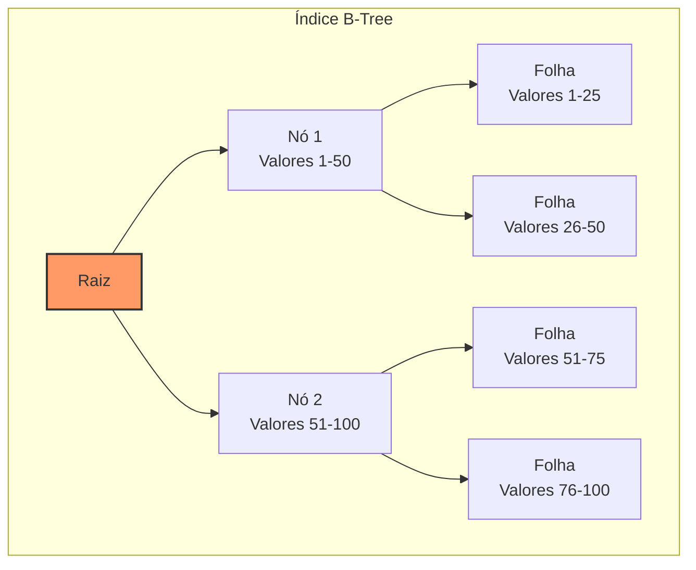
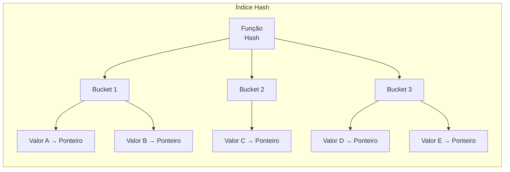
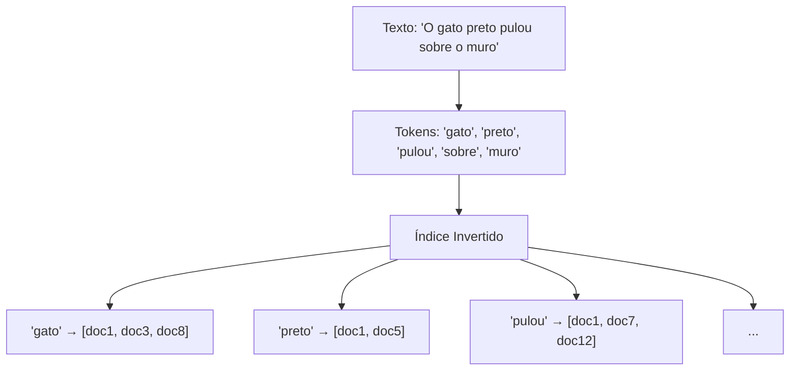
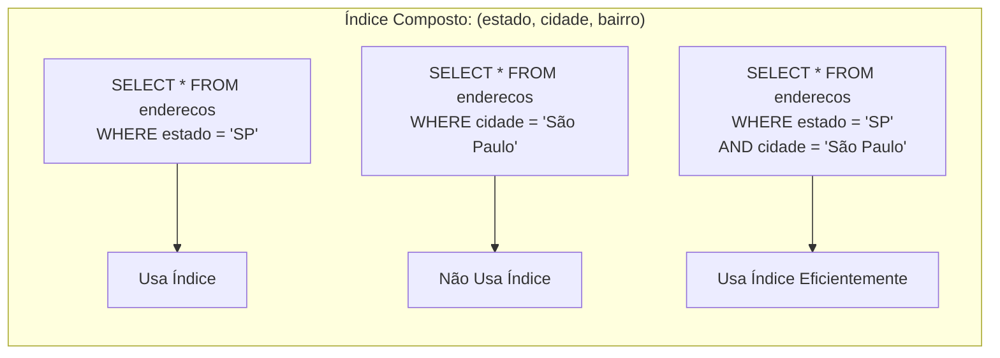
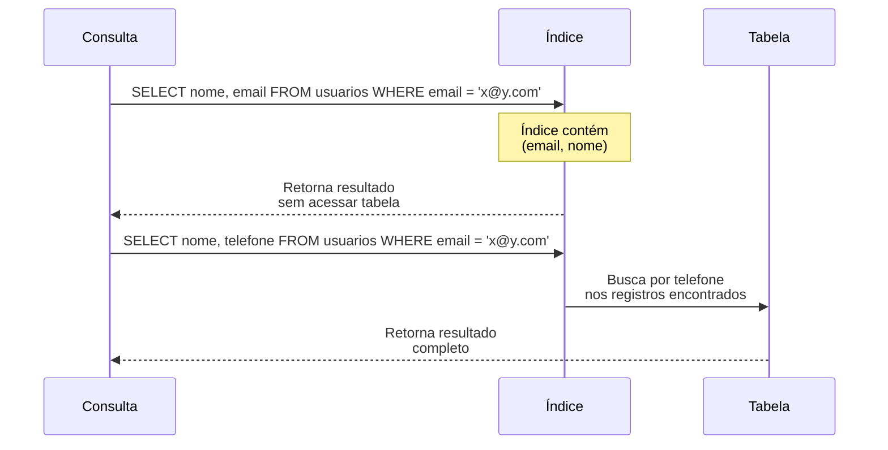

# DB Indexing (Indexação de Banco de Dados)

## Definição e Visão Geral

Database Indexing (Indexação de Banco de Dados) é uma técnica de otimização que melhora significativamente a velocidade de operações de recuperação de dados em um banco de dados. Um índice é uma estrutura de dados que organiza e armazena ponteiros para os registros em uma tabela, permitindo localizar dados específicos sem a necessidade de percorrer toda a tabela.

Similar ao índice de um livro, que permite encontrar rapidamente um tópico sem ler o livro inteiro, os índices de banco de dados permitem que o sistema de gerenciamento de banco de dados (SGBD) encontre dados sem examinar cada registro. Isso resulta em consultas mais rápidas, especialmente em tabelas grandes com milhões ou bilhões de registros.

Embora os índices acelerem operações de leitura (SELECT), eles têm um custo: as operações de escrita (INSERT, UPDATE, DELETE) se tornam mais lentas, pois o banco de dados precisa atualizar não apenas a tabela, mas também todos os índices associados. Por isso, um bom design de índices requer equilíbrio entre necessidades de leitura e escrita.

## Diagramas

### Tabela sem Índice vs. com Índice



### Estrutura Básica de um Índice

```mermaid
graph TD
    subgraph "Tabela de Clientes"
        T[Tabela] --> R1[id=1<br>nome='João'<br>email='joao@exemplo.com']
        T --> R2[id=2<br>nome='Maria'<br>email='maria@exemplo.com']
        T --> R3[id=3<br>nome='Pedro'<br>email='pedro@exemplo.com']
        T --> R4["..."] 
    end
    
    subgraph "Índice em 'email'"
        I[Índice] --> E1["'joao@exemplo.com' → Ponteiro para id=1"]
        I --> E2["'maria@exemplo.com' → Ponteiro para id=2"]
        I --> E3["'pedro@exemplo.com' → Ponteiro para id=3"]
        I --> E4["..."]
    end
    
    style I fill:#f96,stroke:#333,stroke-width:2px
```

### Tipos Comuns de Estruturas de Índice



## Casos de Uso

- **Tabelas de grande volume**: Melhoria crítica de performance para milhões/bilhões de registros
- **Colunas em cláusula WHERE**: Indexação de colunas frequentemente usadas em filtros
- **Joins**: Otimização de junções entre tabelas
- **Colunas para ORDER BY e GROUP BY**: Aceleração de operações de ordenação e agrupamento
- **Chaves estrangeiras**: Melhoria de desempenho em relações entre tabelas
- **Consultas de texto parcial**: Índices especializados para buscas por padrões (LIKE/ILIKE)
- **Consultas espaciais/geográficas**: Índices espaciais para operações geográficas
- **Aplicações com mais leitura que escrita**: E-commerce, sistemas analíticos

## Exemplos Práticos

### Criação de Índices em SQL

```sql
-- Índice básico em uma coluna
CREATE INDEX idx_clientes_email ON clientes(email);

-- Índice composto (múltiplas colunas)
CREATE INDEX idx_produtos_categoria_preco ON produtos(categoria_id, preco);

-- Índice único
CREATE UNIQUE INDEX idx_usuarios_username ON usuarios(username);

-- Índice parcial (apenas para produtos ativos)
CREATE INDEX idx_produtos_ativos ON produtos(nome, preco) WHERE status = 'ativo';

-- Índice funcional
CREATE INDEX idx_clientes_email_lower ON clientes(LOWER(email));

-- Índice para texto com busca parcial
CREATE INDEX idx_produtos_descricao_gin ON produtos USING GIN (to_tsvector('portuguese', descricao));
```

### Análise de Consultas em PostgreSQL

```sql
-- Analisar plano de execução para ver se os índices estão sendo usados
EXPLAIN ANALYZE 
SELECT * FROM clientes 
WHERE email = 'joao@exemplo.com';

-- Output de exemplo:
/*
Index Scan using idx_clientes_email on clientes  (cost=0.29..8.31 rows=1 width=812) (actual time=0.019..0.021 rows=1 loops=1)
  Index Cond: (email = 'joao@exemplo.com'::text)
Planning Time: 0.083 ms
Execution Time: 0.048 ms
*/

-- Comparação com busca sem índice:
/*
Seq Scan on clientes  (cost=0.00..458.00 rows=1 width=812) (actual time=3.815..3.817 rows=1 loops=1)
  Filter: (email = 'joao@exemplo.com'::text)
  Rows Removed by Filter: 9999
Planning Time: 0.092 ms
Execution Time: 3.839 ms
*/
```

### Implementação de Índice em MongoDB

```javascript
// Criação de índice simples
db.usuarios.createIndex({ email: 1 });

// Índice composto
db.produtos.createIndex({ categoria: 1, preco: -1 });

// Índice único
db.usuarios.createIndex({ username: 1 }, { unique: true });

// Índice esparso (não inclui documentos onde o campo não existe)
db.produtos.createIndex({ codigo_barras: 1 }, { sparse: true });

// Índice TTL (Time-To-Live)
db.sessoes.createIndex({ ultimo_acesso: 1 }, { expireAfterSeconds: 3600 });

// Índice de texto
db.produtos.createIndex({ descricao: "text" });

// Verificar uso de índice em uma consulta
db.usuarios.find({ email: "joao@exemplo.com" }).explain("executionStats");
```

### Índice em MySQL/MariaDB com Ferramentas

```sql
-- Analisar consultas lentas para identificação de necessidade de índices
SHOW VARIABLES LIKE 'slow_query%';
SET GLOBAL slow_query_log = 'ON';

-- Comando EXPLAIN para verificar uso de índice
EXPLAIN SELECT * FROM clientes WHERE email = 'joao@exemplo.com';
/*
+----+-------------+---------+------------+------+---------------+------+---------+------+------+----------+-------------+
| id | select_type | table   | partitions | type | possible_keys | key  | key_len | ref  | rows | filtered | Extra       |
+----+-------------+---------+------------+------+---------------+------+---------+------+------+----------+-------------+
|  1 | SIMPLE      | clientes | NULL       | ref  | idx_email     | idx_email | 768     | const |    1 |   100.00 | Using where |
+----+-------------+---------+------------+------+---------------+------+---------+------+------+----------+-------------+
*/

-- Otimizar tabela (reorganiza índices)
OPTIMIZE TABLE clientes;
```

## Tipos de Índices e Suas Características

### Índices B-Tree e B+Tree



B-Trees e B+Trees são as estruturas mais comuns para índices:
- **Balanceadas em altura**: Garantem tempo de busca O(log n)
- **Boas para buscas por intervalo**: Suportam operações =, <, >, BETWEEN
- **Ordenadas**: Facilitam ORDER BY sem necessidade de ordenação adicional
- **Auto-balanceadas**: Mantêm performance constante mesmo com inserções/remoções

### Índices Hash



Características dos índices hash:
- **Extremamente rápidos para igualdade**: O(1) para buscas exatas
- **Não suportam intervalo**: Ineficazes para <, >, BETWEEN, LIKE
- **Não mantêm ordem**: Não ajudam em cláusulas ORDER BY
- **Risco de colisão**: Diferentes valores podem gerar o mesmo hash

### Estratégias de Indexação Especializadas

#### Índice Bitmap

```
Produtos: 10.000 registros
Categorias: apenas 5 (1=Eletrônicos, 2=Livros, 3=Roupas, 4=Alimentos, 5=Outros)

Representação do índice bitmap para categoria:
Categoria 1: [1,0,0,0,1,0,0,0,1,0,...] (1=possui, 0=não possui)
Categoria 2: [0,1,0,0,0,1,0,0,0,1,...] 
Categoria 3: [0,0,1,0,0,0,1,0,0,0,...] 
...
```

Ideal para:
- Colunas com **baixa cardinalidade** (poucos valores distintos)
- **Consultas analíticas** com múltiplos filtros
- Operações de AND, OR e NOT

#### Índices para Full-Text Search



Específicos para busca textual:
- **Índice Invertido**: GIN em PostgreSQL, Full-Text em MySQL
- **Tokenização**: Quebra texto em palavras/termos
- **Stemming**: Reduz palavras à sua raiz (corre/correndo/correu → corr)
- **Ranking**: Relevância de resultados

## Estratégias de Indexação e Otimização

### Índices Compostos e Ordem das Colunas



A ordem das colunas é crucial em índices compostos:
- Índice em (A, B, C) pode ser usado para consultas em:
  - A
  - A, B
  - A, B, C
- Não ajuda em consultas que não incluem A como primeiro critério

### Cobertura de Índice (Index Covering)



Um índice de cobertura contém todos os campos necessários para a consulta:
- Permite responder consultas apenas com o índice (**index-only scan**)
- Muito mais rápido por evitar acesso à tabela (**table lookup**)
- Equilibra tamanho do índice vs. performance

### Casos Específicos e Considerações

#### Índices e Nulidade

```sql
-- Índice normal: valores NULL são indexados
CREATE INDEX idx_clientes_telefone ON clientes(telefone);

-- Índice parcial: apenas registros não-nulos
CREATE INDEX idx_clientes_telefone_preenchido ON clientes(telefone) 
WHERE telefone IS NOT NULL;
```

#### Seleção de Colunas para Indexação

Considere indexar:
- Colunas em cláusula WHERE
- Colunas em JOIN
- Colunas em ORDER BY e GROUP BY
- Chaves estrangeiras
- Colunas com alta seletividade (muitos valores distintos)

Evite indexar:
- Colunas raramente consultadas
- Colunas muito atualizadas
- Colunas de baixa seletividade (poucos valores únicos)
- Tabelas muito pequenas

## Prós e Contras

### Prós
- **Performance de leitura**: Consultas muito mais rápidas
- **Redução de I/O**: Menos leitura de disco
- **Suporte a unicidade**: Garantia de valores únicos
- **Ordenação otimizada**: Evita operações de sort em memória
- **Melhoria de joins**: Aceleração de operações entre tabelas
- **Suporte a constraints**: Facilita implementação de chaves estrangeiras
- **Flexibilidade**: Diferentes tipos para diferentes necessidades

### Contras
- **Overhead de escrita**: INSERT, UPDATE e DELETE mais lentos
- **Espaço em disco**: Índices ocupam espaço adicional
- **Manutenção**: Necessidade de monitoramento e reorganização
- **Seleção complexa**: Escolher os índices ideais pode ser desafiador
- **Custo em memória**: Índices ativos consomem RAM
- **Impacto em backups**: Tempo e espaço adicionais

## Melhores Práticas

1. **Indexe com propósito**: Crie índices baseados em padrões reais de consulta, não especulativamente

2. **Monitore utilização de índices**: Verifique regularmente se os índices estão sendo usados

3. **Cuide da fragmentação**: Reorganize periodicamente índices fragmentados para manter performance

4. **Balanceie leitura e escrita**: Considere o impacto em operações de escrita ao criar índices

5. **Mantenha estatísticas atualizadas**: Atualize estatísticas do banco regularmente para otimização de consultas

6. **Remova índices redundantes**: Elimine índices duplicados ou não utilizados

7. **Mantenha índices pequenos**: Quando possível, minimize colunas nos índices

8. **Considere índices parciais**: Use WHERE na criação para indexar apenas dados relevantes

9. **Entenda o plano de execução**: Use EXPLAIN para analisar como as consultas são executadas

10. **Teste diferentes estratégias**: Compare performance com diferentes abordagens de indexação

## Ferramentas e Técnicas de Monitoramento

### Análise de Consultas

```
-- PostgreSQL: Identificar índices não utilizados
SELECT s.schemaname,
       s.relname AS tablename,
       s.indexrelname AS indexname,
       pg_relation_size(s.indexrelid) AS index_size,
       s.idx_scan AS index_scans
FROM pg_catalog.pg_stat_user_indexes s
JOIN pg_catalog.pg_index i ON s.indexrelid = i.indexrelid
WHERE s.idx_scan = 0      -- Nunca usado
  AND 0 <>ALL (i.indkey)  -- Sem ser coluna de sistema
  AND NOT i.indisunique   -- Não é chave única
  AND NOT EXISTS          -- Sem ser chave primária
       (SELECT 1 FROM pg_catalog.pg_constraint c
        WHERE c.conindid = s.indexrelid)
ORDER BY pg_relation_size(s.indexrelid) DESC;
```

### Monitoramento de Performance

- **Ferramentas dedicadas**:
  - Query analyzers nativos (EXPLAIN)
  - Oracle SQL Tuning Advisor
  - SQL Server Database Engine Tuning Advisor
  - MySQL Workbench
  - pganalyze para PostgreSQL

- **Métricas para monitorar**:
  - Taxa de acertos/erros no cache de índice
  - Tempo de escrita com diferentes índices
  - Fragmentação de índices
  - Espaço utilizado por índices

## Referências

- Elmasri, R., & Navathe, S. B. (2016). Fundamentals of Database Systems. Pearson.
- Ramakrishnan, R., & Gehrke, J. (2003). Database Management Systems. McGraw-Hill.
- PostgreSQL Documentation. (2023). Indexes. https://www.postgresql.org/docs/current/indexes.html
- Winand, M. (2012). SQL Performance Explained. Self-published.
- MySQL Documentation. (2023). Optimization and Indexes. https://dev.mysql.com/doc/refman/8.0/en/optimization-indexes.html
- MongoDB Manual. (2023). Indexes. https://docs.mongodb.com/manual/indexes/
- Date, C. J. (2004). An Introduction to Database Systems. Pearson.
- Stonebraker, M., & Hellerstein, J. M. (2005). What Goes Around Comes Around. In M. Stonebraker & J. M. Hellerstein (Eds.), Readings in Database Systems (4th ed., pp. 2-41). MIT Press.
- Kleppmann, M. (2017). Designing Data-Intensive Applications. O'Reilly Media.
