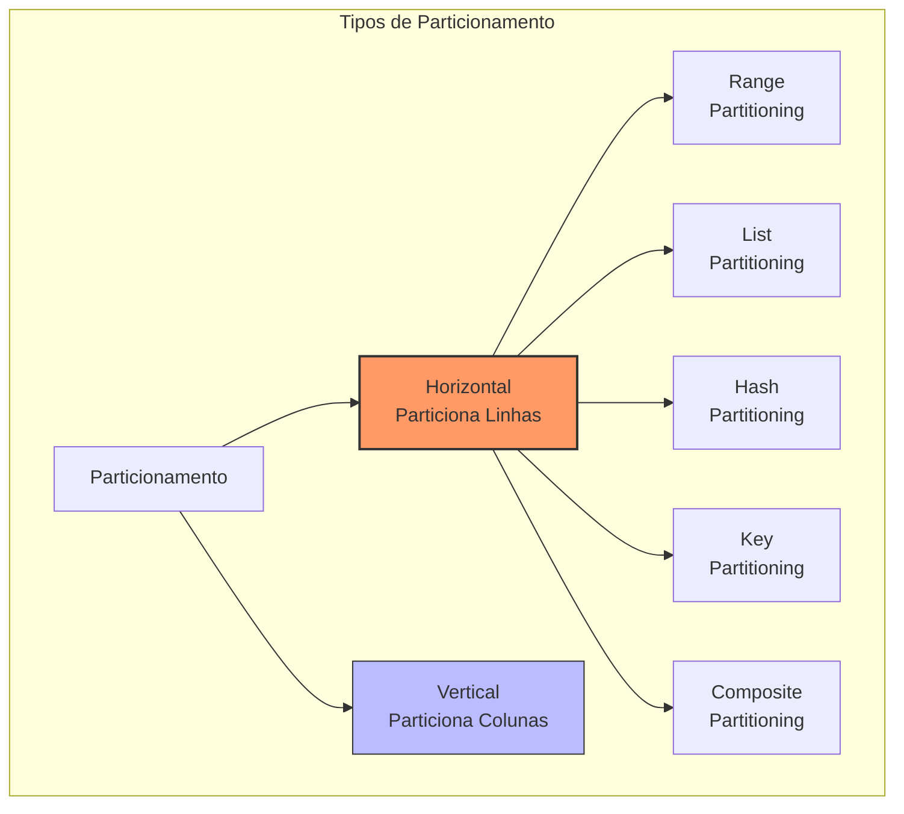
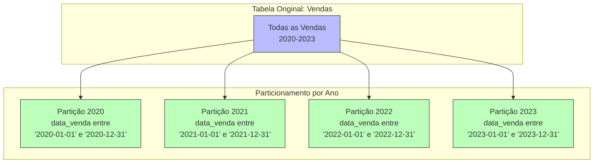
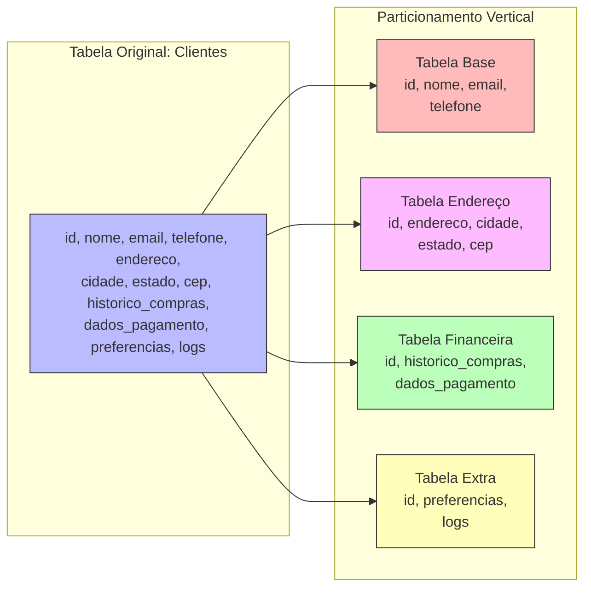
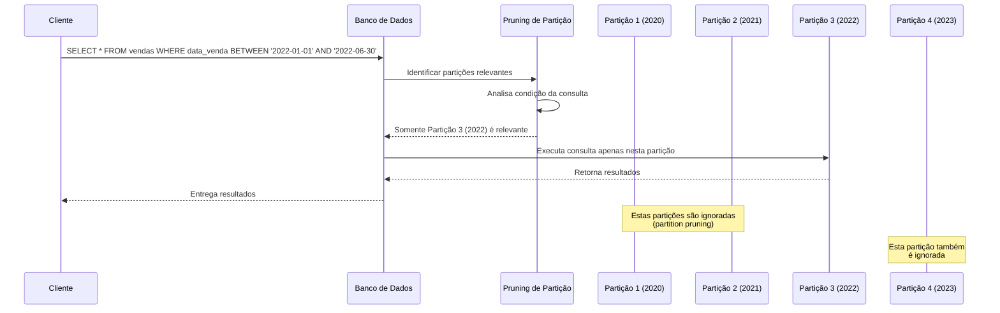
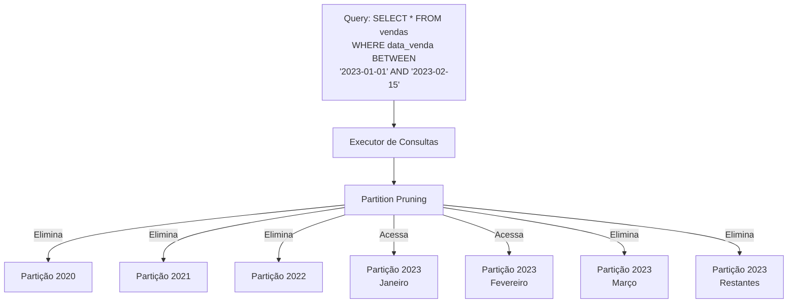
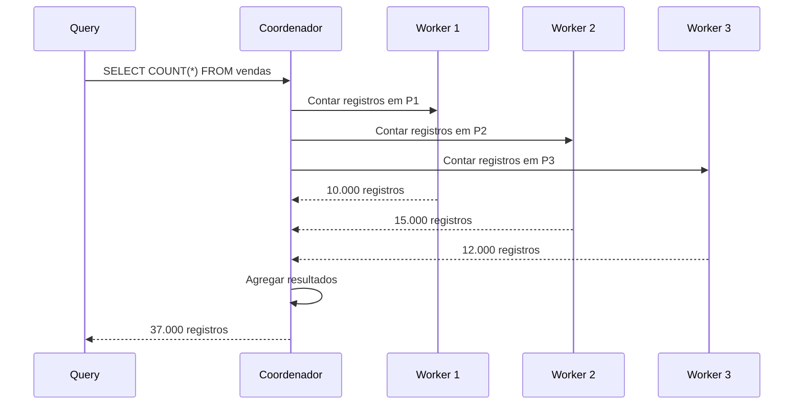
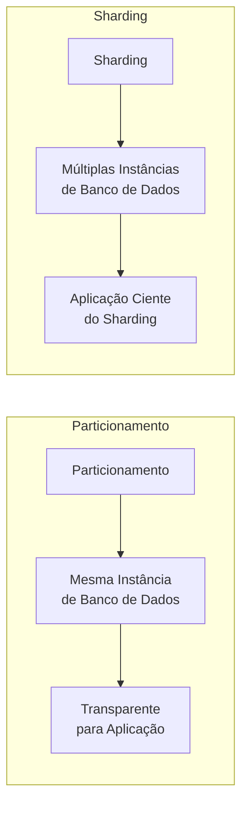

# Partitioning (Particionamento)

## Definição e Visão Geral

Partitioning (Particionamento) é uma técnica de design de banco de dados que divide grandes tabelas ou índices em partes menores e mais gerenciáveis, chamadas partições. Cada partição é uma divisão lógica da tabela que contém um subconjunto de dados, mas que para a aplicação continua aparecendo como uma única entidade. O objetivo principal é melhorar a performance, gerenciabilidade e disponibilidade de dados, especialmente para tabelas muito grandes.

Diferentemente do sharding (que distribui dados entre múltiplos servidores de banco de dados), o particionamento geralmente ocorre dentro de uma única instância de banco de dados. No entanto, essas duas técnicas podem ser combinadas para criar arquiteturas de banco de dados altamente escaláveis.

A essência do particionamento está na distribuição dos dados segundo algum critério lógico (como intervalo de datas, valores de colunas específicas ou função hash), que permite ao banco de dados acessar apenas as partições relevantes durante a execução de consultas, ignorando dados irrelevantes.

## Diagramas

### Tipos Básicos de Particionamento



### Particionamento Horizontal (por Linhas)



### Particionamento Vertical (por Colunas)



### Processo de Particionamento de Consulta



## Estratégias de Particionamento

### Range Partitioning (Por Intervalo)

Divide dados com base em intervalos de valores:

```sql
-- PostgreSQL: Particionamento por intervalo de datas
CREATE TABLE vendas (
  id SERIAL,
  cliente_id INTEGER,
  produto_id INTEGER,
  data_venda DATE,
  valor DECIMAL(10,2)
) PARTITION BY RANGE (data_venda);

-- Criação das partições
CREATE TABLE vendas_2020 PARTITION OF vendas
  FOR VALUES FROM ('2020-01-01') TO ('2021-01-01');
  
CREATE TABLE vendas_2021 PARTITION OF vendas
  FOR VALUES FROM ('2021-01-01') TO ('2022-01-01');
  
CREATE TABLE vendas_2022 PARTITION OF vendas
  FOR VALUES FROM ('2022-01-01') TO ('2023-01-01');
  
CREATE TABLE vendas_2023 PARTITION OF vendas
  FOR VALUES FROM ('2023-01-01') TO ('2024-01-01');
```

### List Partitioning (Por Lista)

Divide dados com base em listas de valores discretos:

```sql
-- MySQL: Particionamento por lista de regiões
CREATE TABLE clientes (
  id INT,
  nome VARCHAR(100),
  email VARCHAR(100),
  regiao VARCHAR(20),
  /* outras colunas */
)
PARTITION BY LIST COLUMNS(regiao) (
  PARTITION p_norte VALUES IN ('norte', 'nordeste'),
  PARTITION p_sul VALUES IN ('sul', 'sudeste'),
  PARTITION p_central VALUES IN ('centro-oeste'),
  PARTITION p_outros VALUES IN ('exterior', 'desconhecido')
);
```

### Hash Partitioning (Por Hash)

Distribui dados uniformemente usando função hash:

```sql
-- Oracle: Particionamento por hash do ID do cliente
CREATE TABLE pedidos (
  id NUMBER,
  cliente_id NUMBER,
  data_pedido DATE,
  valor NUMBER,
  /* outras colunas */
)
PARTITION BY HASH (cliente_id) 
PARTITIONS 8
STORE IN (tbs_01, tbs_02, tbs_03, tbs_04);
```

### Composite Partitioning (Composto)

Combina múltiplas estratégias:

```sql
-- PostgreSQL: Particionamento por intervalo e hash
CREATE TABLE medicoes (
  id SERIAL,
  sensor_id INTEGER,
  data_medicao TIMESTAMP,
  valor DECIMAL(10,2)
) PARTITION BY RANGE (data_medicao);

-- Partição por trimestre
CREATE TABLE medicoes_t1_2023 PARTITION OF medicoes
  FOR VALUES FROM ('2023-01-01') TO ('2023-04-01')
  PARTITION BY HASH (sensor_id);

-- Subpartições por hash para o primeiro trimestre
CREATE TABLE medicoes_t1_2023_p1 PARTITION OF medicoes_t1_2023
  FOR VALUES WITH (MODULUS 4, REMAINDER 0);
CREATE TABLE medicoes_t1_2023_p2 PARTITION OF medicoes_t1_2023
  FOR VALUES WITH (MODULUS 4, REMAINDER 1);
CREATE TABLE medicoes_t1_2023_p3 PARTITION OF medicoes_t1_2023
  FOR VALUES WITH (MODULUS 4, REMAINDER 2);
CREATE TABLE medicoes_t1_2023_p4 PARTITION OF medicoes_t1_2023
  FOR VALUES WITH (MODULUS 4, REMAINDER 3);
```

## Casos de Uso

- **Tabelas históricas**: Particionamento por data para dados históricos
- **Tabelas massivas**: Gerenciamento de tabelas com bilhões de registros
- **Dados regionalizados**: Particionamento geográfico para localizações diferentes
- **Multitenant**: Separação de dados por cliente/inquilino
- **Manutenção seletiva**: Operações de backup e manutenção em partições específicas
- **Arquivamento de dados**: Facilidade para arquivar partições antigas
- **Melhoria de performance**: Consultas mais rápidas com acesso a menos dados
- **Paralelismo**: Consultas distribuídas entre diferentes partições
- **Conformidade regulatória**: Armazenamento regionalizado para conformidade com leis locais

## Exemplos Práticos e Detalhes de Implementação

### Particionamento em PostgreSQL

```sql
-- Criar tabela de logs particionada por mês
CREATE TABLE logs (
    id SERIAL,
    timestamp TIMESTAMP NOT NULL,
    user_id INT,
    action VARCHAR(50),
    details TEXT
) PARTITION BY RANGE (timestamp);

-- Criar partições para os meses
CREATE TABLE logs_202301 PARTITION OF logs
    FOR VALUES FROM ('2023-01-01') TO ('2023-02-01');
CREATE TABLE logs_202302 PARTITION OF logs
    FOR VALUES FROM ('2023-02-01') TO ('2023-03-01');
CREATE TABLE logs_202303 PARTITION OF logs
    FOR VALUES FROM ('2023-03-01') TO ('2023-04-01');

-- Configurar partições futuras automaticamente
CREATE OR REPLACE FUNCTION create_log_partition()
RETURNS TRIGGER AS $$
DECLARE
    partition_date TEXT;
    partition_name TEXT;
    start_date DATE;
    end_date DATE;
BEGIN
    start_date := date_trunc('month', NEW.timestamp)::DATE;
    end_date := (date_trunc('month', NEW.timestamp) + interval '1 month')::DATE;
    partition_date := to_char(NEW.timestamp, 'YYYYMM');
    partition_name := 'logs_' || partition_date;
    
    -- Verificar se partição existe
    IF NOT EXISTS (
        SELECT 1 FROM pg_class c JOIN pg_namespace n 
        ON n.oid = c.relnamespace
        WHERE c.relname = partition_name
    ) THEN
        -- Criar nova partição
        EXECUTE format(
            'CREATE TABLE %I PARTITION OF logs FOR VALUES FROM (%L) TO (%L)',
            partition_name, start_date, end_date
        );
        
        RAISE NOTICE 'Criada partição: %', partition_name;
    END IF;
    
    RETURN NEW;
END;
$$ LANGUAGE plpgsql;

-- Trigger para criar partições automaticamente
CREATE TRIGGER create_log_partition_trigger
    BEFORE INSERT ON logs
    FOR EACH ROW
    EXECUTE FUNCTION create_log_partition();
```

### Particionamento em MySQL

```sql
-- Particionamento de tabela de vendas por ano e mês
CREATE TABLE vendas (
    id INT AUTO_INCREMENT PRIMARY KEY,
    data_venda DATE NOT NULL,
    cliente_id INT,
    valor DECIMAL(10,2),
    /* outras colunas */
)
PARTITION BY RANGE (YEAR(data_venda)*100 + MONTH(data_venda)) (
    PARTITION p202301 VALUES LESS THAN (202302),
    PARTITION p202302 VALUES LESS THAN (202303),
    PARTITION p202303 VALUES LESS THAN (202304),
    PARTITION p202304 VALUES LESS THAN (202305),
    PARTITION p202305 VALUES LESS THAN (202306),
    PARTITION p202306 VALUES LESS THAN (202307),
    PARTITION p202307 VALUES LESS THAN (202308),
    PARTITION p202308 VALUES LESS THAN (202309),
    PARTITION p202309 VALUES LESS THAN (202310),
    PARTITION p202310 VALUES LESS THAN (202311),
    PARTITION p202311 VALUES LESS THAN (202312),
    PARTITION p202312 VALUES LESS THAN (202401),
    PARTITION pmax VALUES LESS THAN MAXVALUE
);
```

### Particionamento Vertical em Aplicações

Exemplo em Java/Spring Data:

```java
// Entidade principal
@Entity
@Table(name = "clientes")
public class Cliente {
    @Id
    private Long id;
    private String nome;
    private String email;
    private String telefone;
    
    // Referência para dados de endereço
    @OneToOne(mappedBy = "cliente", cascade = CascadeType.ALL)
    private EnderecoCliente endereco;
    
    // Referência para dados financeiros
    @OneToOne(mappedBy = "cliente", cascade = CascadeType.ALL)
    private DadosFinanceirosCliente dadosFinanceiros;
    
    // Getters e setters
}

// Tabela particionada verticalmente para endereços
@Entity
@Table(name = "cliente_enderecos")
public class EnderecoCliente {
    @Id
    private Long id;
    
    @OneToOne
    @MapsId
    @JoinColumn(name = "cliente_id")
    private Cliente cliente;
    
    private String logradouro;
    private String bairro;
    private String cidade;
    private String estado;
    private String cep;
    
    // Getters e setters
}

// Tabela particionada verticalmente para dados financeiros
@Entity
@Table(name = "cliente_dados_financeiros")
public class DadosFinanceirosCliente {
    @Id
    private Long id;
    
    @OneToOne
    @MapsId
    @JoinColumn(name = "cliente_id")
    private Cliente cliente;
    
    private String contaBancaria;
    private String cartaoCredito;
    @Lob
    private String historicoCompras;
    
    // Getters e setters
}
```

## Gerenciamento e Manutenção de Partições

### Manutenção e Otimização

```sql
-- PostgreSQL: desanexar partição (detach)
ALTER TABLE vendas DETACH PARTITION vendas_2020;

-- Executar manutenção na partição separada
VACUUM FULL vendas_2020;
REINDEX TABLE vendas_2020;

-- Reanexar partição (attach)
ALTER TABLE vendas ATTACH PARTITION vendas_2020
    FOR VALUES FROM ('2020-01-01') TO ('2021-01-01');
```

### Partições de Arquivamento

```sql
-- Oracle: mover partição antiga para tablespace de arquivamento
ALTER TABLE vendas 
MOVE PARTITION vendas_2020 
TABLESPACE archive_tablespace;

-- PostgreSQL: mover para tabela separada (para arquivamento)
BEGIN;
CREATE TABLE vendas_2020_archive (LIKE vendas_2020 INCLUDING ALL);
INSERT INTO vendas_2020_archive SELECT * FROM vendas_2020;
ALTER TABLE vendas DETACH PARTITION vendas_2020;
DROP TABLE vendas_2020;
COMMIT;
```

### Troca de Partições (Partition Exchange)

```sql
-- Oracle: troca de partição para carga rápida
-- Criar tabela temporária com mesma estrutura
CREATE TABLE temp_vendas_2023 AS
SELECT * FROM vendas WHERE 1=0;

-- Carregar dados na tabela temporária (muito mais rápido)
INSERT /*+ APPEND */ INTO temp_vendas_2023 
SELECT * FROM staging_vendas;

-- Trocar partição (operação quase instantânea)
ALTER TABLE vendas 
EXCHANGE PARTITION vendas_2023 
WITH TABLE temp_vendas_2023;
```

## Impactos na Performance

### Partition Pruning (Eliminação de Partições)

O mecanismo mais importante para ganho de performance, que permite ao banco ignorar partições irrelevantes:



### Paralelismo em Partições



## Prós e Contras

### Prós
- **Performance otimizada**: Consultas acessam apenas dados relevantes
- **Gerenciamento simplificado**: Operações de manutenção em partições menores
- **Melhor disponibilidade**: Falhas afetam apenas partições específicas
- **Arquivamento eficiente**: Facilidade para arquivar dados históricos
- **Paralelismo**: Execução de consultas em paralelo por partição
- **Balanceamento de I/O**: Distribuição de carga entre diferentes armazenamentos
- **Compliance de dados**: Facilita atender a requisitos legais de localização
- **Escalonamento**: Suporte a tabelas de tamanho praticamente ilimitado

### Contras
- **Complexidade**: Design e manutenção mais complexos
- **Sobrecarga**: Custos adicionais para gerenciamento de partições
- **Limitações em chaves**: Chaves primárias/estrangeiras com restrições
- **Overhead em tabelas pequenas**: Benefícios minimizados para dados pequenos
- **Rebalanceamento**: Necessidade de rebalancear periodicamente
- **Consultas cross-partition**: Performance diminuída para consultas entre partições
- **Limitações específicas**: Cada banco de dados tem diferentes implementações
- **Curva de aprendizado**: Requer conhecimentos específicos para design eficiente

## Ferramentas e Monitoramento

### Ferramentas de Gerenciamento

- **Oracle Partition Advisor**: Sugere estratégias de particionamento
- **PostgreSQL pg_partman**: Gerenciamento automático de partições
- **MySQL Partition Manager**: Scripts para gerenciar partições
- **Ferramentas de automação**: Scripts para criar/remover partições automaticamente

### Métricas de Monitoramento

Principais aspectos para monitorar:

```
- Tamanho das partições (identificar desbalanceamento)
- Número de acessos por partição (identificar hotspots)
- Tempo de consulta por partição
- Taxa de partition pruning (eficiência da eliminação)
- Fragmentação de partições
- Uso de armazenamento por partição
```

## Melhores Práticas

1. **Escolha a chave de particionamento apropriada**: Deve ser baseada nos padrões de acesso comuns

2. **Crie partições de tamanho similar**: Evite desbalanceamento que impacta a performance

3. **Mantenha o esquema de particionamento simples**: Não complique além do necessário

4. **Automatize a gestão de partições**: Use scripts ou ferramentas para criar/arquivar partições

5. **Considere índices por partição**: Índices locais podem melhorar performance específica

6. **Monitore o crescimento das partições**: Evite partições que crescem além do gerenciável

7. **Planeje a estratégia de arquivamento**: Define regras para dados históricos

8. **Documente o esquema de particionamento**: Essencial para manutenção a longo prazo

9. **Teste performance**: Compare performance antes e depois do particionamento

10. **Considere subpartições com cautela**: Adicione complexidade apenas se necessário

## Diferenças entre Bancos de Dados

| Banco de Dados | Características Específicas |
|----------------|---------------------------|
| **PostgreSQL** | - Particionamento declarativo a partir da versão 10<br>- Suporte a múltiplos tipos de particionamento<br>- Ferramentas como pg_partman para gestão automatizada |
| **MySQL** | - Particionamento nativo desde versão 5.1<br>- Limitações em chaves estrangeiras<br>- Até 8192 partições (limitação do InnoDB) |
| **Oracle** | - Sistema avançado de particionamento<br>- Global/Local indexes<br>- Interval Partitioning (criação automática) |
| **SQL Server** | - Partitioned Views (pré-2005)<br>- Partitioned Tables (pós-2005)<br>- Filegroups para armazenamento físico |
| **MongoDB** | - Sharded Clusters<br>- Particionamento automático via shard key<br>- Balancer para redistribuição automática |

## Conclusão: Particionamento vs. Sharding



Diferenças principais:
- **Particionamento**: Divisão lógica dentro de uma instância única de banco de dados
- **Sharding**: Divisão física distribuída por múltiplos servidores
- **Combinação**: Estratégias frequentemente combinadas em sistemas de larga escala

## Referências

- Garcia-Molina, H., Ullman, J. D., & Widom, J. (2008). Database Systems: The Complete Book. Pearson.
- PostgreSQL Documentation. (2023). Table Partitioning. https://www.postgresql.org/docs/current/ddl-partitioning.html
- MySQL Documentation. (2023). Partitioning. https://dev.mysql.com/doc/refman/8.0/en/partitioning.html
- Oracle Documentation. (2023). Partitioning Concepts. https://docs.oracle.com/en/database/oracle/oracle-database/19/vldbg/partition-concepts.html
- Das, S., & Saha, D. (2013). Data Partitioning Techniques in SQL Server. International Journal of Computer Applications, 75(10), 13-19.
- Nanda, A. (2008). Oracle Database 11g: New Features for Administrators. Packt Publishing.
- Kleppmann, M. (2017). Designing Data-Intensive Applications. O'Reilly Media.
- Connolly, T. M., & Begg, C. E. (2014). Database Systems: A Practical Approach to Design, Implementation, and Management. Pearson.
