# Eventual Consistency (Consistência Eventual)

## Definição e Visão Geral

Eventual Consistency (Consistência Eventual) é um modelo de consistência utilizado em sistemas distribuídos que permite que um sistema de dados continue funcionando mesmo quando as comunicações de rede não são confiáveis ou quando ocorrem partições. Em vez de garantir que todos os nós tenham a versão mais recente dos dados imediatamente após cada atualização (como em sistemas com consistência forte), o modelo de consistência eventual garante apenas que, se nenhuma nova atualização for feita a um item, eventualmente todos os acessos a esse item retornarão o último valor atualizado.

Este modelo representa um compromisso que favorece a disponibilidade e a tolerância a partições sobre a consistência imediata, alinhando-se com o teorema CAP (Consistency, Availability, Partition Tolerance), onde, em face de partições de rede, escolhe-se priorizar a disponibilidade. A consistência eventual tornou-se um conceito fundamental no design de bancos de dados distribuídos, sistemas de cache e arquiteturas web de alta escalabilidade.

## Diagramas

### Consistência Forte vs. Consistência Eventual

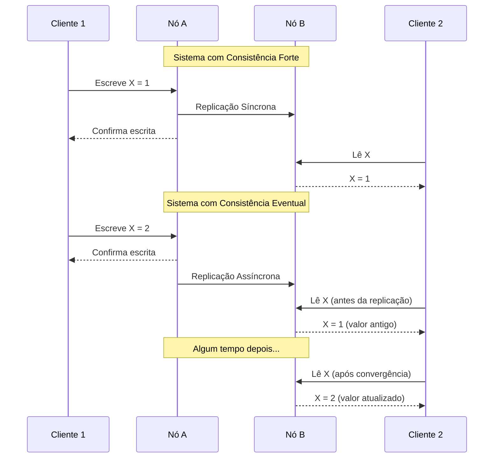

### Propagação de Atualizações em Sistema Distribuído

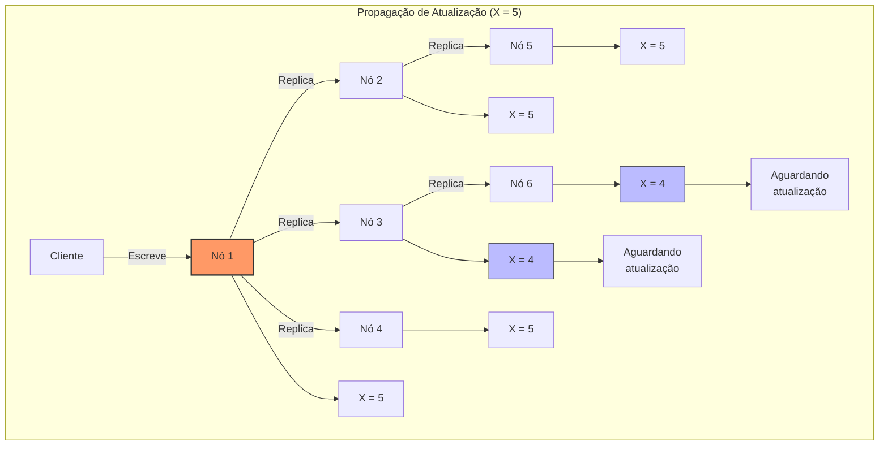

### Conflitos e Resolução

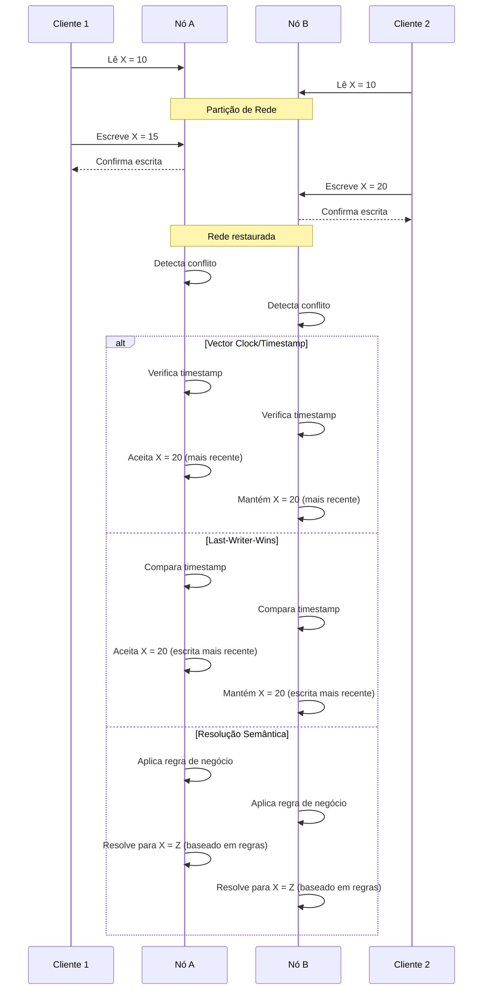

## Modelos de Consistência

### Espectro de Consistência

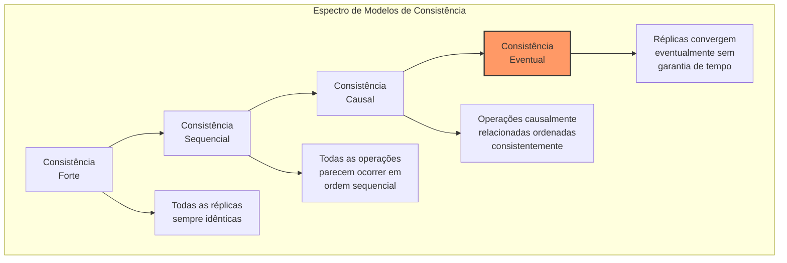

### Tunable Consistency

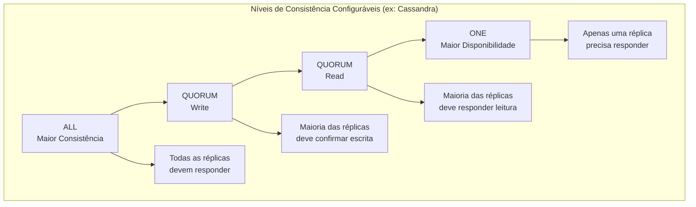

## Casos de Uso

- **Bancos de dados NoSQL distribuídos**: DynamoDB, Cassandra, MongoDB
- **Sistemas de cache distribuído**: Redis, Memcached em cluster
- **CDNs (Content Delivery Networks)**: Propagação de conteúdo entre PoPs
- **DNS (Domain Name System)**: Atualizações de registros DNS
- **Redes sociais**: Feed de notícias e linha do tempo
- **Sistemas de comércio eletrônico**: Inventário e catálogo de produtos
- **Serviços de mensagens**: Status de entrega em sistemas de mensageria
- **Logs distribuídos**: Agregação de logs de múltiplos serviços
- **Colaboração em tempo real**: Edição colaborativa de documentos
- **Réplicas globais de bancos de dados**: Bancos de dados geograficamente distribuídos

## Exemplos Práticos

### Configuração de Consistência em Cassandra

```java
// Configurando níveis diferentes de consistência para operações
import com.datastax.driver.core.*;

public class CassandraConsistencyExample {
    public static void main(String[] args) {
        Cluster cluster = Cluster.builder()
            .addContactPoint("127.0.0.1")
            .build();
        
        Session session = cluster.connect("mykeyspace");
        
        // Consistência forte para escrita crítica
        PreparedStatement strongWrite = session.prepare(
            "UPDATE user_accounts SET balance = ? WHERE user_id = ?");
        
        // Cada operação pode ter seu próprio nível de consistência
        BoundStatement bound = strongWrite.bind(500.00, "user123");
        bound.setConsistencyLevel(ConsistencyLevel.ALL); // Maior consistência
        session.execute(bound);
        
        // Leitura com consistência eventual (mais rápida)
        PreparedStatement eventualRead = session.prepare(
            "SELECT * FROM product_catalog WHERE category = ?");
        
        BoundStatement readBound = eventualRead.bind("electronics");
        readBound.setConsistencyLevel(ConsistencyLevel.ONE); // Maior disponibilidade
        ResultSet results = session.execute(readBound);
        
        // Fechar conexões
        session.close();
        cluster.close();
    }
}
```

### Resolução de Conflitos em DynamoDB

```javascript
// Exemplo de AWS SDK para DynamoDB com resolução de conflitos
const AWS = require('aws-sdk');
AWS.config.update({ region: 'us-west-2' });

const dynamoDB = new AWS.DynamoDB.DocumentClient();

// Função para ler com consistência eventual (mais rápido)
async function readWithEventualConsistency(userId) {
    const params = {
        TableName: 'UserPreferences',
        Key: { 'userId': userId },
        // ConsistentRead: false é o padrão (consistência eventual)
    };
    
    try {
        const result = await dynamoDB.get(params).promise();
        return result.Item;
    } catch (error) {
        console.error("Erro na leitura:", error);
        throw error;
    }
}

// Função para ler com consistência forte (mais lento)
async function readWithStrongConsistency(userId) {
    const params = {
        TableName: 'UserPreferences',
        Key: { 'userId': userId },
        ConsistentRead: true // solicita leitura fortemente consistente
    };
    
    try {
        const result = await dynamoDB.get(params).promise();
        return result.Item;
    } catch (error) {
        console.error("Erro na leitura:", error);
        throw error;
    }
}

// Atualização condicional (evita sobrescrever mudanças concorrentes)
async function conditionalUpdate(userId, oldVersion, newPreferences) {
    const params = {
        TableName: 'UserPreferences',
        Key: { 'userId': userId },
        UpdateExpression: 'SET preferences = :newPref, version = :newVersion',
        ConditionExpression: 'version = :oldVersion',
        ExpressionAttributeValues: {
            ':newPref': newPreferences,
            ':oldVersion': oldVersion,
            ':newVersion': oldVersion + 1
        },
        ReturnValues: 'ALL_NEW'
    };
    
    try {
        const result = await dynamoDB.update(params).promise();
        return result.Attributes;
    } catch (error) {
        if (error.code === 'ConditionalCheckFailedException') {
            // Conflito detectado - implementar estratégia de resolução
            console.log("Conflito detectado - recuperando versão atual");
            const currentItem = await readWithStrongConsistency(userId);
            // Aqui poderia implementar lógica de mesclagem ou aplicar regras de negócio
            // para resolver o conflito entre newPreferences e currentItem.preferences
        }
        throw error;
    }
}
```

### Implementação de CRDTs (Conflict-free Replicated Data Types)

```javascript
// Implementação simples de um contador incrementado apenas (G-Counter)
class GCounter {
    constructor(nodeId) {
        this.nodeId = nodeId;
        this.counters = {}; // Um contador por nó
        this.counters[nodeId] = 0;
    }
    
    // Incrementa o contador local
    increment(amount = 1) {
        this.counters[this.nodeId] = (this.counters[this.nodeId] || 0) + amount;
    }
    
    // Retorna o valor total combinando todos os contadores
    value() {
        return Object.values(this.counters).reduce((sum, count) => sum + count, 0);
    }
    
    // Mescla com outro contador (resolve conflitos)
    merge(other) {
        // Para cada nó no outro contador
        for (const nodeId in other.counters) {
            // Pega o valor mais alto para cada nó
            this.counters[nodeId] = Math.max(
                this.counters[nodeId] || 0,
                other.counters[nodeId] || 0
            );
        }
    }
}

// Exemplo de uso em nós diferentes
const nodeA = new GCounter('A');
const nodeB = new GCounter('B');

// Operações no nó A
nodeA.increment(5);
console.log("Valor no nó A:", nodeA.value()); // 5

// Operações no nó B (sem conhecimento das operações no nó A)
nodeB.increment(3);
console.log("Valor no nó B:", nodeB.value()); // 3

// Sincronização (poderia ser em qualquer ordem)
nodeA.merge(nodeB);
nodeB.merge(nodeA);

// Ambos convergiram para o mesmo valor
console.log("Valor no nó A após sincronização:", nodeA.value()); // 8
console.log("Valor no nó B após sincronização:", nodeB.value()); // 8
```

## Técnicas de Implementação

### Vector Clocks

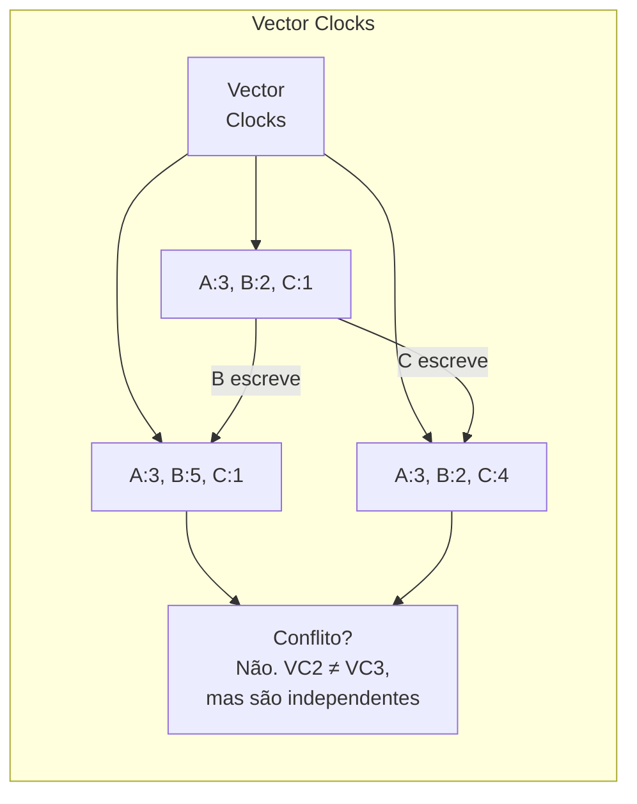

Vector clocks são utilizados para:
- Rastrear a causalidade entre eventos em sistemas distribuídos
- Detectar alterações concorrentes que requerem reconciliação
- Ordenar eventos em um ambiente onde o relógio físico não é confiável
- Permitir que sistemas entendam quais atualizações um nó já viu

### Modelos de Replicação para Consistência Eventual

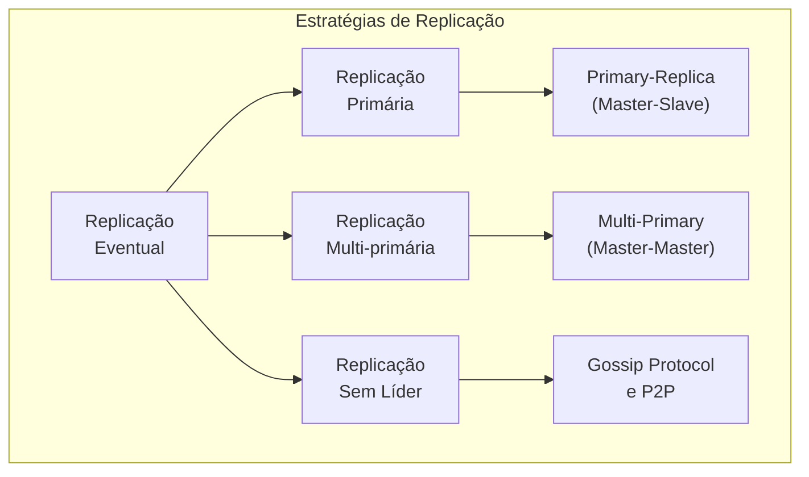

### Read-Repair e Anti-Entropy

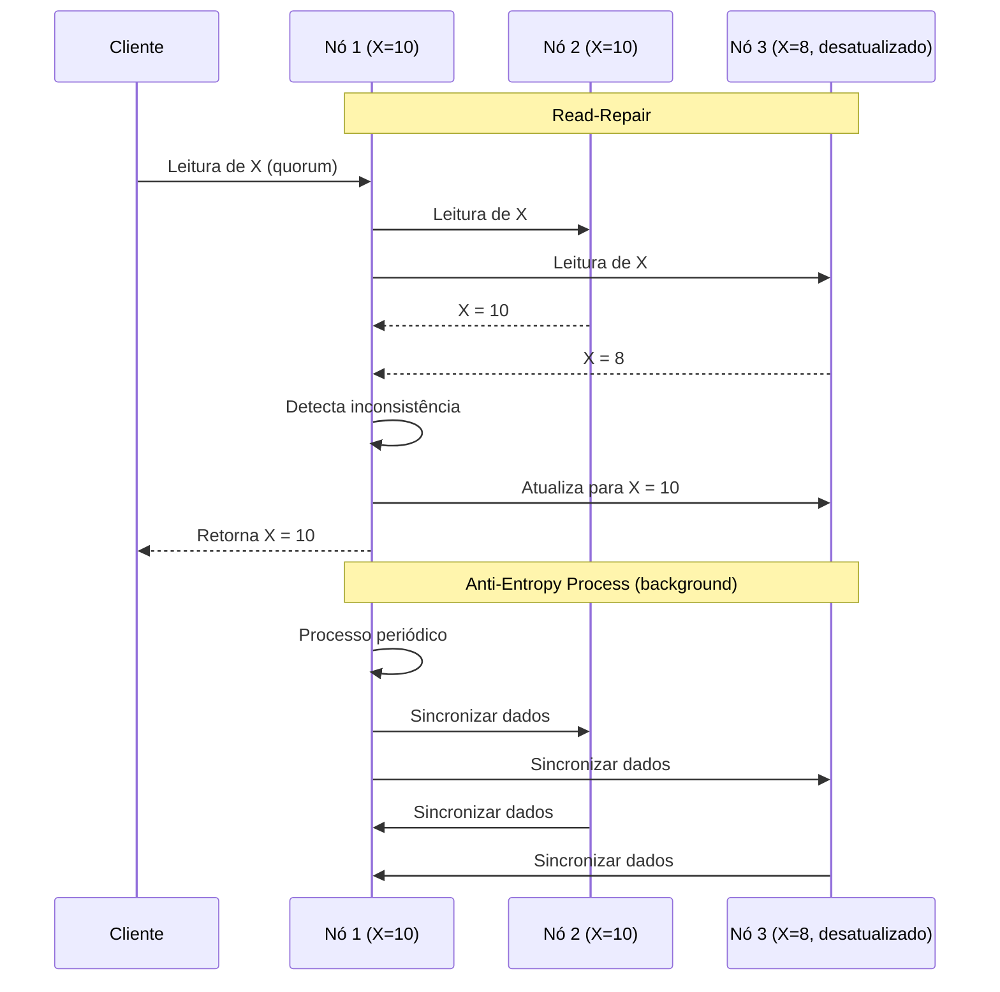

## Padrões de Implementação

### Event Sourcing

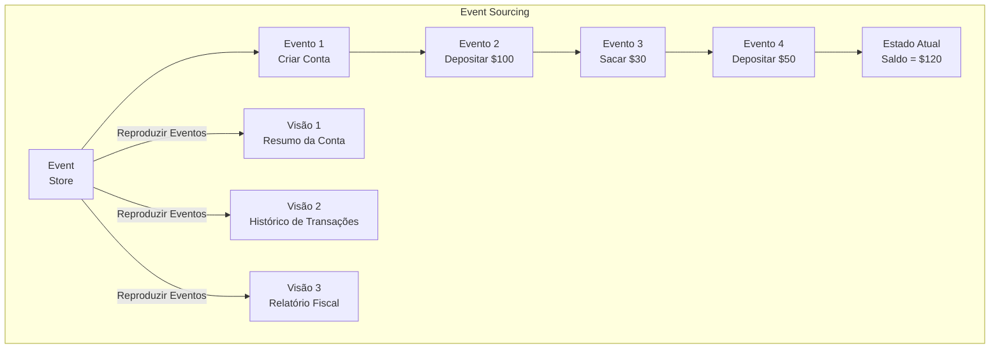

O Event Sourcing ajuda na consistência eventual:
- Armazena sequência de eventos em vez de estado atual
- Permite reconstruir o estado a partir do histórico de eventos
- Facilita a sincronização quando sistemas ficam offline

### Command Query Responsibility Segregation (CQRS)

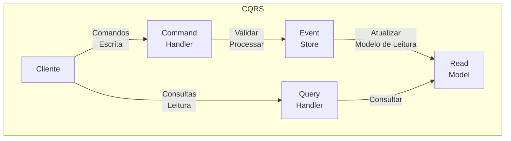

CQRS complementa a consistência eventual:
- Separa operações de leitura e escrita
- Permite otimizar independentemente cada caminho
- Facilita múltiplas representações dos mesmos dados
- Suporta diferentes níveis de consistência para leitura e escrita

## Prós e Contras

### Prós
- **Alta disponibilidade**: Continua operando mesmo durante partições de rede
- **Baixa latência**: Respostas rápidas sem necessidade de coordenação síncrona
- **Escalabilidade**: Facilidade de escala horizontal
- **Tolerância a partições**: Robustez em face de falhas de rede
- **Distribuição geográfica**: Suporte a operações em múltiplas regiões
- **Performance de escrita**: Melhor performance para operações de escrita
- **Operação offline**: Permite operações sem conectividade constante
- **Resiliência**: Degradação gradual em vez de falha total

### Contras
- **Complexidade**: Lógica adicional para detecção e resolução de conflitos
- **Inconsistência temporária**: Usuários podem ver dados desatualizados
- **Janela de inconsistência**: Período entre atualização e convergência
- **Dificuldade de debugging**: Problemas difíceis de reproduzir
- **Raciocínio sobre o sistema**: Maior dificuldade de entender o estado global
- **Sobrecarga de desenvolvimento**: Equipes precisam considerar cenários de conflito
- **Requisitos específicos**: Nem todas as aplicações toleram inconsistência temporária
- **Padrões de acesso imprevisíveis**: Difícil otimizar quando padrões são aleatórios

## Considerações de Design

### Quando Usar Consistência Eventual

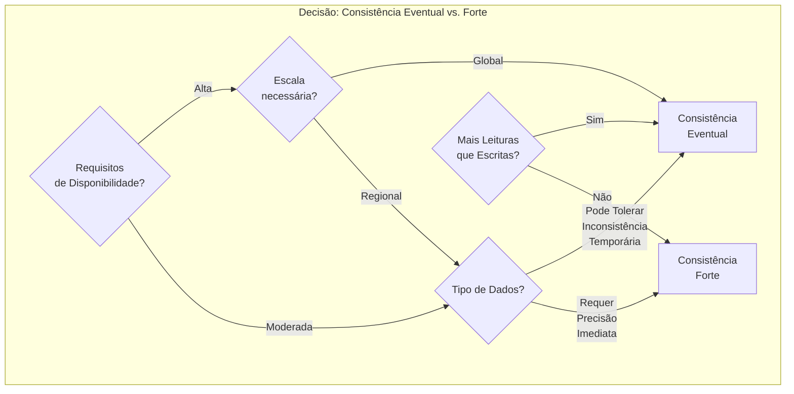

### Padrões de Desenvolvimento com Consistência Eventual

1. **Design para idempotência**: Operações devem ser seguras para repetir
2. **Comandos vs. Eventos**: Use comandos para intenções, eventos para fatos ocorridos
3. **Versionamento de dados**: Rastreie versões para detectar conflitos
4. **Compensação em vez de rollback**: Em sistemas distribuídos, desfazer via nova operação
5. **Comunicação assíncrona**: Use filas de mensagens para operações não-críticas
6. **Expiração de dados**: Defina TTL (time-to-live) para dados em cache
7. **Sincronização periódica**: Implemente processos de reconciliação em background
8. **Feedback ao usuário**: Informe status de operações (confirmado vs. em progresso)

## Ferramentas e Tecnologias

### Bancos de Dados com Suporte a Consistência Eventual

- **Cassandra**: Consistência configurável por operação
- **DynamoDB**: Suporte a leituras eventualmente consistentes
- **MongoDB**: Configurações de write concern e read preference
- **CouchDB**: Modelo de replicação baseado em mudanças incrementais
- **Riak**: Baseado em algoritmos de gossip para convergência
- **Azure Cosmos DB**: Cinco níveis de consistência configuráveis

### Implementações de CRDTs

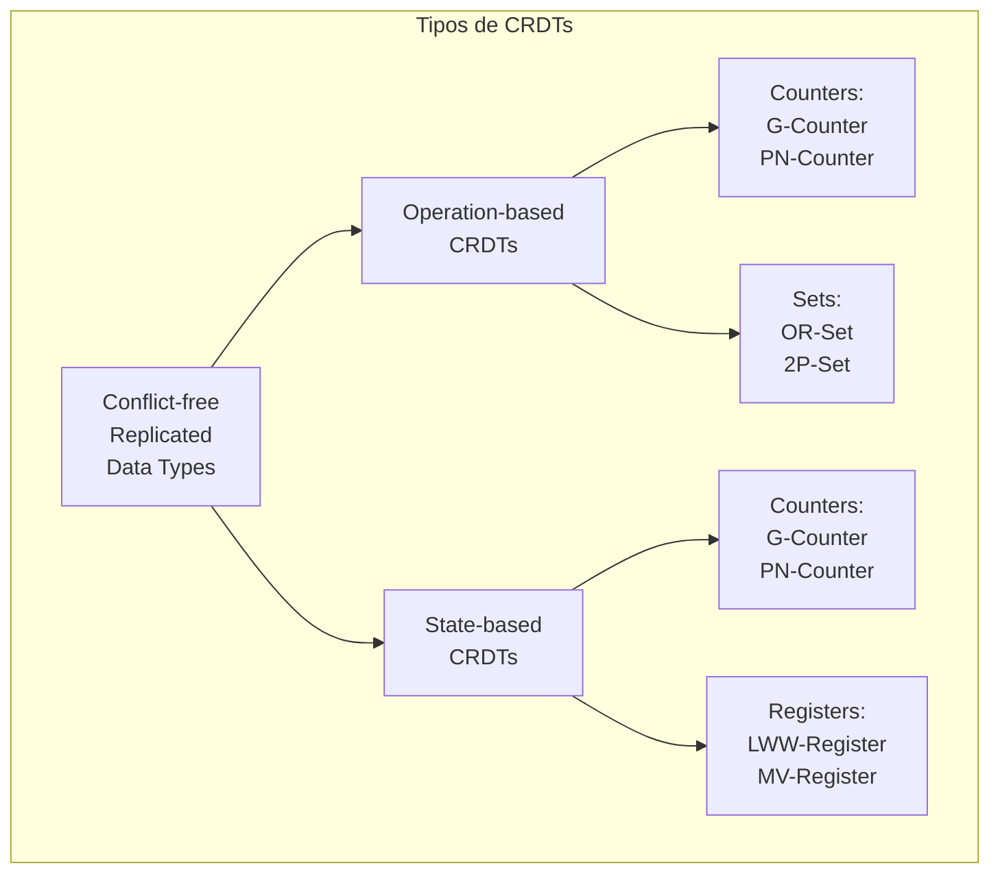

Bibliotecas e ferramentas:
- **Automerge**: Biblioteca JavaScript para estruturas de dados que se mesclam automaticamente
- **Yjs**: Framework para CRDTs em tempo real
- **Redis Enterprise**: Implementação de CRDTs para Redis em cluster
- **Akka Distributed Data**: Estruturas de dados distribuídas para Scala/Java
- **Riak DT**: Implementação de CRDTs no Riak

## Melhores Práticas

1. **Escolha o nível de consistência adequado para cada operação**: Nem tudo precisa da mesma garantia

2. **Projete para falhas**: Sempre considere como o sistema reagirá durante partições

3. **Implemente mecanismos robustos de detecção e resolução de conflitos**: Last-Writer-Wins é simples mas nem sempre adequado

4. **Use timestamps vetoriais ou lógicos**: Relógios físicos não são confiáveis em sistemas distribuídos

5. **Automatize a reconciliação**: Processos em background para corrigir inconsistências

6. **Monitore a divergência**: Rastreie métricas de inconsistência entre réplicas

7. **Eduque usuários e stakeholders**: Explique as implicações de consistência eventual

8. **Teste exaustivamente**: Simule partições e condições de rede adversas

9. **Documente o modelo de consistência**: Torne explícitas as garantias do sistema

10. **Forneça ferramentas de reparo**: Mecanismos para corrigir manualmente quando necessário

## Referências

- Vogels, W. (2009). Eventually Consistent. Communications of the ACM, 52(1), 40-44.
- Shapiro, M., Preguiça, N., Baquero, C., & Zawirski, M. (2011). A comprehensive study of Convergent and Commutative Replicated Data Types. INRIA.
- Kleppmann, M. (2017). Designing Data-Intensive Applications. O'Reilly Media.
- Bailis, P., & Ghodsi, A. (2013). Eventual Consistency Today: Limitations, Extensions, and Beyond. ACM Queue, 11(3).
- Terry, D. (2013). Replicated Data Consistency Explained Through Baseball. Microsoft Research.
- Bernstein, P. A., & Newcomer, E. (2009). Principles of Transaction Processing. Morgan Kaufmann.
- Banks, A., & Porcello, E. (2017). Learning GraphQL: Declarative Data Fetching for Modern Web Apps. O'Reilly Media.
- Helland, P., & Campbell, D. (2009). Building on Quicksand. CIDR.
- Gilbert, S., & Lynch, N. (2002). Brewer's Conjecture and the Feasibility of Consistent, Available, Partition-Tolerant Web Services. ACM SIGACT News, 33(2), 51-59.
- Lakshman, A., & Malik, P. (2010). Cassandra: A Decentralized Structured Storage System. ACM SIGOPS Operating Systems Review, 44(2), 35-40.
