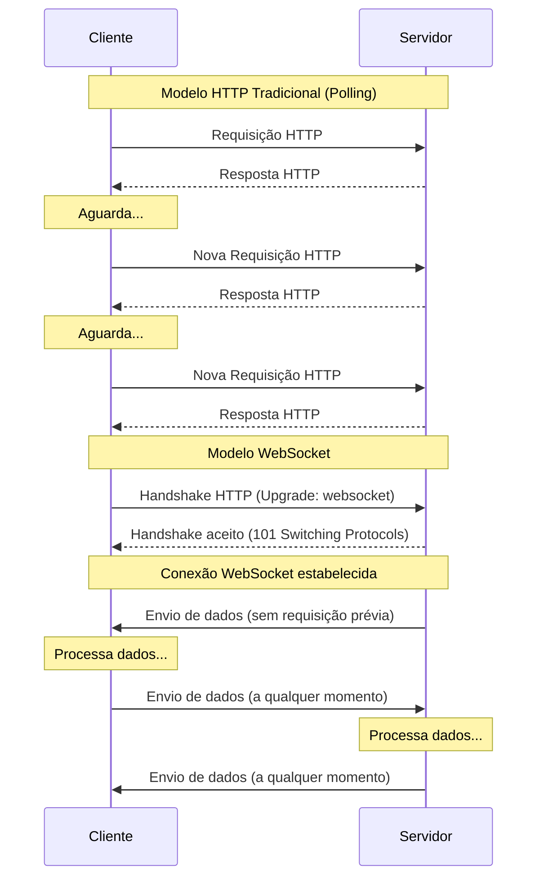
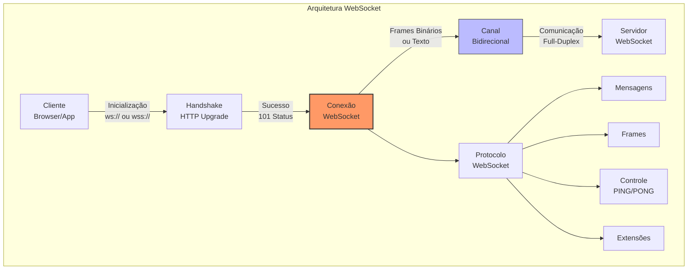
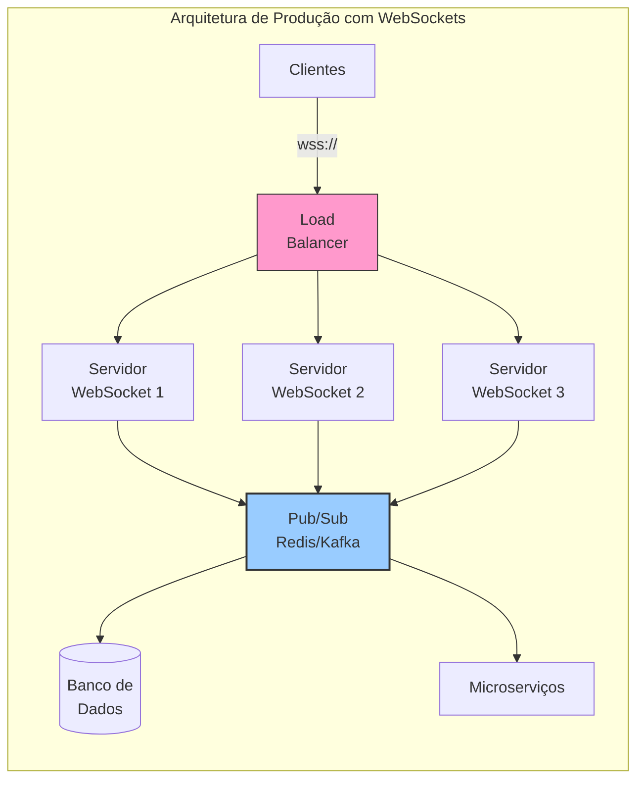

# WebSockets

## Definição e Visão Geral

WebSockets é um protocolo de comunicação bidirecional que opera sobre uma única conexão TCP persistente, permitindo a troca de dados em tempo real entre cliente e servidor. Diferentemente do modelo tradicional HTTP de requisição-resposta, o WebSocket estabelece um canal de comunicação que permanece aberto, possibilitando que tanto o cliente quanto o servidor enviem dados independentemente, sem a necessidade de uma nova solicitação.

Padronizado pela IETF como RFC 6455 em 2011, o protocolo WebSocket foi desenvolvido para resolver limitações do HTTP em aplicações que exigem atualizações em tempo real ou de baixa latência. Ele começa como uma requisição HTTP normal com um "handshake" que solicita uma atualização para WebSocket, e uma vez estabelecida, a conexão permanece aberta até que seja explicitamente fechada por qualquer uma das partes.

WebSockets são particularmente úteis em aplicações como chats ao vivo, jogos online, dashboards em tempo real, ferramentas colaborativas e qualquer sistema que se beneficie de comunicação instantânea sem a sobrecarga associada a múltiplas conexões HTTP.

## Diagramas

### Comunicação HTTP vs. WebSocket



### Arquitetura e Componentes do WebSocket



### WebSocket em Ambiente de Produção



## Casos de Uso

- **Chat em tempo real**: Mensageiros, suporte ao cliente, salas de bate-papo
- **Dashboards ao vivo**: Painéis de controle com atualização instantânea
- **Jogos online**: Comunicação rápida para jogos multiplayer
- **Plataformas de trading**: Atualização de preços e ordens em tempo real
- **Ferramentas colaborativas**: Edição simultânea de documentos
- **Streaming de notificações**: Alertas e notificações push
- **Monitoramento de IoT**: Acompanhamento em tempo real de dispositivos
- **Aplicações sociais**: Feed de notícias ao vivo, notificações, likes
- **Visualização de dados ao vivo**: Gráficos e estatísticas atualizadas instantaneamente
- **Ferramentas de apresentação interativa**: Controle remoto de slides, enquetes ao vivo

## Exemplos Práticos

### Cliente WebSocket em JavaScript (Browser)

```javascript
// Conexão WebSocket simples em JavaScript no navegador
const connectWebSocket = () => {
    // Criar uma nova conexão WebSocket
    const socket = new WebSocket('wss://exemplo.com/socket');
    
    // Evento disparado quando a conexão é estabelecida
    socket.addEventListener('open', (event) => {
        console.log('Conexão WebSocket estabelecida');
        
        // Enviar uma mensagem para o servidor
        socket.send(JSON.stringify({
            type: 'greeting',
            content: 'Olá, servidor!'
        }));
    });
    
    // Evento disparado quando uma mensagem é recebida
    socket.addEventListener('message', (event) => {
        try {
            const data = JSON.parse(event.data);
            console.log('Mensagem recebida:', data);
            
            // Processar diferentes tipos de mensagens
            switch(data.type) {
                case 'chat':
                    addChatMessage(data.user, data.content);
                    break;
                case 'notification':
                    showNotification(data.content);
                    break;
                case 'update':
                    updateDashboard(data.metrics);
                    break;
                default:
                    console.log('Tipo de mensagem desconhecido:', data.type);
            }
        } catch (error) {
            console.error('Erro ao processar mensagem:', error);
        }
    });
    
    // Evento disparado quando ocorre um erro
    socket.addEventListener('error', (event) => {
        console.error('Erro na conexão WebSocket:', event);
    });
    
    // Evento disparado quando a conexão é fechada
    socket.addEventListener('close', (event) => {
        console.log(`Conexão fechada. Código: ${event.code}, Motivo: ${event.reason}`);
        
        // Tentar reconectar após um intervalo
        if (event.code !== 1000) { // 1000 é o código para fechamento normal
            console.log('Tentando reconectar em 5 segundos...');
            setTimeout(connectWebSocket, 5000);
        }
    });
    
    // Retornar o objeto socket para uso externo
    return socket;
};

// Iniciar conexão
const socket = connectWebSocket();

// Função para enviar mensagens de chat
function sendChatMessage(message) {
    if (socket.readyState === WebSocket.OPEN) {
        socket.send(JSON.stringify({
            type: 'chat',
            content: message
        }));
    } else {
        console.warn('WebSocket não está aberto. Estado atual:', socket.readyState);
    }
}
```

### Servidor WebSocket com Node.js (ws)

```javascript
// Servidor WebSocket usando a biblioteca 'ws' no Node.js
const WebSocket = require('ws');
const http = require('http');
const express = require('express');

// Configurar aplicação Express
const app = express();
app.use(express.static('public'));

// Criar servidor HTTP
const server = http.createServer(app);

// Criar servidor WebSocket anexado ao servidor HTTP
const wss = new WebSocket.Server({ server });

// Armazenar conexões ativas
const clients = new Map();

// Evento disparado quando uma conexão é estabelecida
wss.on('connection', (ws, req) => {
    const clientId = generateClientId();
    const clientIp = req.socket.remoteAddress;
    
    console.log(`Nova conexão: ${clientId} de ${clientIp}`);
    
    // Armazenar informações do cliente
    clients.set(ws, {
        id: clientId,
        ip: clientIp,
        joinedAt: new Date()
    });
    
    // Enviar mensagem de boas-vindas
    ws.send(JSON.stringify({
        type: 'system',
        content: 'Bem-vindo ao servidor WebSocket!'
    }));
    
    // Notificar outros clientes sobre novo usuário
    broadcast({
        type: 'notification',
        content: `Novo usuário conectado: ${clientId}`
    }, ws);
    
    // Evento disparado quando uma mensagem é recebida
    ws.on('message', (message) => {
        console.log(`Mensagem de ${clientId}: ${message}`);
        
        try {
            const data = JSON.parse(message);
            
            // Processar diferentes tipos de mensagens
            switch(data.type) {
                case 'chat':
                    // Repassar mensagem de chat para todos
                    broadcast({
                        type: 'chat',
                        user: clientId,
                        content: data.content
                    });
                    break;
                
                case 'ping':
                    // Responder com pong
                    ws.send(JSON.stringify({
                        type: 'pong',
                        timestamp: Date.now()
                    }));
                    break;
                
                default:
                    console.log(`Tipo de mensagem não tratado: ${data.type}`);
            }
        } catch (error) {
            console.error('Erro ao processar mensagem:', error);
        }
    });
    
    // Evento disparado quando a conexão é fechada
    ws.on('close', (code, reason) => {
        console.log(`Conexão fechada: ${clientId}. Código: ${code}, Motivo: ${reason}`);
        
        // Remover cliente do mapa
        clients.delete(ws);
        
        // Notificar outros sobre a desconexão
        broadcast({
            type: 'notification',
            content: `Usuário desconectado: ${clientId}`
        });
        
        // Estatísticas
        console.log(`Clientes conectados: ${clients.size}`);
    });
    
    // Enviar ping periodicamente para verificar conexão
    const pingInterval = setInterval(() => {
        if (ws.readyState === WebSocket.OPEN) {
            ws.ping();
        } else {
            clearInterval(pingInterval);
        }
    }, 30000);
});

// Função para enviar mensagem para todos os clientes
function broadcast(message, exclude = null) {
    const data = JSON.stringify(message);
    
    wss.clients.forEach((client) => {
        if (client !== exclude && client.readyState === WebSocket.OPEN) {
            client.send(data);
        }
    });
}

// Gerar ID de cliente
function generateClientId() {
    return `user-${Math.floor(Math.random() * 10000)}`;
}

// Iniciar servidor na porta 8080
const PORT = process.env.PORT || 8080;
server.listen(PORT, () => {
    console.log(`Servidor rodando em http://localhost:${PORT}`);
    console.log(`Servidor WebSocket disponível em ws://localhost:${PORT}`);
});
```

### WebSockets com Spring Boot (Java)

```java
// Configuração do servidor WebSocket com Spring Boot

// WebSocketConfig.java
@Configuration
@EnableWebSocketMessageBroker
public class WebSocketConfig implements WebSocketMessageBrokerConfigurer {

    @Override
    public void registerStompEndpoints(StompEndpointRegistry registry) {
        registry.addEndpoint("/ws")
                .setAllowedOrigins("*")
                .withSockJS();
    }

    @Override
    public void configureMessageBroker(MessageBrokerRegistry registry) {
        // Prefixo para endpoints de mensagens destinadas ao servidor
        registry.setApplicationDestinationPrefixes("/app");
        
        // Prefixo para tópicos de mensagens destinadas aos clientes
        registry.enableSimpleBroker("/topic");
    }
}

// ChatMessage.java
public class ChatMessage {
    private String sender;
    private String content;
    private MessageType type;
    
    public enum MessageType {
        CHAT, JOIN, LEAVE
    }
    
    // Getters, setters, construtores, etc.
}

// ChatController.java
@Controller
public class ChatController {

    @MessageMapping("/chat.send")
    @SendTo("/topic/public")
    public ChatMessage sendMessage(@Payload ChatMessage chatMessage) {
        return chatMessage;
    }

    @MessageMapping("/chat.join")
    @SendTo("/topic/public")
    public ChatMessage addUser(@Payload ChatMessage chatMessage,
                               SimpMessageHeaderAccessor headerAccessor) {
        // Adicionar nome de usuário à sessão WebSocket
        headerAccessor.getSessionAttributes().put("username", chatMessage.getSender());
        return chatMessage;
    }
    
    @EventListener
    public void handleWebSocketDisconnectListener(SessionDisconnectEvent event) {
        SimpMessageHeaderAccessor headerAccessor = 
            SimpMessageHeaderAccessor.wrap(event.getMessage());
        
        String username = (String) headerAccessor.getSessionAttributes().get("username");
        
        if(username != null) {
            ChatMessage chatMessage = new ChatMessage();
            chatMessage.setType(ChatMessage.MessageType.LEAVE);
            chatMessage.setSender(username);
            
            messagingTemplate.convertAndSend("/topic/public", chatMessage);
        }
    }
}
```

## Detalhes Técnicos

### Protocolo e Estrutura de Frames

```
 0                   1                   2                   3
 0 1 2 3 4 5 6 7 8 9 0 1 2 3 4 5 6 7 8 9 0 1 2 3 4 5 6 7 8 9 0 1
+-+-+-+-+-------+-+-------------+-------------------------------+
|F|R|R|R| opcode|M| Payload len |    Extended payload length    |
|I|S|S|S|  (4)  |A|     (7)     |             (16/64)           |
|N|V|V|V|       |S|             |   (if payload len==126/127)   |
| |1|2|3|       |K|             |                               |
+-+-+-+-+-------+-+-------------+ - - - - - - - - - - - - - - - +
|     Extended payload length continued, if payload len == 127  |
+ - - - - - - - - - - - - - - - +-------------------------------+
|                               |Masking-key, if MASK set to 1  |
+-------------------------------+-------------------------------+
| Masking-key (continued)       |          Payload Data         |
+-------------------------------- - - - - - - - - - - - - - - - +
:                     Payload Data continued ...                :
+ - - - - - - - - - - - - - - - - - - - - - - - - - - - - - - - +
|                     Payload Data continued ...                |
+---------------------------------------------------------------+
```

O protocolo WebSocket define:
- **Frames**: Unidade básica de comunicação, com cabeçalho e dados
- **Opcode**: Tipo de frame (0x1 para texto, 0x2 para binário, 0x8 para close, etc.)
- **Masking**: Processo para ocultar os dados (obrigatório do cliente para o servidor)
- **Fragmentação**: Divisão de mensagens grandes em múltiplos frames
- **Controle**: Frames especiais para controlar a conexão (ping/pong)

### Processo de Handshake

```http
# Requisição do cliente
GET /chat HTTP/1.1
Host: servidor.exemplo.com
Upgrade: websocket
Connection: Upgrade
Sec-WebSocket-Key: dGhlIHNhbXBsZSBub25jZQ==
Origin: http://exemplo.com
Sec-WebSocket-Protocol: chat, superchat
Sec-WebSocket-Version: 13

# Resposta do servidor
HTTP/1.1 101 Switching Protocols
Upgrade: websocket
Connection: Upgrade
Sec-WebSocket-Accept: s3pPLMBiTxaQ9kYGzzhZRbK+xOo=
Sec-WebSocket-Protocol: chat
```

Passos importantes:
1. Cliente envia requisição HTTP com cabeçalhos específicos
2. Servidor valida a requisição e responde com código 101 (Switching Protocols)
3. Ambos trocam o protocolo HTTP para WebSocket
4. A conexão permanece aberta para comunicação bidirecional

### WebSockets Seguros (WSS)

Assim como HTTPS é a versão segura de HTTP, WSS (WebSocket Secure) é a versão segura de WS:
- Usa TLS/SSL para criptografia da comunicação
- Opera na porta 443 por padrão (mesma do HTTPS)
- Recomendado para todas as implementações de produção
- Ajuda a evitar problemas com firewalls e proxies intermediários

## Comparação com Outras Técnicas

### WebSockets vs. HTTP Polling

```mermaid
graph TD
    subgraph "HTTP Polling"
        HP1[Cliente] -->|1. Requisição| HP2[Servidor]
        HP2 -->|2. Resposta| HP1
        HP1 -->|3. Aguarda<br>Intervalo| HP1
        HP1 -->|4. Nova<br>Requisição| HP2
        HP2 -->|5. Resposta| HP1
    end
    
    subgraph "HTTP Long Polling"
        LP1[Cliente] -->|1. Requisição| LP2[Servidor]
        LP2 -->|2. Espera<br>por Evento| LP2
        LP2 -->|3. Evento<br>Disponível<br>Resposta| LP1
        LP1 -->|4. Nova<br>Requisição| LP2
    end
    
    subgraph "WebSockets"
        WS1[Cliente] -->|1. Handshake| WS2[Servidor]
        WS2 -->|2. Estabelece<br>Conexão| WS1
        WS2 -->|3. Mensagem<br>(a qualquer momento)| WS1
        WS1 -->|4. Mensagem<br>(a qualquer momento)| WS2
    end
```

| Aspecto | HTTP Polling | HTTP Long Polling | WebSockets | SSE (Server-Sent Events) |
|---------|--------------|-------------------|------------|--------------------------|
| **Conexão** | Múltiplas conexões | Múltiplas conexões | Uma conexão persistente | Uma conexão persistente |
| **Direção** | Cliente → Servidor | Cliente → Servidor | Bidirecional | Servidor → Cliente |
| **Overhead** | Alto | Médio | Baixo | Baixo |
| **Latência** | Alta | Média | Baixa | Baixa |
| **Uso de Recursos** | Alto | Médio | Baixo | Baixo |
| **Implementação** | Simples | Média | Complexa | Média |
| **Compatibilidade** | Excelente | Boa | Boa (IE10+) | Boa (IE não suporta) |
| **Uso Ideal** | Dados não críticos | Notificações raras | Interação em tempo real | Atualizações frequentes (unidirecionais) |

## Prós e Contras

### Prós
- **Comunicação em tempo real**: Latência mínima para atualizações
- **Eficiência**: Menor overhead de rede comparado a polling
- **Bidirecionalidade**: Tanto cliente quanto servidor podem iniciar comunicação
- **Redução de carga**: Menos requisições e conexões para gerenciar
- **Simplicidade conceptual**: Modelo mental direto para comunicação
- **Performance**: Menor uso de CPU e memória no servidor para muitas conexões
- **Estado**: Mantém estado da conexão (diferente do modelo stateless HTTP)
- **Suporte abrangente**: Implementado em todos os navegadores modernos

### Contras
- **Complexidade de implementação**: Requer lógica para manter e gerenciar conexões
- **Desafios de escala**: Conexões persistentes podem ser difíceis de escalar horizontalmente
- **Uso de recursos**: Cada conexão consome recursos do servidor
- **Gerenciamento de falhas**: Requer estratégias robustas para reconexão e tolerância a falhas
- **Compatibilidade com proxies**: Alguns proxies e firewalls podem ter problemas com conexões persistentes
- **Segurança**: Requer atenção extra para evitar ataques específicos
- **Debugging mais complexo**: Mais difícil de depurar que requisições HTTP normais
- **Alternativas mais simples**: SSE pode ser suficiente para muitos casos de uso unidirecionais

## Padrões e Melhores Práticas

### Mensagens e Serialização

```javascript
// Estrutura comum para mensagens WebSocket
const messageTypes = {
    CONNECT: 'connect',
    DISCONNECT: 'disconnect',
    EVENT: 'event',
    ERROR: 'error',
    ACK: 'acknowledgement',
    HEARTBEAT: 'heartbeat'
};

// Exemplo de formato de mensagem estruturada
function createMessage(type, payload, id = null) {
    return JSON.stringify({
        type,
        id: id || generateUUID(),
        timestamp: Date.now(),
        payload
    });
}

// Gerenciamento de ACKs para mensagens importantes
function sendWithAck(socket, message, timeout = 5000) {
    return new Promise((resolve, reject) => {
        const messageId = generateUUID();
        
        // Registrar callback para este ID
        pendingAcks.set(messageId, {
            resolve,
            timer: setTimeout(() => {
                pendingAcks.delete(messageId);
                reject(new Error(`ACK timeout for message ${messageId}`));
            }, timeout)
        });
        
        // Enviar com ID para acompanhamento
        socket.send(createMessage(message.type, message.payload, messageId));
    });
}
```

### Estratégias de Reconexão

```javascript
// Implementação de reconexão exponencial
function createReconnectingWebSocket(url, options = {}) {
    const {
        maxRetries = 10,
        initialDelay = 1000,
        maxDelay = 30000,
        factor = 2,
        jitter = 0.1,
        onOpen,
        onMessage,
        onClose,
        onError,
        onReconnect
    } = options;
    
    let socket;
    let retries = 0;
    let isReconnecting = false;
    
    function calculateDelay() {
        const delay = Math.min(initialDelay * Math.pow(factor, retries), maxDelay);
        const jitterAmount = delay * jitter * (Math.random() * 2 - 1);
        return delay + jitterAmount;
    }
    
    function connect() {
        socket = new WebSocket(url);
        
        socket.addEventListener('open', (event) => {
            retries = 0;
            isReconnecting = false;
            if (onOpen) onOpen(event, socket);
        });
        
        socket.addEventListener('message', (event) => {
            if (onMessage) onMessage(event, socket);
        });
        
        socket.addEventListener('close', (event) => {
            if (onClose) onClose(event);
            
            if (!event.wasClean && retries < maxRetries) {
                isReconnecting = true;
                const delay = calculateDelay();
                
                if (onReconnect) {
                    onReconnect({
                        retries,
                        maxRetries,
                        delay,
                        reconnecting: isReconnecting
                    });
                }
                
                retries++;
                setTimeout(connect, delay);
            }
        });
        
        socket.addEventListener('error', (event) => {
            if (onError) onError(event);
        });
    }
    
    connect();
    
    return {
        // Métodos expostos
        send: (data) => {
            if (socket.readyState === WebSocket.OPEN) {
                socket.send(typeof data === 'string' ? data : JSON.stringify(data));
                return true;
            }
            return false;
        },
        close: (code, reason) => {
            retries = maxRetries; // Evitar reconexão automática
            socket.close(code, reason);
        },
        getState: () => ({
            readyState: socket.readyState,
            isReconnecting,
            retries
        })
    };
}
```

### Escalabilidade em Produção

Para escalar WebSockets em produção:

1. **Balanceamento de carga com afinidade de sessão (sticky sessions)**:
   - Garante que requisições do mesmo cliente cheguem ao mesmo servidor
   - Essencial para manter estado da conexão

2. **Barramento de mensagens entre servidores**:
   - Redis Pub/Sub, Kafka, RabbitMQ para comunicação entre nós
   - Permite distribuir mensagens entre diferentes instâncias

3. **Clusterização**:
   - Compartilhamento de estado entre nós do cluster
   - Capacidade de migrar conexões entre nós

4. **Monitoramento especializado**:
   - Métricas específicas: conexões ativas, taxa de mensagens, latência
   - Alertas para picos de desconexão ou latência

5. **Proteção contra sobrecarga**:
   - Rate limiting por cliente
   - Tamanho máximo de mensagem
   - Timeout para conexões inativas

## Ferramentas e Bibliotecas

### Frontend
- **Socket.io-client**: Abstração cross-browser com fallback
- **SockJS**: Emulação de WebSockets com fallbacks
- **SignalR (Client)**: Implementação .NET para WebSockets
- **Stomp.js**: Cliente STOMP sobre WebSockets
- **RxJS WebSocketSubject**: WebSockets reativo

### Backend
- **ws**: Implementação WebSocket leve para Node.js
- **Socket.io**: Solução completa para aplicações em tempo real
- **Spring WebSocket**: Suporte a WebSockets no Spring Framework
- **Django Channels**: WebSockets para o ecossistema Django
- **ASP.NET SignalR**: Framework de comunicação em tempo real
- **Gorilla WebSocket**: Implementação WebSocket para Go
- **Phoenix Channels**: WebSockets no framework Elixir Phoenix

### Ferramentas de Teste e Depuração
- **Postman**: Suporte a testes de WebSocket
- **WebSocket King**: Cliente WebSocket para testes
- **Chrome DevTools**: Inspeção de tráfego WebSocket
- **Wireshark**: Análise detalhada de pacotes
- **Artillery**: Testes de carga para WebSockets

## Considerações de Segurança

1. **Autenticação e Autorização**:
   - Autenticar antes de estabelecer conexão
   - Utilizar tokens JWT ou similar
   - Verificar permissões para cada mensagem

2. **Validação de Dados**:
   - Validar todas as mensagens recebidas
   - Limitar tamanho e frequência de mensagens
   - Desconfiar de entradas não sanitizadas

3. **Proteção contra Ataques**:
   - Rate limiting para prevenção de DoS
   - Proteção contra WebSocket Hijacking
   - Monitoramento de comportamentos anômalos

4. **Sempre Usar WSS (WebSocket Secure)**:
   - Criptografia TLS/SSL
   - Certificados válidos e atualizados
   - HTTP Strict Transport Security (HSTS)

5. **Políticas de Origem (CORS)**:
   - Verificar Origin durante o handshake
   - Limitar conexões a origens confiáveis

## Referências

- Fette, I., & Melnikov, A. (2011). RFC 6455 - The WebSocket Protocol. IETF.
- Wang, V., Salim, F., & Moskovits, P. (2013). The Definitive Guide to HTML5 WebSocket. Apress.
- Lombardi, A. (2015). WebSocket: Lightweight Client-Server Communications. O'Reilly Media.
- Socket.io Documentation. (2023). https://socket.io/docs/
- MDN Web Docs. (2023). WebSockets API. https://developer.mozilla.org/en-US/docs/Web/API/WebSockets_API
- Grigorik, I. (2013). High Performance Browser Networking. O'Reilly Media.
- Spring Framework. (2023). WebSocket Support. https://docs.spring.io/spring-framework/docs/current/reference/html/web.html#websocket
- Django Channels. (2023). Documentation. https://channels.readthedocs.io/
