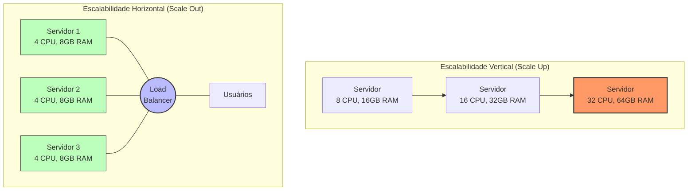
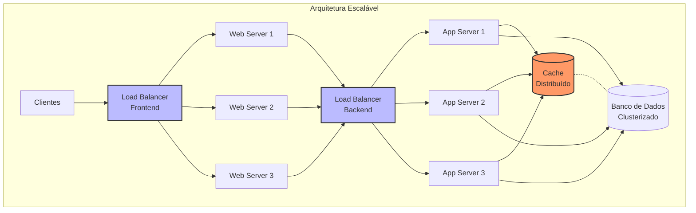
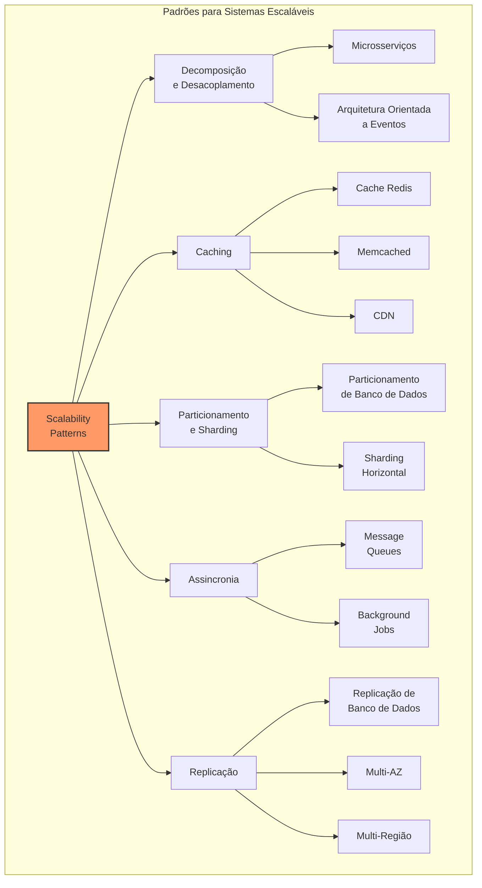
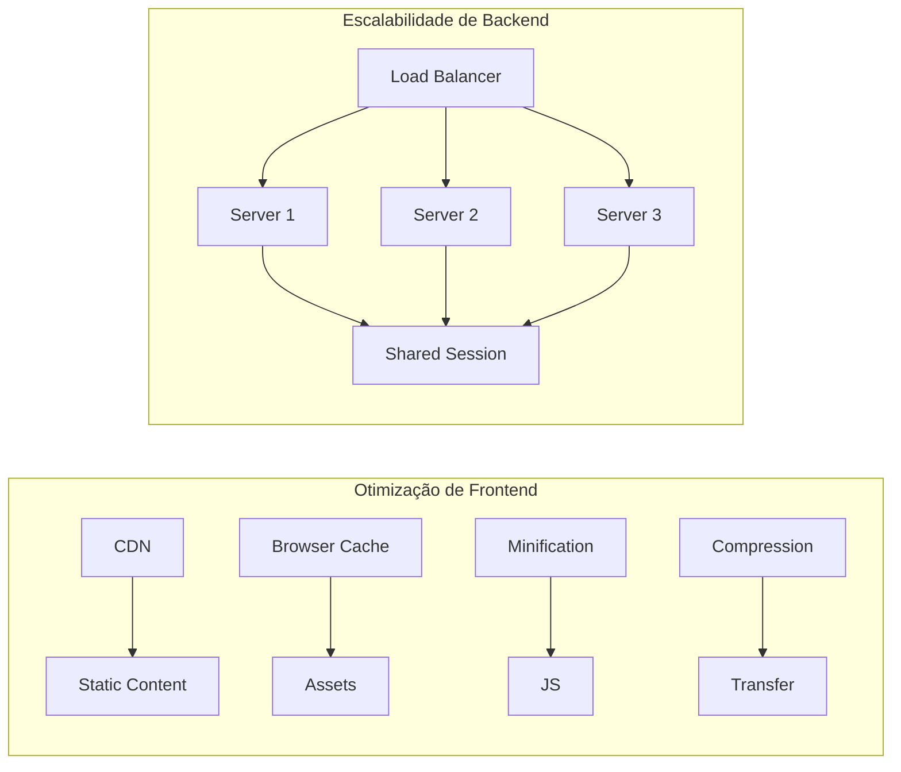
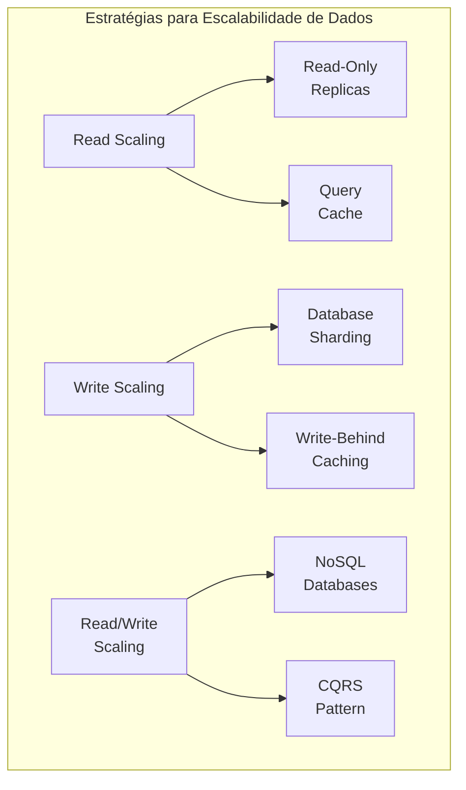
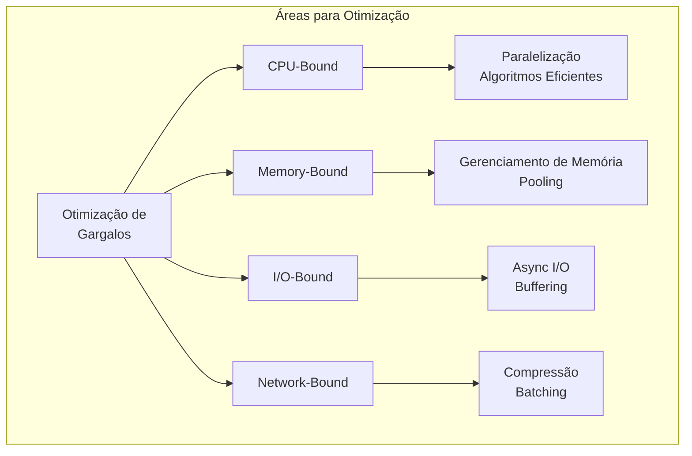
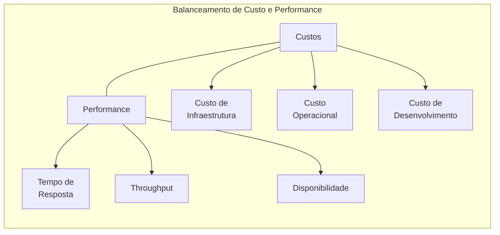
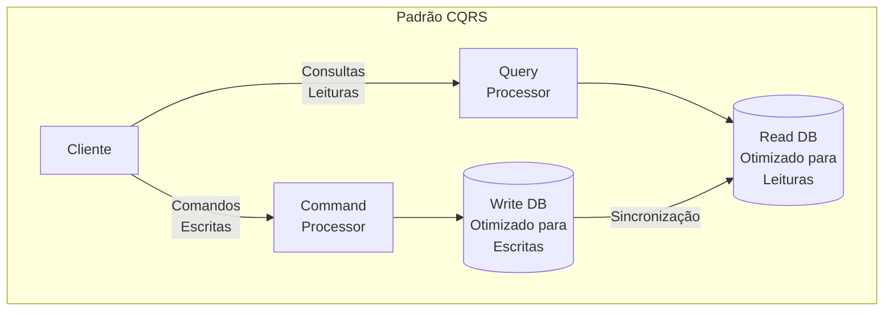
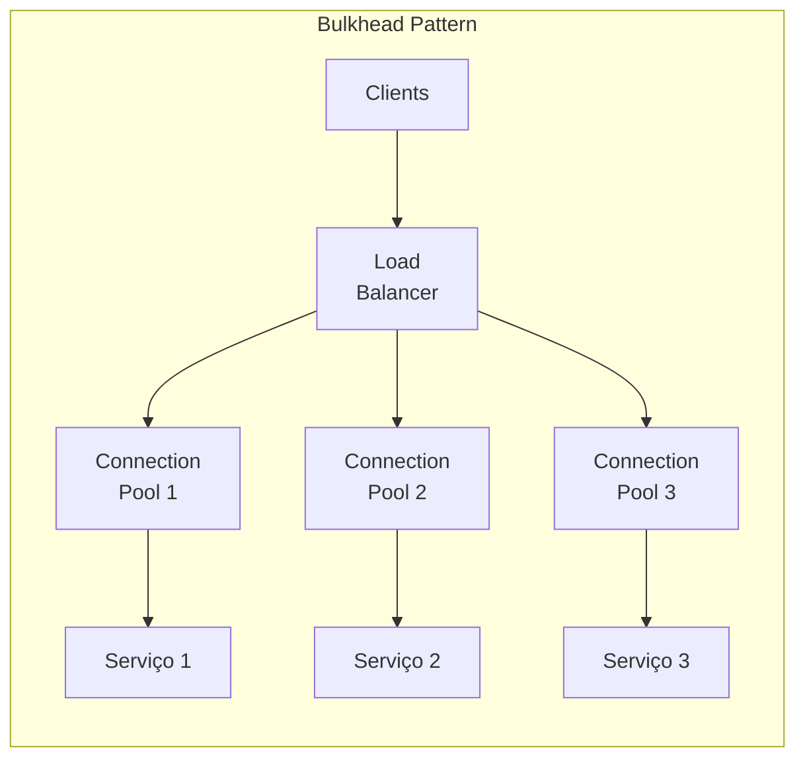
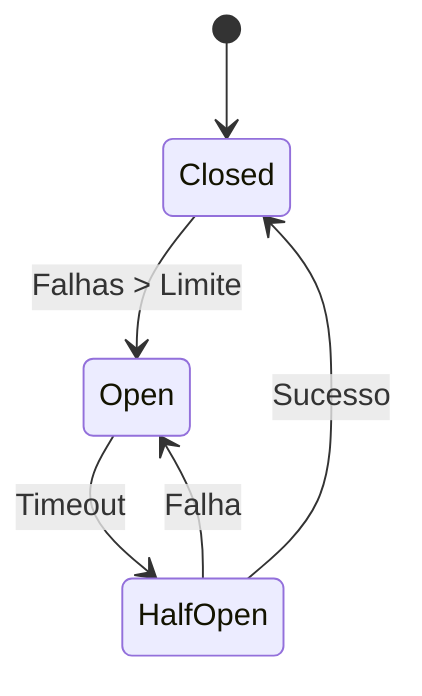

# 📈 Scalability (Escalabilidade)

## Definição e Visão Geral

Scalability (Escalabilidade) é a capacidade de um sistema, rede ou processo de lidar com uma quantidade crescente de trabalho, ou seu potencial de ser expandido para acomodar esse crescimento. Em sistemas de software, a escalabilidade refere-se à habilidade de uma aplicação ou infraestrutura de manter ou melhorar o desempenho à medida que a demanda por recursos aumenta, seja em termos de número de usuários, volume de dados, taxa de transações ou complexidade das operações.

A escalabilidade não se trata apenas de adicionar mais recursos, mas de fazê-lo de maneira eficiente e econômica, mantendo ou melhorando a confiabilidade e a experiência do usuário. Um sistema verdadeiramente escalável deve crescer sem necessidade de redesenho arquitetural significativo e sem degradação desproporcional de performance.

Este conceito fundamental no design de sistemas modernos tem implicações profundas nas decisões de arquitetura, tanto para startups que esperam rápido crescimento quanto para empresas estabelecidas que precisam lidar com volumes de dados e tráfego cada vez maiores.

## Diagramas

### Escalabilidade Horizontal vs. Vertical



### Arquitetura para Escalabilidade



### Padrões de Escalabilidade



## Casos de Uso

- **E-commerce durante Black Friday**: Escalabilidade para lidar com picos de tráfego
- **Redes Sociais**: Crescimento contínuo de usuários e conteúdo
- **Streaming de Vídeo**: Suporte a milhões de visualizações simultâneas
- **Jogos Online**: Servidores que escalam conforme o número de jogadores
- **Processamento de Big Data**: Análise de volumes crescentes de dados
- **Aplicações SaaS**: Suporte a número crescente de clientes e inquilinos
- **Sistemas IoT**: Processamento de dados de milhares/milhões de dispositivos
- **Plataformas de Pagamento**: Processamento de volumes crescentes de transações
- **Sistemas de Monitoramento**: Coleta e análise de métricas em alta escala
- **APIs Públicas**: Gerenciamento de requisições de múltiplos consumidores

## Estratégias e Técnicas de Escalabilidade

### Escalabilidade Vertical (Scale Up)

```
Exemplo: Upgrade de PostgreSQL

Servidor Inicial:
- 4 vCPUs
- 16 GB RAM
- 500 GB SSD

Upgrade 1:
- 8 vCPUs
- 32 GB RAM
- 1 TB SSD
- Ajuste de shared_buffers para 8 GB
- Ajuste de work_mem para 100 MB

Upgrade 2:
- 16 vCPUs
- 64 GB RAM
- 2 TB SSD
- Ajuste de shared_buffers para 16 GB
- Ajuste de work_mem para 200 MB
- Melhoria em hardware de armazenamento com maior IOPS
```

Vantagens:
- Implementação mais simples
- Sem mudanças arquiteturais
- Melhor para workloads intensivos em CPU/Memória

Limitações:
- Limites físicos de hardware
- Ponto único de falha
- Maior custo por unidade de performance
- Tempo de inatividade durante upgrades

### Escalabilidade Horizontal (Scale Out)

Exemplo com Docker e Kubernetes:

```yaml
# Manifesto Kubernetes para escala horizontal automática
apiVersion: autoscaling/v2
kind: HorizontalPodAutoscaler
metadata:
  name: api-service
spec:
  scaleTargetRef:
    apiVersion: apps/v1
    kind: Deployment
    name: api-service
  minReplicas: 3
  maxReplicas: 30
  metrics:
  - type: Resource
    resource:
      name: cpu
      target:
        type: Utilization
        averageUtilization: 75
  - type: Resource
    resource:
      name: memory
      target:
        type: Utilization
        averageUtilization: 80
  - type: Pods
    pods:
      metric:
        name: requests_per_second
      target:
        type: AverageValue
        averageValue: 1000
```

Vantagens:
- Maior resiliência e tolerância a falhas
- Escalabilidade quase ilimitada
- Melhor custo-benefício em larga escala
- Possibilidade de escala automática

Desafios:
- Maior complexidade arquitetural
- Necessidade de gerenciamento de estado
- Sobrecarga de comunicação entre nós
- Overhead de coordenação

### Estratégias para Camadas Específicas

#### Camada Web



Técnicas para camada web:
- Balanceamento de carga entre servidores
- CDN para conteúdo estático
- Arquivos minificados e compactados
- Sessões distribuídas
- Caching em nível de navegador e proxy

#### Camada de Aplicação

Técnicas para escalar lógica de negócio:
- Microsserviços para decomposição funcional
- Processamento assíncrono com filas de mensagens
- Caching em memória (Redis, Memcached)
- API Gateway para gerenciamento de tráfego
- Circuit Breakers para isolamento de falhas

#### Camada de Dados



Técnicas para camada de dados:
- Réplicas de leitura
- Particionamento e sharding
- Bancos de dados distribuídos
- CQRS (Command Query Responsibility Segregation)
- Caching com invalidação inteligente
- Data denormalization para leituras otimizadas

## Exemplos Práticos

### Auto-scaling em AWS

```terraform
# Configuração Terraform para Auto Scaling Group em AWS
resource "aws_autoscaling_group" "web_asg" {
  name                 = "web-autoscaling-group"
  launch_configuration = aws_launch_configuration.web_config.id
  min_size             = 2
  max_size             = 10
  desired_capacity     = 2
  
  vpc_zone_identifier  = [aws_subnet.private_a.id, aws_subnet.private_b.id]
  
  # Definindo políticas de health check
  health_check_type          = "ELB"
  health_check_grace_period  = 300
  
  # Anexando ao balanceador de carga
  target_group_arns = [aws_lb_target_group.web_tg.arn]
  
  tag {
    key                 = "Name"
    value               = "web-server"
    propagate_at_launch = true
  }
}

# Política de auto scaling baseada em CPU
resource "aws_autoscaling_policy" "web_scale_up" {
  name                   = "web-scale-up"
  scaling_adjustment     = 1
  adjustment_type        = "ChangeInCapacity"
  cooldown               = 300
  autoscaling_group_name = aws_autoscaling_group.web_asg.name
}

resource "aws_cloudwatch_metric_alarm" "web_cpu_high" {
  alarm_name          = "web-cpu-high"
  comparison_operator = "GreaterThanOrEqualToThreshold"
  evaluation_periods  = 2
  metric_name         = "CPUUtilization"
  namespace           = "AWS/EC2"
  period              = 60
  statistic           = "Average"
  threshold           = 70
  
  dimensions = {
    AutoScalingGroupName = aws_autoscaling_group.web_asg.name
  }
  
  alarm_description = "Scale up when CPU > 70% for 2 minutes"
  alarm_actions     = [aws_autoscaling_policy.web_scale_up.arn]
}

# Política de escala para baixo
resource "aws_autoscaling_policy" "web_scale_down" {
  name                   = "web-scale-down"
  scaling_adjustment     = -1
  adjustment_type        = "ChangeInCapacity"
  cooldown               = 300
  autoscaling_group_name = aws_autoscaling_group.web_asg.name
}

resource "aws_cloudwatch_metric_alarm" "web_cpu_low" {
  alarm_name          = "web-cpu-low"
  comparison_operator = "LessThanOrEqualToThreshold"
  evaluation_periods  = 3
  metric_name         = "CPUUtilization"
  namespace           = "AWS/EC2"
  period              = 60
  statistic           = "Average"
  threshold           = 30
  
  dimensions = {
    AutoScalingGroupName = aws_autoscaling_group.web_asg.name
  }
  
  alarm_description = "Scale down when CPU < 30% for 3 minutes"
  alarm_actions     = [aws_autoscaling_policy.web_scale_down.arn]
}
```

### Escalabilidade com Node.js e PM2

```javascript
// ecosystem.config.js - Configuração para PM2
module.exports = {
  apps: [{
    name: "api-service",
    script: "./index.js",
    instances: "max",       // Usar número de CPUs disponíveis
    exec_mode: "cluster",   // Executar em modo cluster
    autorestart: true,
    watch: false,
    max_memory_restart: "1G",
    env: {
      NODE_ENV: "production",
      PORT: 3000
    },
    env_production: {
      NODE_ENV: "production",
      PORT: 3000
    }
  }]
};

// index.js - Servidor de API com Node.js
const express = require('express');
const cluster = require('cluster');
const numCPUs = require('os').cpus().length;
const app = express();
const port = process.env.PORT || 3000;

// Middleware para evitar bloqueio de evento loop
app.use((req, res, next) => {
  res.setHeader('X-Worker-ID', process.pid);
  next();
});

// Rotas da API
app.get('/api/data', async (req, res) => {
  // Simulação de operação assíncrona que não bloqueia
  const data = await fetchDataFromDatabase();
  res.json(data);
});

// Iniciar servidor
if (cluster.isMaster && !process.env.NODE_APP_INSTANCE) {
  console.log(`Master ${process.pid} inicializando`);
  
  // Fork workers
  for (let i = 0; i < numCPUs; i++) {
    cluster.fork();
  }
  
  // Lidar com término de worker
  cluster.on('exit', (worker, code, signal) => {
    console.log(`Worker ${worker.process.pid} encerrou`);
    // Substituir worker morto
    cluster.fork();
  });
} else {
  // Workers compartilham a porta TCP
  app.listen(port, () => {
    console.log(`Worker ${process.pid} ouvindo na porta ${port}`);
  });
}

// Simulação de operação de banco de dados
async function fetchDataFromDatabase() {
  return new Promise(resolve => {
    setTimeout(() => {
      resolve({ status: 'success', time: new Date() });
    }, 100);
  });
}
```

### Banco de Dados Escalável com MongoDB

```javascript
// Configuração de MongoDB Sharded Cluster

// 1. Inicializar Config Servers
mongod --configsvr --replSet configReplSet --dbpath /data/configdb --port 27019

// 2. Inicializar Shard Replicas
// Shard 1
mongod --shardsvr --replSet shard1 --dbpath /data/shard1 --port 27020
// Shard 2
mongod --shardsvr --replSet shard2 --dbpath /data/shard2 --port 27021
// Shard 3
mongod --shardsvr --replSet shard3 --dbpath /data/shard3 --port 27022

// 3. Configurar Mongos Router
mongos --configdb configReplSet/config1:27019,config2:27019,config3:27019 --port 27017

// 4. Habilitar Sharding para Database e Collection
// No cliente mongo
sh.enableSharding("meuDataBase")
sh.shardCollection("meuDataBase.minhaColecao", { chaveDeSharding: 1 })

// Verificar status do sharding
sh.status()
```

## Desafios e Considerações

### Otimização para Escalabilidade



Estratégias de otimização:
- Profiling para identificar gargalos
- Caching em múltiplas camadas
- Algoritmos e estruturas de dados eficientes
- Paginação e limites em APIs
- Paralelização de processamento
- Batch processing para operações em massa
- Compressão de dados para reduzir transferência

### Consistência vs. Disponibilidade

No contexto do Teorema CAP, sistemas escaláveis frequentemente precisam fazer trade-offs:

- **Sistemas CP (Consistência + Tolerância a Partição)**:
  - Priorizam que todos os nós vejam os mesmos dados
  - Exemplos: MongoDB com WriteConcern majority, HBase, ZooKeeper

- **Sistemas AP (Disponibilidade + Tolerância a Partição)**:
  - Priorizam que o sistema continue respondendo mesmo durante falhas
  - Exemplos: Cassandra, DynamoDB, CouchDB

### Gerenciamento de Estado

Desafios no gerenciamento de estado em sistemas escaláveis:
- Sessões distribuídas (Redis, DataStax)
- Transações distribuídas (2PC, Saga pattern)
- Consistência eventual (CRDTs, Vector Clocks)
- Controle de concorrência (MVCC, Locking)
- Replicação e sincronização de dados

### Custo vs. Performance



Considerações:
- TCO (Total Cost of Ownership) vs. performance
- Auto-scaling para otimizar custos em cargas variáveis
- Reserved Instances vs. Spot Instances
- Multi-cloud vs. vendor lock-in
- Microserviços vs. overhead operacional
- Serverless para cargas irregulares

## Padrões de Design para Escalabilidade

### CQRS (Command Query Responsibility Segregation)



- Separa operações de leitura e escrita
- Permite otimizar cada caminho separadamente
- Facilita escalabilidade e performance independentes

### Bulkhead Pattern



- Isola componentes para evitar falhas em cascata
- Contém falhas dentro de "compartimentos"
- Melhora resiliência do sistema como um todo

### Circuit Breaker Pattern



- Previne tentativas em sistemas já sobrecarregados
- Falha rápido em vez de timeout
- Auto-recuperação após normalização

## Prós e Contras

### Prós
- **Crescimento sustentável**: Suporta aumento de carga sem redesenho completo
- **Resiliência**: Melhor tolerância a falhas e redundância
- **Otimização de custos**: Flexibilidade para escalar sob demanda
- **Performance**: Capacidade de manter tempos de resposta consistentes
- **Adaptabilidade**: Ajuste a diferentes padrões de tráfego
- **Competitividade**: Capacidade de atender mais usuários sem degradação
- **Inovação**: Possibilidade de focar em novos features em vez de problemas de performance

### Contras
- **Complexidade**: Sistemas distribuídos são inerentemente mais complexos
- **Custos iniciais**: Arquiteturas escaláveis geralmente têm maior overhead inicial
- **Desafios operacionais**: Monitoramento e debugging mais complexos
- **Consistência de dados**: Compromissos em consistência (CAP theorem)
- **Maior superfície de ataque**: Considerações de segurança adicionais
- **Latência de rede**: Overhead de comunicação entre componentes distribuídos
- **Desafios de coordenação**: Sincronização e controle de concorrência

## Ferramentas e Tecnologias

### Infraestrutura e Plataformas
- **Kubernetes**: Orquestração de containers para escalabilidade automática
- **Docker Swarm**: Gerenciamento de clusters Docker
- **AWS Auto Scaling**: Escala dinâmica de recursos na AWS
- **Azure Scale Sets**: Grupos de VMs com escala automática na Azure
- **Google Kubernetes Engine**: Kubernetes gerenciado no GCP
- **Istio**: Service mesh para sistemas distribuídos
- **HashiCorp Nomad**: Agendador de workloads distribuídos

### Monitoramento e Observabilidade
- **Prometheus**: Monitoramento e alertas
- **Grafana**: Visualização de métricas
- **Datadog**: Plataforma de observabilidade
- **New Relic**: Monitoramento de performance
- **Jaeger/Zipkin**: Tracing distribuído
- **ELK Stack**: Logging centralizado
- **Dynatrace**: Monitoramento com AI

### Bancos de Dados Escaláveis
- **Cassandra**: Banco de dados distribuído para alta disponibilidade
- **MongoDB**: Banco de dados de documentos com sharding
- **Amazon Aurora**: MySQL/PostgreSQL escalável e gerenciado
- **CockroachDB**: Banco SQL distribuído
- **Redis Cluster**: Cache distribuído em memória
- **Elasticsearch**: Busca e análise escalável
- **TiDB**: Banco de dados SQL distribuído

## Melhores Práticas

1. **Design para falhas**: Assumir que componentes falharão e planejar para isso

2. **Arquitetura stateless**: Minimizar ou eliminar estado em servidores de aplicação

3. **Distribuir carga**: Utilizar balanceamento de carga em todas as camadas

4. **Descentralizar**: Evitar pontos únicos de falha ou gargalos

5. **Caching inteligente**: Implementar estratégia de cache em múltiplos níveis

6. **Particionamento de dados**: Dividir dados para distribuir carga

7. **Comunicação assíncrona**: Usar filas de mensagens para desacoplar componentes

8. **Monitoramento proativo**: Implementar métricas e alertas abrangentes

9. **Testes de carga**: Validar escalabilidade antes de atingir limites em produção

10. **Automação**: Automatizar processos de implantação, scaling e recuperação

## Referências

- Kleppmann, M. (2017). Designing Data-Intensive Applications. O'Reilly Media.
- Abbott, M. L., & Fisher, M. T. (2015). The Art of Scalability. Addison-Wesley.
- Newman, S. (2021). Building Microservices (2nd ed.). O'Reilly Media.
- Ford, N., et al. (2017). Building Evolutionary Architectures. O'Reilly Media.
- Burns, B. (2018). Designing Distributed Systems. O'Reilly Media.
- Adkins, H., et al. (2020). Building Secure and Reliable Systems. O'Reilly Media.
- Vogels, W. (2009). Eventually Consistent. Communications of the ACM, 52(1), 40-44.
- Verma, A., et al. (2015). Large-scale cluster management at Google with Borg. Proceedings of the European Conference on Computer Systems, 10(1), 1-17.
- Abbot, M. (2021). The Site Reliability Workbook. O'Reilly Media.
- AWS. (2023). AWS Well-Architected Framework. https://aws.amazon.com/architecture/well-architected/
