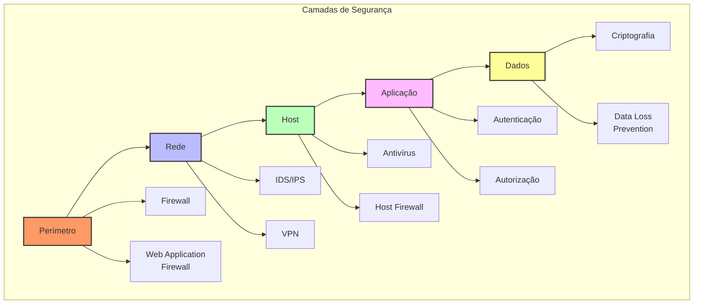
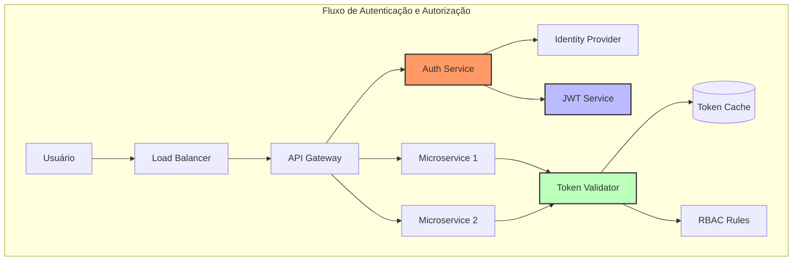
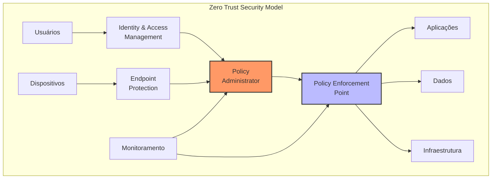

# 🛡️ Security Patterns (Padrões de Segurança)

## Definição e Visão Geral

Security Patterns (Padrões de Segurança) são soluções comprovadas e reutilizáveis para problemas comuns de segurança em sistemas distribuídos. Eles fornecem uma abordagem estruturada para proteger dados, autenticar usuários, autorizar acessos e garantir a integridade das comunicações em sistemas de larga escala. Estes padrões são fundamentais para construir sistemas robustos e seguros que possam resistir a ameaças modernas e proteger informações sensíveis.

Os padrões de segurança abrangem múltiplas camadas de uma aplicação, desde a infraestrutura até a camada de aplicação, e são essenciais para manter a confidencialidade, integridade e disponibilidade dos sistemas. Eles também ajudam a cumprir requisitos regulatórios e de conformidade, como GDPR, LGPD, PCI DSS, entre outros.

## Diagramas

### Camadas de Segurança



### Arquitetura de Autenticação e Autorização



### Zero Trust Architecture



## Casos de Uso

- **Sistemas Financeiros**: Proteção de transações e dados sensíveis
- **Healthcare**: Conformidade com HIPAA e proteção de dados médicos
- **E-commerce**: Segurança de pagamentos e dados de cartão (PCI DSS)
- **Aplicações SaaS**: Multi-tenancy seguro e isolamento de dados
- **APIs Públicas**: Proteção contra abusos e ataques
- **IoT**: Segurança de dispositivos e comunicações
- **Sistemas Governamentais**: Proteção de dados críticos
- **Redes Sociais**: Privacidade e proteção de dados pessoais
- **Sistemas de Nuvem**: Segurança em ambientes compartilhados
- **Aplicações Móveis**: Proteção de dados em dispositivos não confiáveis

## Estratégias e Técnicas de Segurança

### Autenticação e Autorização

```yaml
# Exemplo de configuração OAuth2/OIDC
auth:
  oauth2:
    issuer: https://auth.example.com
    jwks_uri: https://auth.example.com/.well-known/jwks.json
    audiences:
      - api.example.com
    scopes:
      - read:users
      - write:users
    claims:
      - sub
      - email
      - groups
  rbac:
    roles:
      - name: admin
        permissions:
          - "*"
      - name: user
        permissions:
          - "read:own"
          - "write:own"
```

### Criptografia e Proteção de Dados

```python
# Exemplo de criptografia em camadas
from cryptography.fernet import Fernet
from cryptography.hazmat.primitives import hashes
from cryptography.hazmat.primitives.kdf.pbkdf2 import PBKDF2HMAC

class DataProtection:
    def __init__(self):
        self.kdf = PBKDF2HMAC(
            algorithm=hashes.SHA256(),
            length=32,
            salt=b'static_salt',  # Use dynamic salt in produção
            iterations=100000,
        )
        
    def encrypt_data(self, data: bytes, key: bytes) -> bytes:
        derived_key = self.kdf.derive(key)
        f = Fernet(derived_key)
        return f.encrypt(data)
        
    def decrypt_data(self, encrypted_data: bytes, key: bytes) -> bytes:
        derived_key = self.kdf.derive(key)
        f = Fernet(derived_key)
        return f.decrypt(encrypted_data)
```

### Segurança em Microsserviços

```yaml
# Exemplo de configuração de segurança para Kubernetes
apiVersion: networking.k8s.io/v1
kind: NetworkPolicy
metadata:
  name: restrict-traffic
spec:
  podSelector:
    matchLabels:
      app: secure-service
  policyTypes:
  - Ingress
  - Egress
  ingress:
  - from:
    - podSelector:
        matchLabels:
          role: frontend
    ports:
    - protocol: TCP
      port: 8080
  egress:
  - to:
    - podSelector:
        matchLabels:
          role: database
    ports:
    - protocol: TCP
      port: 5432
```

## Melhores Práticas

1. **Defense in Depth**
   - Implementar múltiplas camadas de segurança
   - Não confiar em uma única medida de proteção
   - Usar controles compensatórios

2. **Principle of Least Privilege**
   - Conceder apenas permissões necessárias
   - Revisar acessos regularmente
   - Implementar Just-In-Time Access

3. **Secure by Design**
   - Considerar segurança desde o início do projeto
   - Realizar threat modeling
   - Implementar security controls nos primeiros estágios

4. **Data Protection**
   - Criptografar dados em repouso e em trânsito
   - Implementar controles de acesso granulares
   - Realizar backup e recuperação seguros

5. **Monitoring e Detection**
   - Implementar logging abrangente
   - Usar sistemas de detecção de intrusão
   - Realizar análise de comportamento

## Anti-patterns e Pitfalls

1. **Security Through Obscurity**
   - Depender de segredos de implementação
   - Não documentar controles de segurança
   - Esconder vulnerabilidades

2. **Implicit Trust**
   - Confiar em redes internas
   - Não validar entradas de fontes "confiáveis"
   - Assumir segurança de componentes terceiros

3. **Weak Authentication**
   - Usar senhas fracas
   - Não implementar MFA
   - Armazenar credenciais em texto plano

4. **Insufficient Logging**
   - Não registrar eventos de segurança
   - Logs sem contexto
   - Retenção inadequada de logs

## Ferramentas e Tecnologias

1. **Identity & Access Management**
   - Keycloak
   - Auth0
   - AWS IAM

2. **Web Application Firewalls**
   - CloudFlare
   - AWS WAF
   - ModSecurity

3. **Secret Management**
   - HashiCorp Vault
   - AWS Secrets Manager
   - Azure Key Vault

4. **Security Scanning**
   - SonarQube
   - OWASP ZAP
   - Snyk

5. **Compliance & Audit**
   - AWS Config
   - Azure Policy
   - Chef InSpec

## Métricas e Monitoramento

1. **Security Metrics**
   - Tempo de detecção de incidentes
   - Vulnerabilidades por severidade
   - Cobertura de patches
   - Taxa de falhas de autenticação

2. **Compliance Metrics**
   - Conformidade com políticas
   - Cobertura de controles
   - Tempo de resolução de findings
   - Status de certificações

3. **Operational Metrics**
   - Disponibilidade de serviços de segurança
   - Performance de autenticação
   - Uso de recursos de segurança
   - Tempo de resposta de controles

## Referências

1. OWASP Security Patterns: https://owasp.org/www-community/patterns/
2. NIST Cybersecurity Framework: https://www.nist.gov/cyberframework
3. Cloud Security Alliance: https://cloudsecurityalliance.org/
4. Zero Trust Architecture: https://www.nist.gov/publications/zero-trust-architecture
5. AWS Security Best Practices: https://aws.amazon.com/architecture/security-identity-compliance/ 