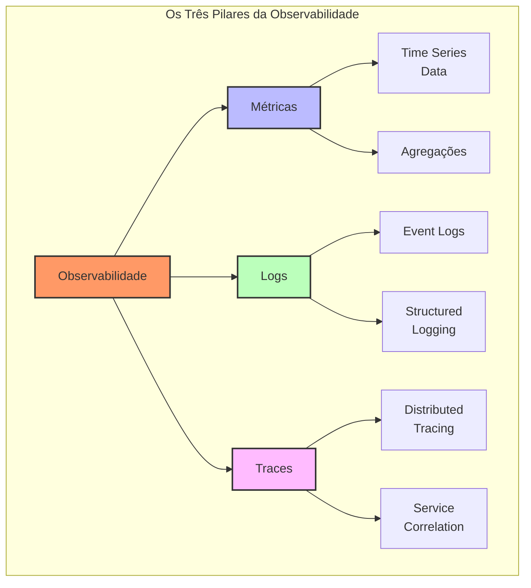
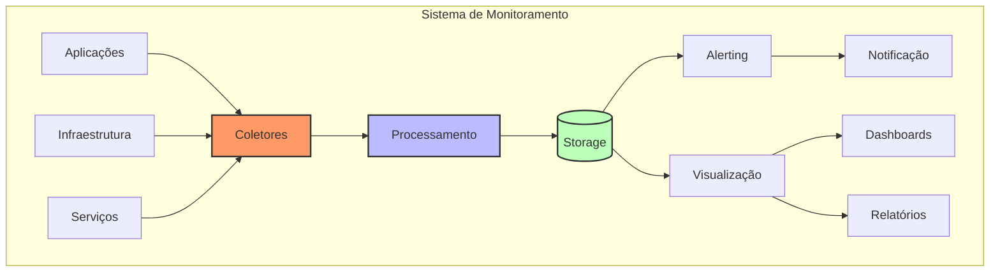
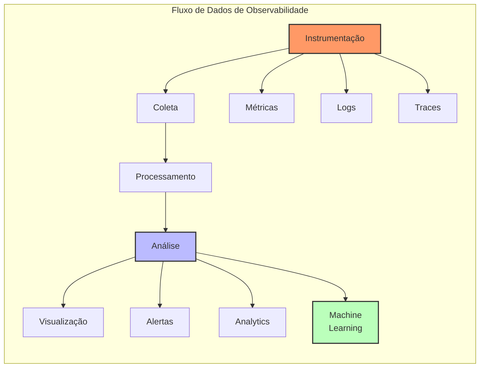

# Monitoring and Observability (Monitoramento e Observabilidade)

## Definição e Visão Geral

Monitoring and Observability (Monitoramento e Observabilidade) são conceitos fundamentais para entender o comportamento, performance e saúde de sistemas distribuídos. Enquanto o monitoramento se concentra em coletar e analisar métricas predefinidas, a observabilidade vai além, permitindo compreender o estado interno do sistema através de seus outputs externos.

A observabilidade é construída sobre três pilares principais: métricas, logs e traces. Esta abordagem holística permite não apenas detectar problemas (monitoramento), mas também entender por que eles ocorrem e como se propagam através do sistema (observabilidade). Em sistemas distribuídos modernos, estes conceitos são essenciais para manter a confiabilidade e performance do serviço.

## Diagramas

### Pilares da Observabilidade



### Arquitetura de Monitoramento



### Fluxo de Observabilidade



## Casos de Uso

- **Microserviços**: Rastreamento de requisições distribuídas
- **Cloud Infrastructure**: Monitoramento de recursos e custos
- **E-commerce**: Monitoramento de transações e performance
- **SaaS Platforms**: Observabilidade multi-tenant
- **DevOps**: Monitoramento de pipelines e deploys
- **SRE**: SLI/SLO tracking e reliability
- **Security**: Detecção de anomalias e threats
- **Performance**: Otimização e troubleshooting
- **Capacity Planning**: Previsão de recursos
- **User Experience**: Real User Monitoring (RUM)

## Estratégias e Técnicas

### Instrumentação de Código

```python
# Exemplo de instrumentação com OpenTelemetry
from opentelemetry import trace
from opentelemetry.trace import Status, StatusCode
from opentelemetry.metrics import get_meter_provider
from opentelemetry.instrumentation.flask import FlaskInstrumentor

# Configuração do tracer
tracer = trace.get_tracer(__name__)

# Configuração do meter
meter = get_meter_provider().get_meter(__name__)

# Criação de métricas
request_counter = meter.create_counter(
    "http_requests_total",
    description="Total number of HTTP requests",
)

request_duration = meter.create_histogram(
    "http_request_duration_seconds",
    description="HTTP request duration in seconds",
)

# Exemplo de uso em uma função
@tracer.start_as_current_span("process_request")
def process_request(request_data):
    try:
        # Incrementa contador de requests
        request_counter.add(1, {"endpoint": request_data["path"]})
        
        with tracer.start_span("business_logic") as span:
            # Lógica de negócio aqui
            result = perform_business_logic(request_data)
            span.set_attribute("result_status", "success")
            
        return result
    except Exception as e:
        span = trace.get_current_span()
        span.set_status(Status(StatusCode.ERROR))
        span.record_exception(e)
        raise
```

### Configuração de Logging

```yaml
# Exemplo de configuração do Fluentd
<source>
  @type forward
  port 24224
  bind 0.0.0.0
</source>

<filter service.*>
  @type parser
  key_name log
  <parse>
    @type json
    time_key timestamp
    time_format %Y-%m-%dT%H:%M:%S.%NZ
  </parse>
</filter>

<match service.*>
  @type elasticsearch
  host elasticsearch
  port 9200
  logstash_format true
  logstash_prefix service-logs
  flush_interval 5s
  retry_limit 30
  retry_wait 10s
</match>
```

### Configuração de Alerting

```yaml
# Exemplo de regra de alerta no Prometheus
groups:
- name: service_alerts
  rules:
  - alert: HighErrorRate
    expr: |
      sum(rate(http_requests_total{status=~"5.."}[5m])) 
      / 
      sum(rate(http_requests_total[5m])) > 0.05
    for: 5m
    labels:
      severity: critical
    annotations:
      summary: High HTTP error rate
      description: "Error rate is {{ $value | humanizePercentage }} for the last 5m"

  - alert: HighLatency
    expr: |
      histogram_quantile(0.95, 
        sum(rate(http_request_duration_seconds_bucket[5m])) by (le)
      ) > 2
    for: 5m
    labels:
      severity: warning
    annotations:
      summary: High latency detected
      description: "95th percentile latency is {{ $value }}s"
```

## Melhores Práticas

1. **Instrumentação Consistente**
   - Usar padrões de instrumentação
   - Implementar tracing distribuído
   - Padronizar formato de logs

2. **Data Collection**
   - Implementar buffering e batching
   - Usar sampling inteligente
   - Garantir resiliência na coleta

3. **Storage & Retention**
   - Definir políticas de retenção
   - Implementar compressão
   - Usar storage apropriado para cada tipo de dado

4. **Visualization & Analysis**
   - Criar dashboards efetivos
   - Implementar correlação de eventos
   - Usar análise preditiva

5. **Alerting**
   - Definir thresholds apropriados
   - Implementar alerting em camadas
   - Evitar alert fatigue

## Anti-patterns e Pitfalls

1. **Over-Monitoring**
   - Coletar dados sem propósito
   - Métricas redundantes
   - Alertas desnecessários

2. **Poor Instrumentation**
   - Falta de contexto nos logs
   - Traces incompletos
   - Métricas mal definidas

3. **Alert Fatigue**
   - Muitos alertas
   - Thresholds inadequados
   - Falta de priorização

4. **Data Silos**
   - Falta de correlação
   - Sistemas isolados
   - Visão fragmentada

## Ferramentas e Tecnologias

1. **Métricas**
   - Prometheus
   - Grafana
   - Datadog
   - New Relic

2. **Logging**
   - ELK Stack
   - Splunk
   - Loki
   - Fluentd

3. **Tracing**
   - Jaeger
   - Zipkin
   - OpenTelemetry
   - AWS X-Ray

4. **APM**
   - Dynatrace
   - AppDynamics
   - Elastic APM
   - Instana

5. **Alerting**
   - PagerDuty
   - OpsGenie
   - VictorOps
   - AlertManager

## Métricas Chave

1. **Golden Signals**
   - Latência
   - Tráfego
   - Erros
   - Saturação

2. **USE Method**
   - Utilização
   - Saturação
   - Erros

3. **RED Method**
   - Rate
   - Errors
   - Duration

## Referências

1. Google SRE Book: https://sre.google/sre-book/monitoring-distributed-systems/
2. OpenTelemetry: https://opentelemetry.io/
3. Prometheus Docs: https://prometheus.io/docs/
4. Grafana Labs: https://grafana.com/
5. Elastic Observability: https://www.elastic.co/observability 