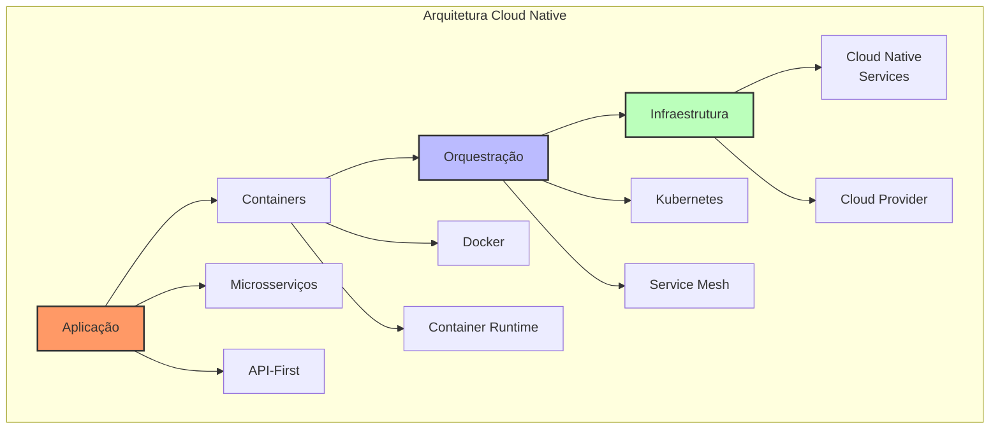
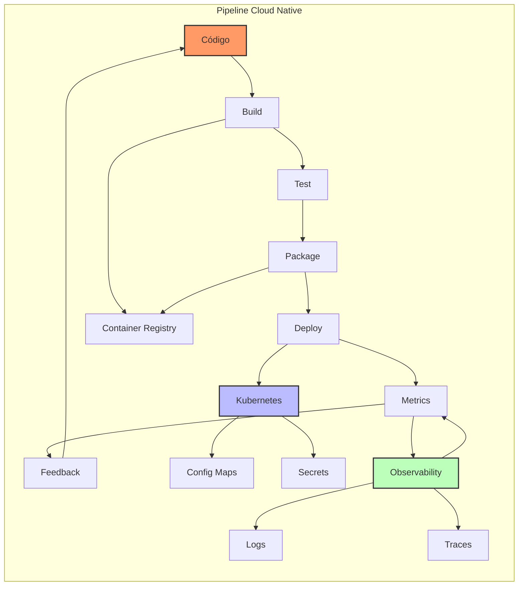
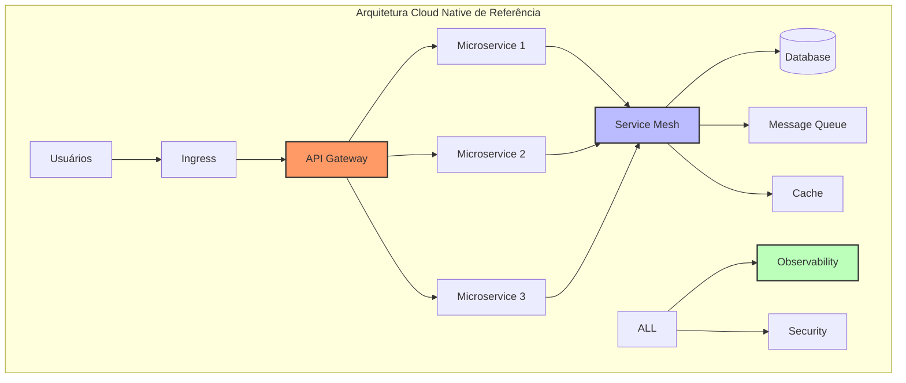

# ☁️ Cloud Native (Arquitetura Nativa em Nuvem)

## Definição e Visão Geral

Cloud Native (Arquitetura Nativa em Nuvem) refere-se a uma abordagem de construção e execução de aplicações que exploram as vantagens do modelo de computação em nuvem. Aplicações cloud native são projetadas para abraçar escalabilidade automática, alta disponibilidade, e resiliência desde sua concepção. Elas são tipicamente construídas como microsserviços empacotados em containers, implantadas em plataformas de orquestração de containers e gerenciadas através de práticas DevOps automatizadas.

Esta arquitetura representa uma mudança fundamental na forma como as aplicações são construídas, implantadas e operadas, priorizando automação, observabilidade e adaptabilidade. Os princípios cloud native permitem que organizações construam e operem aplicações escaláveis em ambientes de nuvem dinâmicos, sejam públicos, privados ou híbridos.

## Diagramas

### Componentes Cloud Native



### Fluxo DevOps Cloud Native



### Arquitetura de Referência



## Casos de Uso

- **E-commerce**: Plataforma escalável e resiliente
- **Streaming**: Serviços de mídia distribuídos
- **FinTech**: Sistemas financeiros cloud native
- **IoT**: Processamento de dados em escala
- **SaaS**: Aplicações multi-tenant
- **Gaming**: Servidores de jogos escaláveis
- **Healthcare**: Sistemas de saúde distribuídos
- **Analytics**: Processamento de big data
- **DevOps**: Pipelines e automação
- **Mobile Backend**: APIs escaláveis

## Estratégias e Técnicas

### Configuração Kubernetes

```yaml
# Exemplo de deployment Kubernetes
apiVersion: apps/v1
kind: Deployment
metadata:
  name: cloud-native-app
  labels:
    app: cloud-native-app
spec:
  replicas: 3
  selector:
    matchLabels:
      app: cloud-native-app
  template:
    metadata:
      labels:
        app: cloud-native-app
    spec:
      containers:
      - name: app
        image: cloud-native-app:1.0.0
        ports:
        - containerPort: 8080
        resources:
          requests:
            memory: "64Mi"
            cpu: "250m"
          limits:
            memory: "128Mi"
            cpu: "500m"
        readinessProbe:
          httpGet:
            path: /health
            port: 8080
          initialDelaySeconds: 5
          periodSeconds: 10
        livenessProbe:
          httpGet:
            path: /health
            port: 8080
          initialDelaySeconds: 15
          periodSeconds: 20
```

### Service Mesh Configuration

```yaml
# Exemplo de configuração Istio
apiVersion: networking.istio.io/v1alpha3
kind: VirtualService
metadata:
  name: cloud-native-app
spec:
  hosts:
  - cloud-native-app
  http:
  - route:
    - destination:
        host: cloud-native-app
        subset: v1
      weight: 90
    - destination:
        host: cloud-native-app
        subset: v2
      weight: 10
    retries:
      attempts: 3
      perTryTimeout: 2s
    timeout: 5s
    fault:
      delay:
        percentage:
          value: 0.1
        fixedDelay: 5s
```

### Observabilidade Cloud Native

```yaml
# Exemplo de configuração Prometheus
apiVersion: monitoring.coreos.com/v1
kind: ServiceMonitor
metadata:
  name: cloud-native-app
  labels:
    app: cloud-native-app
spec:
  selector:
    matchLabels:
      app: cloud-native-app
  endpoints:
  - port: metrics
    interval: 15s
    path: /metrics
  namespaceSelector:
    matchNames:
    - default
```

## Melhores Práticas

1. **Design Principles**
   - Microsserviços independentes
   - Stateless quando possível
   - Resiliência por design
   - API-first approach

2. **Container Best Practices**
   - Imagens mínimas
   - Multi-stage builds
   - Security scanning
   - Versionamento adequado

3. **Kubernetes Practices**
   - Resource limits
   - Health checks
   - Auto-scaling
   - Config management

4. **DevOps & Automation**
   - CI/CD pipelines
   - Infrastructure as Code
   - Automated testing
   - Continuous monitoring

5. **Security**
   - Zero trust model
   - Secret management
   - Network policies
   - Compliance automation

## Anti-patterns e Pitfalls

1. **Distributed Monolith**
   - Microsserviços muito acoplados
   - Dependências síncronas
   - Shared database

2. **Container Anti-patterns**
   - Imagens muito grandes
   - Processos múltiplos
   - Root access
   - Dados persistentes

3. **Kubernetes Mistakes**
   - Sem limites de recursos
   - Probes inadequadas
   - Config hardcoding
   - Poor scaling config

4. **Cloud Native Antipatterns**
   - Vendor lock-in
   - Over-engineering
   - Ignorar custos
   - Complexidade desnecessária

## Ferramentas e Tecnologias

1. **Container Runtime**
   - Docker
   - containerd
   - CRI-O
   - Podman

2. **Orchestration**
   - Kubernetes
   - OpenShift
   - Rancher
   - EKS/AKS/GKE

3. **Service Mesh**
   - Istio
   - Linkerd
   - Consul
   - AWS App Mesh

4. **CI/CD**
   - Jenkins X
   - Tekton
   - ArgoCD
   - Flux

5. **Observability**
   - Prometheus
   - Grafana
   - Jaeger
   - OpenTelemetry

## Métricas e KPIs

1. **Performance**
   - Latência
   - Throughput
   - Error rate
   - Resource utilization

2. **Reliability**
   - Uptime
   - MTTR
   - Error budget
   - SLO compliance

3. **Deployment**
   - Deployment frequency
   - Lead time
   - Change failure rate
   - Recovery time

## Referências

1. CNCF Landscape: https://landscape.cncf.io/
2. Kubernetes Documentation: https://kubernetes.io/docs/
3. Cloud Native Patterns: https://www.manning.com/books/cloud-native-patterns
4. The Twelve-Factor App: https://12factor.net/
5. GitOps Guide: https://www.weave.works/technologies/gitops/ 